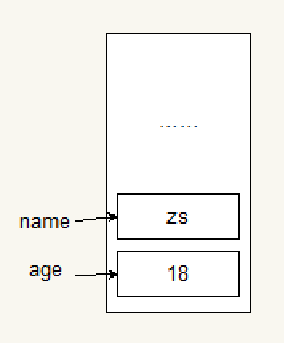
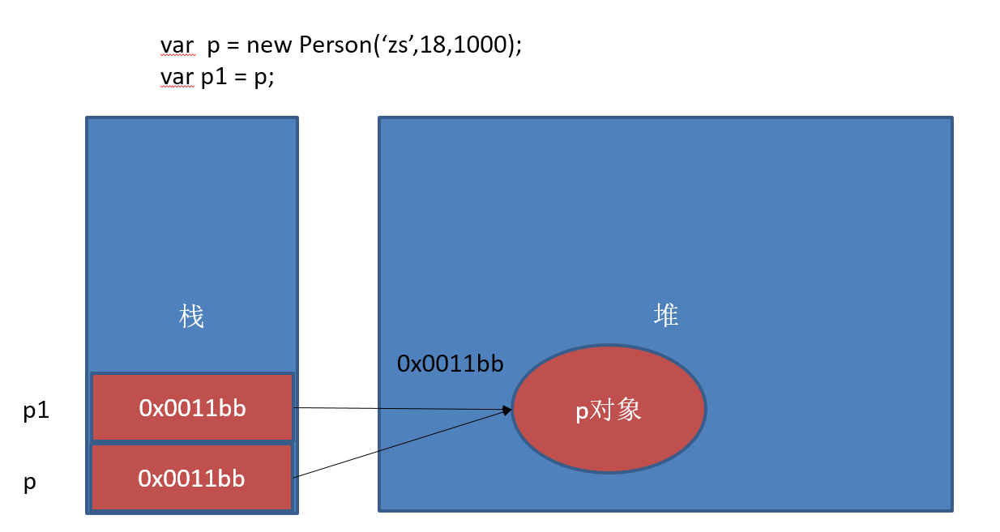
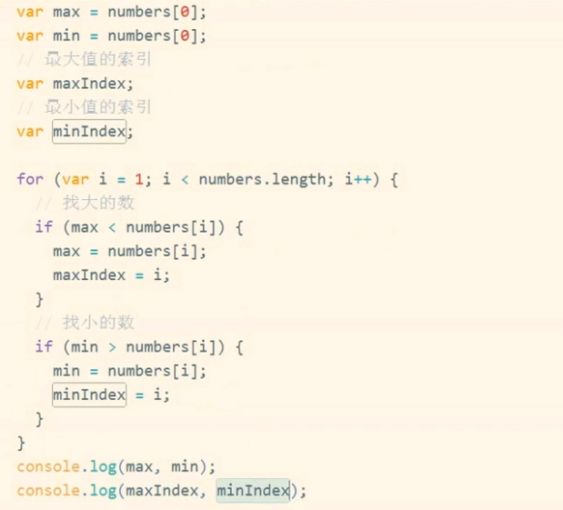

---
 学习目标:
  - 掌握编程的基本思维
  - 掌握编程的基本语法
---

# 一、JavaScript基础

HTML和CSS   京东

## 网页、网站和应用程序

网页：单独的一个页面
网站：一些列相关的页面组成到一起
应用程序：可以和用户产生交互，并实现某种功能。

## 演示JavaScript的强大

http://impress.github.io/impress.js/
http://naotu.baidu.com/ 
https://codecombat.com/
https://ide.codemao.cn/

需要翻墙
https://developers.google.com/blockly/
blockly迷宫
https://blockly-games.appspot.com

blockly迷宫不需要翻墙
https://blockly.uieee.com/

## 一、JavaScript介绍

### JavaScript是什么

HTML CSS 

JavaScript 编程语言   流程控制

Netscape在最初将其脚本语言命名为LiveScript，后来Netscape在与Sun合作之后将其改名为JavaScript。JavaScript最初受Java启发而开始设计的，目的之一就是“看上去像Java”，因此语法上有类似之处，一些名称和命名规范也借自Java。JavaScript与Java名称上的近似，是当时Netscape为了营销考虑与Sun微系统达成协议的结果。Java和JavaScript的关系就像张雨和张雨生的关系，只是名字很像。

​	**Java  服务器端的编程语言**

​	**JavaScript  运行在客户端(浏览器)的编程语言**

> JavaScript是一种运行在***客户端*** 的***脚本语言*** 
> JavaScript的解释器被称为JavaScript引擎，为浏览器的一部分，广泛用于客户端的脚本语言，最早是在HTML（标准通用标记语言下的一个应用）网页上使用，用来给HTML网页增加动态功能。

### JavaScript最初的目的

演示：http://baixiu.uieee.com/admin/login.php
最初的目的是为了处理表单的验证操作。

### JavaScript现在的意义(应用场景)

JavaScript 发展到现在几乎无所不能。

1. 网页特效
2. 服务端开发(Node.js)
3. 命令行工具(Node.js)
4. 桌面程序(Electron)
5. App(Cordova)
6. 控制硬件-物联网(Ruff)
7. 游戏开发(cocos2d-js)

### JavaScript和HTML、CSS的区别

1. HTML：提供网页的结构，提供网页中的内容。**HTML控制结构**
2. CSS: 用来美化网页。**CSS控制样式**
3. JavaScript: 可以用来控制网页内容，给网页增加动态的效果。**JS控制行为**

## 二、JavaScript的组成


### 1.ECMAScript - JavaScript的核心 

ECMA：欧洲计算机制造联合会，该组织制定了JS的语法语句

​	网景：JavaScript

​	微软：JScript

ECMAScript是JavaScript的核心。定义了JavaScript的语法规范，**<u>描述了语言的基本语法和数据类型</u>**，ECMAScript是一套**标准**，定义了一种语言的标准，与具体实现无关。

### 2.BOM - 浏览器对象模型

一套操作浏览器功能的API，**<u>描述了与浏览器进行交互的方法和接口。</u>**

通过BOM可以操作浏览器窗口，比如：弹出框、控制浏览器跳转、获取分辨率等

### 3.DOM - 文档对象模型

一套操作页面元素的API，**<u>描述了处理网页内容的方法和接口。</u>**

DOM可以把HTML看做是文档树，通过DOM提供的API可以对树上的节点进行操作

## JavaScript初体验

CSS：行内样式、内嵌(内部)样式、外部样式

### JavaScript的书写位置 

- 写在行内

```html
<input type="button" value="按钮" onclick="alert('Hello World')" />
```

- 写在script标签中

```html
<head>
  <script>
    alert('Hello World!');
  </script>
</head>
```

- 写在外部js文件中，在页面引入

```html
<script src="main.js"></script>
```

- 注意点

  **引用外部js文件的script标签中不可以写JavaScript代码**

## 三、计算机组成

### 软件

- 应用软件：浏览器(Chrome/IE/Firefox)、QQ、Sublime、Word
- 系统软件：Windows、Linux、mac OSX

### 硬件

- 三大件：CPU、内存、硬盘    -- 主板
- 输入设备：鼠标、键盘、手写板、摄像头等
- 输出设备：显示器、打印机、投影仪等


# 二、变量

### 什么是变量

- 什么是变量

  变量是计算机内存中存储数据的<u>标识符</u>，根据变量名称可以获取到内存中存储的数据

- 为什么要使用变量

  使用变量可以方便的获取或者修改内存中的数据

所谓**标识符**，就是指变量、函数、属性的名字，或者函数的参数。

### 如何使用变量

- var声明变量

```javascript
var age;
```

- 变量的赋值

```javascript
var age;
age = 18;
```

- 同时声明多个变量

```javascript
var age, name, sex;
age = 22;
name = 'ch';
```

- 同时声明多个变量并赋值


```javascript
var age = 22, name = 'ch';
```

java、C#中声明变量时就确定了变量类型；而JavaScript中声明变量并没有确定变量类型。执行时才确定了类型。

### 变量在内存中的存储

```javascript
var age = 18;
```



### 变量的命名规则和规范

- 规则 - 必须遵守的，不遵守会报错

  - 由字母、数字、下划线、$符号组成，**不能以数字开头**

  - 不能是关键字和保留字，例如：for、while。

  - 区分大小写

- 规范 - 建议遵守的，不遵守不会报错

  - 变量名必须有意义
  - 遵守驼峰命名法。首字母小写，后面单词的首字母需要大写。例如：userName、userPassword

- 下面哪些变量名不合法

  ```javascript
  a	    
  1 			//变量名不能数字开头
  age18
  18age		//变量名不能数字开头
  name
  $name
  _sex
  &sex		//仅由字母、数字、下划线、$符号组成
  theworld  theWorld		//驼峰命名法
  ```

### 案例

1. 交换两个变量的值

2. 不使用临时变量，交换两个数值变量的值

   思路：n1 = n1 + n2   交换就是   n2 = n1 - n2       n1 = n1 - n2


# 三、数据类型

##一、数据类型
### 1.简单数据类型

Number、String、Boolean、Undefined、Null

还有ES6中新添加的类型：Symbol

​	一种实例是唯一且不可改变的数据类型。Symbol类型的对象永远不相等，即便创建它们的时候传入了相同的值，因此，可借助此特性解决属性名的冲突问题（比如适用于多人编码的时候），这也是该数据类型存在的主要用途，意为标记。

#### Number类型

- 数值字面量：数值的固定值的表示法

  ​	110   1024     60.5

- 进制

```javascript
1. 十进制：      数字序列范围   0-9
	var num = 9;
	
2. 八进制：      数字序列范围  0-7
（第一位必须是0，然后是八进制数字序列（0-7），如果字面值中数值超出范围，那么前导0被忽略，后面数值被当为十进制数值解析。）
     var num1 = 070;    //八进制的56
	 var num2 = 019;    //无效的八进制数值————解析为十进制的19
	 var num3 = 08;     //无效的八进制数值————解析为8
	 
3. 十六进制：                   0-9   A-F  
 (前两位必须是0X，后跟任何十六进制数字（0-9  A-F)，字母A-F可以大小写。
 A:10 B:11 C:12 D:13 E:14  F:15  )
	var num=0xA;         //十六进制的10
	var num=0xAB;        //十六进制的171
	var num=0x1f;        //十六进制的31

进行算数计算时，八进制和十六进制表示的数值最终都将被转换成十进制数值。	
```

- 浮点数

  所谓浮点数，就是该数值中必须包含一个小数点，并且小数点后面必须至少有一位数字。

  - 浮点数的精度问题

```javascript
浮点数
	var n = 5e-324;   // 科学计数法  5乘以10的-324次方  
	
浮点数值的最高精度是 17 位小数，但在进行算术计算时其精确度远远不如整数
  	var result = 0.1 + 0.2;    
	console.log(result);	    /* 结果不是0.3，而是0.30000000000000004   (17位）
							     0.05+0.25都不会有这问题，但是如果是1-0.9=0.09999999999999999
因为存储数据最终都会转换为二进制，即是用二进制去描述0.30000000000000004这个小数，所以会出现这问题。*/
```

关于浮点数值计算产生舍入误差的问题，是使用基于IEEE754数值的浮点计算的通病。

**不要判断两个浮点数是否相等。**

- 数值范围

```javascript
最小值：Number.MIN_VALUE，这个值为： 5e-324
最大值：Number.MAX_VALUE，这个值为： 1.7976931348623157e+308
//超出范围会被转换为无穷大和无穷小
无穷大：Infinity
无穷小：-Infinity
```

​	如果想要确定一个数值是否有穷（即介于最小值和最大值间），可以用**isFinite(）** 函数。

- 数值判断

  - NaN：非数值（Not a Number）
    - NaN 与任何值都不相等，包括他本身
    - 任何涉及NaN的操作都会返回NaN。

  - isNaN: is not a number

    ```javascript
    alert(isNaN(NaN));      //true
    alert(isNaN(10));       //flase
    alert(isNaN('10'));     //flase(可以被转换成数值10）
    alert(isNaN(blue));     //true(不能被转换成数值）
    alert(isNaN(true));     //false(可以被转换成数值1）
    ```


#### String类型

表示由零或多个16位Unicode字符组成的字符序列，即字符串。可以由单引号或双引号表示（推荐单引号）。与php中单双引号会影响对字符串的解释方式不同，ECMAScript中这两种语法形式没区别，但是左右引号必须匹配（单引号开头，单引号结束)。

'abc'    "abc"

- 字符串字面量

  '程序猿'，'程序媛', "黑马程序猿"

  ​

  思考：如何打印以下字符串。
  我是一个"正直"的人 
  我很喜欢"黑马'程序猿'"

- 转义符

  String数据类型包含一些特殊的字符字面量，也称转移序列。如下表：

  

- 字符串长度

  length属性用来获取字符串的长度

  ```javascript
  var str = '黑马程序猿 Hello World';
  console.log(str.length);
  ```

- 字符串拼接

  字符串拼接使用 + 连接

  ```javascript
  console.log(11 + 11);        //22
  console.log('hello' + ' world');
  console.log('100' + '100');
  console.log('11' + 11);		//1111
  console.log('male:' + true);
  ```

  1. 两边只要有一个是字符串，那么+就是字符串拼接功能
  2. 两边如果都是数字，那么就是算术功能。

#### Boolean类型

- Boolean字面量：  true和false，区分大小写
- 计算机内部存储：true为1，false为0

#### Undefined和Null

1. undefined表示一个<u>声明了没有赋值的变量</u>，变量只声明的时候值默认是undefined
2. null表示一个空，变量的值如果想为null，必须手动设置


### 2.复杂数据类型

​	Object

### 3.简单类型和复杂类型的区别
>基本类型又叫做**值类型**，复杂类型又叫做**引用类型**
>
>**值类型**：简单数据类型，基本数据类型，在存储时，变量中存储的是<u>值本身</u>，因此叫做值类型。
>
>**引用类型**：复杂数据类型，在存储时，变量中存储的仅仅是<u>地址（引用）</u>，因此叫做引用数据类型。

- 堆和栈	

  ```
  堆栈空间分配区别：
  　　1、栈（操作系统）：由操作系统自动分配释放 ，存放函数的参数值，局部变量的值等。 
  　　2、堆（操作系统）： 存储复杂类型(对象)，一般由程序员分配释放， 若程序员不释放，由垃圾回收机制回收。
  ```

- 注意：**JavaScript中没有堆和栈的概念，此处我们用堆和栈来讲解**，目的方便理解和方便以后的学习。


  	   简单类型存储在内存中的栈上，复杂类型存储在内存中的堆中。

#### (1)基本类型在内存中的存储

#### 


#### (2)复杂类型在内存中的存储

 在堆中开辟空间，要把内存地址记录下来。记录在栈上。创建一个对象时，除了要在堆上开辟空间存储，在栈上也会开辟一块内存空间，用来存储内存地址（十六进制表示）

两次寻址：访问p1，根据p1访问到在栈上的内存地址，根据内存地址可以找到堆上。

与简单类型不同，复杂类型执行第二句时，<u>把p的内存地址赋给了p1，它们内存地址是一样的</u>，所以**指向的对象是同一个**。



#### (3)基本类型作为函数的参数

函数的参数就是内部的局部变量。

当调用函数时，会再在栈开辟两块空间，分别存储a和b，然后把x，y的值分别复制赋值给形参a和b。


#### (4)复杂类型作为函数的参数

第一行代码：堆上开辟空间存储p对象，然后在栈中开辟空间存储内存地址，p指向内存地址。

调用函数fn(p);时，再在栈开辟空间，存储形参person。然后将变量p传递给fn形参person：将p的值（内存空间）赋给了person。指向都是同一个对象。然后函数内部修改了name属性。

因为没有new一个，所以是把p的内存地址给person。没有new，就没有在堆上开辟空间。


- 简单类型和复杂类型的区别：

  如果是简单类型，在函数内部修改了参数的值，不会影响外部。而复杂类型修改了对象的某个属性，会影响外部的值，因为指向的是同一个对象。

  ​

案例：

但如果是函数内部创建新的对象?

```javascript
// 下面代码输出的结果?
function Person(name,age) {
  this.name = name;
  this.age = age;
}

var p = new Person("aa",18);

function fn(person) {
  person.name = "bb";
  person = new Person("cc",20);   //堆上开辟新空间存储对象，person和p的内存地址不同，指向对象也不同。所以值不同
  console.log(person.name);     //cc
}

fn(p);          //修改对象p的name为bb,
console.log(p.name);        //bb
```


思考：

```javascript
//1. 
var num1 = 10;
var num2 = num1;
num1 = 20;
console.log(num1);
console.log(num2);

//2. 
var num = 50;
function f1(num) {
    num = 60;
    console.log(num);
}
f1(num);
console.log(num);
```

### 4.获取变量的类型

typeof

```javascript
var age = 18;
console.log(typeof age);  // 'number'
```

### 5.字面量

在源代码中一个固定值的表示法。

数值字面量：8, 9, 10

字符串字面量：'黑马程序员', "大前端"

布尔字面量：true，false

### 6.注释

#### 单行注释

用来描述下面一个或多行代码的作用

```javascript
// 这是一个变量
var name = 'hm';
```

#### 多行注释

用来注释多条代码

```javascript
/*
var age = 18;
var name = 'zs';
console.log(name, age);
*/
```

## 二、数据类型转换

如何使用谷歌浏览器，快速的查看数据类型？

字符串的颜色是黑色的，数值类型是蓝色的，布尔类型也是蓝色的，undefined和null是灰色的

### 1.转换成字符串类型

- toString()

  ```javascript
  var num = 5;
  console.log(num.toString());
  ```

- String()

  ```javascript
  String()函数存在的意义：有些值没有toString()，这个时候可以使用String()。比如：undefined和null
  ```

- 拼接字符串方式

  num  +  ""，当 + 两边一个操作符是字符串类型，一个操作符是其它类型的时候，会先把其它类型转换成字符串再进行字符串拼接，返回字符串

  `-`字符串运算时，一个是数字类型，一个是字符串类型。先把字符串转换为数值，再进行减法运算。如果转换不成功返回NaN

### 2.转换成数值类型

- Number()

  ```
  Number()可以把任意值转换成数值，如果要转换的字符串中有一个不是数值的字符，返回NaN
  ```

- parseInt()

  ```javascript
  var num1 = parseInt("12.3abc");  // 返回12，如果第一个字符是数字会解析直到遇到非数字结束
  var num2 = parseInt("abc123");   // 返回NaN，如果第一个字符不是数字或者符号就返回NaN
  ```

- parseFloat()

  ```javascript
  parseFloat()把字符串转换成浮点数
  parseFloat()和parseInt非常相似，不同之处在与
  	parseFloat会解析第一个点.    遇到第二个.    或者非数字结束
  	如果解析的内容里只有整数，解析成整数
  ```

- +，-0等运算

  ```javascript
  var str = '500';
  console.log(+str);		// 取正
  console.log(-str);		// 取负
  console.log(str - 0);    //也是转换为数值型
  ```

### 3.转换成布尔类型

- Boolean()

5种：0   ''(空字符串)   null   undefined   NaN   会转换成false    其它都会转换成true

# 四、操作符

运算符  operator 

ECMA-262描述了一组用于操作数据值的操作符，包括**算术操作符**、**位操作符**、**关系操作符**和**相等操作符**。

5 + 6   

表达式  组成 操作数和操作符，会有一个结果

### 1.算术运算符

```javascript
+ - * / %  正号 负号  ++  -- 
```

补充：

​	x/0 结果：无穷大：In'finity

​	x%0 结果：NaN


一元运算符：只有一个操作数的运算符    ++  --  正号 负号

二元运算符:   两个操作数的运算符       + - * / %          如：5 + 6  


++  自身加1

-- 自身减1

- 前置++                     ++a  先执行a自身+1，再返回结果

  ```javascript
  var num1 = 5;
  ++ num1; 

  var num2 = 6;
  console.log(num1 + ++ num2);
  ```

- 后置++                     a++   先返回结果，再执行a自身+1

  ```javascript
  var num1 = 5;
  num1 ++;    
  var num2 = 6 
  console.log(num1 + num2 ++);
  ```

- 猜猜看

  ```javascript
  var a = 1; var b = ++a + ++a; console.log(b);    //   2+3=5
  var a = 1; var b = a++ + ++a; console.log(b);    //   1+2=3
  var a = 1; var b = a++ + a++; console.log(b);    //   1+2=3
  var a = 1; var b = ++a + a++; console.log(b);    //   2+2=4
  ```

  ​

### 2.逻辑运算符(布尔运算符)
```javascript
&& 且（与） 两个操作数同时为true，结果为true，否则都是false
|| 或 两个操作数有一个为true，结果为true，否则为false
!  非  取反
```

### 3.关系运算符(比较运算符)
```javascript
<  >  >=  <=  == !=   === !==
```
```javascript
==与===的区别：       ==：只进行值的比较，===：类型和值同时相等，则相等

var result = '55' == 55;  	// true
var result = '55' === 55; 	// false 值相等，类型不相等
var result = 55 === 55; 	// true
```

### 4.赋值运算符

=   +=   -=   *=   /=   %=
```javascript
例如：
var num = 0;
num += 5;	//相当于  num = num + 5;
```


### 5.运算符的优先级
	优先级从高到底
		1. ()  优先级最高
		2. 一元运算符  ++   --   !
		3. 算数运算符  先*  /  %   后 +   -
		4. 关系运算符  >   >=   <   <=
		5. 相等运算符   ==   !=    ===    !==
		6. 逻辑运算符 先&&   后||
		7. 赋值运算符

```	javascript
// 练习1：
4 >= 6 || '人' != '阿凡达' && !(12 * 2 == 144) && true
// 练习2：
var num = 10;
5 == num / 2 && (2 + 2 * num).toString() === '22'
```
#五、流程控制及应用
## 一、表达式和语句 

### 表达式

>一个表达式可以产生一个值，有可能是运算、函数调用、有可能是字面量。表达式可以放在任何需要值的地方。
>
>表达式总会返回一个值。 

### 语句

>语句可以理解为一个行为，循环语句和判断语句就是典型的语句。一个程序有很多个语句组成，一般情况下;分割一个一个的语句
## 二、流程控制

>程序的三种基本结构

### 1.顺序结构

 从上到下执行的代码就是顺序结构

**程序默认就是由上到下顺序执行的**

### 2.分支结构	

根据不同的情况，执行对应代码

### 3.循环结构

循环结构：重复做一件事情

## 三、分支结构

### if语句

语法结构

```javascript
if (/* 条件表达式 */) {
  // 执行语句
}

if (/* 条件表达式 */){
  // 成立执行语句
} else {
  // 否则执行语句
}

if (/* 条件1 */){
  // 成立执行语句
} else if (/* 条件2 */){
  // 成立执行语句
} else if (/* 条件3 */){
  // 成立执行语句
} else {
  // 最后默认执行语句
}
```
案例：
    求两个数的最大数
    判断一个数是偶数还是奇数
    分数转换，把百分制转换成ABCDE   <60  E  60-70 D  70-80 C  80-90 B  90 - 100 A
作业：
    判断一个年份是闰年还是平年
      闰年：能被4整除，但不能被100整除的年份 或者 能被400整除的年份
    判断一个人的年龄是否满18岁(是否成年)

### 三元运算符
```javascript
表达式1 ? 表达式2 : 表达式3
是对if……else语句的一种简化写法
```

案例：
```javascript
是否年满18岁
从两个数中找最大值

1.var age=18;
console.log(age>=18 ? '成年' ：'未成年');
var msg=age>=18 ? '成年' ：'未成年';
console.log(msg); 
```

### switch语句

switch语句中的判断比较的是全等:   `expression === 常量`

语法格式:
```javascript
switch (expression) {
	case 常量1:
    	语句;
    	break;
  	case 常量2:
    	语句;
    	break;
  	case 常量3:
    	语句;
    	break;
  	…
  	case 常量n:
    	语句;
    	break;
  	default:
    	语句;
    	break;
}
```
	break可以省略，如果省略，代码会继续执行下一个case
	switch 语句在比较值时使用的是全等操作符, 因此不会发生类型转换（例如，字符串'10' 不等于数值 10）

案例：
	1.显示星期几
	2.素质教育（把分数变成ABCDE）        千万不要写100个case哟 可以用score/10 然后parseInt 用case10、9、8

### 布尔类型的隐式转换

流程控制语句会把后面的值隐式转换成布尔类型

	转换为true   		非空字符串  非0数字  true 任何对象
	转换成false：		5种:   ""  0  NaN  null  undefined

```javascript
// 结果是什么？
var a = !!'123';
```


### 案例

```javascript
var message;     //undefined 是false
// 会自动把message转换成false
if (message) {     
  // todo...
}
```


## 四、循环结构

> 在javascript中，循环语句有三种，while、do..while、for循环。

tips：知道多少次循环可以用for   不知道可以用while 和do...while

### 1.while语句

基本语法：

```javascript
// 当循环条件为true时，执行循环体，
// 当循环条件为false时，结束循环。
while (循环条件) {
  //循环体
}
```

代码示例：

```javascript
// 计算1-100之间所有数的和
// 初始化变量
var i = 1;
var sum = 0;
// 判断条件
while (i <= 100) {
  // 循环体
  sum += i;
  // 自增
  i++;
}
console.log(sum);
```

案例：
    打印100以内 7的倍数
    打印100以内所有偶数
    打印100以内所有偶数的和
作业：
    打印100以内的奇数
    打印100以内的奇数的和

### 2.do...while语句

> do..while循环和while循环非常像，二者经常可以相互替代，但是do..while的特点是不管条件成不成立，都会执行一次。

基础语法：

```javascript
do {
  // 循环体;
} while (循环条件);
```

代码示例：

```javascript
// 初始化变量
var i = 1;
var sum = 0;
do {
  sum += i;//循环体
  i++;//自增
} while (i <= 100);//循环条件
```

案例：

```javascript
<script type="text/javascript">
  
  // 1.求100以内所有3的倍数的和
	var i=1;sum=0;
	do{
  		if (i%3===0){
  			sum+=i;
  		}
  		i++;
	}while(i<=100);
	alert(sum);

 // 2.使用do-while循环：输出询问“我爱你，嫁给我吧？”，选择“你喜欢我吗？(y/n):"，如果输入为y则打印”我们形影不          离“，若输入为n,则继续询问 
  do{
    var msg=prompt('我爱你，嫁给我吧？'，'你喜欢我吗？(y/n):');
  }while(msg!=='yes');
  console.log('我们形影不离')；
</script>
```


### 3.for语句

>  while和do...while一般用来解决无法确认次数的循环。for循环一般在循环次数确定的时候比较方便

for循环语法：

```javascript
// for循环的表达式之间用的是;号分隔的，千万不要写成,
for (初始化表达式1; 判断表达式2; 自增表达式3) {
  // 循环体4
}
```

执行顺序：1243  ----  243   -----243  ...   (直到循环条件变成false)

1. 初始化表达式
2. 判断表达式
3. 自增表达式
4. 循环体

案例：

```javascript
1.打印1-100之间所有数
2.求1-100之间所有数的和
3.求1-100之间所有数的平均值
4.求1-100之间所有偶数的和
5.同时求1-100之间所有偶数和奇数的和
6.打印正方形
7.打印直角三角形   （区别在j的初始值一个是j=0一个是j=i）
8.九九乘法表
9.补充：等腰三角形
 
// 使用拼字符串的方法的原因
// 1. console.log 输出重复内容的问题 （只有一个*，前面有个数字表示次数）
// 2. console.log 默认输出内容介绍后有换行

6.打印正方形
var start = '';
for (var i = 0; i < 10; i++) {
  for (var j = 0; j < 10; j++) {
    start += '* ';
  }
  start += '\n';
}
console.log(start);


7.打印直角三角形
var start = '';
for (var i = 0; i < 10; i++) {
  for (var j = i; j < 10; j++) {
    start += '* ';
  }
  start += '\n';
}
console.log(start);

8.打印9*9乘法表
var str = '';
for (var i = 1; i <= 9; i++) {
  for (var j = i; j <=9; j++) {
    str += i + ' * ' + j + ' = ' + i * j + '\t';
  }
  str += '\n';
}
console.log(str);


补充：若打印以下这种三角形，只需要找到规律即可。 
	 			7行(n)时:	  行数    空格数    星号               
	      *					 1       6		  1
	     ***				 2       5		  3
	    *****				 3	     4		  5
	   *******				 4       3	       7
	     ...				 i		7-i      2*i-1 


	var n=prompt('请输入一个数字：');
	for (var i=1; i<=n;i++) {
	  for(var j=1;j<=n-i;j++){
	  	document.write('&nbsp;');
	  }
	  for (var k=1; k<=2*i-1;k++) {
	   	document.write('*');
	  }
	  document.write("<br/>");
	}
```

作业：

```
求1-100之间所有数的乘积
求1-100之间所有奇数的和
计算1-100之间能3整除的数的和
计算1-100之间不能被7整除的数的和
// 讲解思路。如果不会写程序，可以先把数学公式准备好
1.本金10000元存入银行，年利率是千分之三，每过1年，将本金和利息相加作为新的本金。计算5年后，获得的本金是多少？
2.有个人想知道，一年之内一对兔子能繁殖多少对？于是就筑了一道围墙把一对兔子关在里面。已知一对兔子每个月可以生一对小兔子，而一对兔子从出生后第3个月起每月生一对小兔子。假如一年内没有发生死亡现象，那么，一对兔子一年内（12个月）能繁殖成多少对？（兔子的规律为数列，1，1，2，3，5，8，13，21）

2.
```


### 4.continue和break

> break:立即跳出整个循环，即循环结束，开始执行循环后面的内容（直接跳到大括号）
>
> continue:立即跳出当前循环，继续下一次循环（跳到i++的地方）

案例：

```javascript
求整数1～100的累加值，但要求碰到个位为3的数则停止累加
求整数1～100的累加值，但要求跳过所有个位为3的数
```

作业：

求1-100之间不能被7整除的整数的和（用continue）
求200-300之间所有的奇数的和（用continue）
求200-300之间第一个能被7整数的数（break）

 


### 调试方法

- 过去调试JavaScript的方式
  - alert()
  - console.log()
- 断点调试

>断点调试是指自己在程序的某一行设置一个断点，调试时，**程序运行到这一行就会停住（那行还没执行） ** ，然后你可以一步一步往下调试，调试过程中可以看各个变量当前的值，出错的话，调试到出错的代码行即显示错误，停下。

- 调试步骤

```javascript
浏览器中按F12-->sources-->找到需要调试的文件-->在程序的某一行设置断点
```

- 调试中的相关操作

```javascript
Watch: 监视，通过watch可以监视变量的值的变化，非常的常用。
F10: 程序单步执行，让程序一行一行的执行，这个时候，观察watch中变量的值的变化。
F8：跳到下一个断点处，如果后面没有断点了，则程序执行结束。
```

tips: ***监视变量，不要监视表达式，因为监视了表达式，那么这个表达式也会执行。***

1. 代码调试的能力非常重要，只有学会了代码调试，才能学会自己解决bug的能力。初学者不要觉得调试代码麻烦就不去调试，知识点花点功夫肯定学的会，但是代码调试这个东西，自己不去练，永远都学不会。
2. 今天学的代码调试非常的简单，只要求记住代码调试的这几个按钮的作用即可，后面还会学到很多的代码调试技巧。


# 六、数组

### 为什么要学习数组

> 之前学习的数据类型，只能存储一个值(比如：Number/String。我们想存储班级中所有学生的姓名，此时该如何存储？


###  1.数组的概念

> 所谓数组，就是将多个元素（通常是同一类型）按一定顺序排列放到一个集合中，那么这个集合我们就称之为数组。
>
> 数组是一组数据的集合。数组的表现形式是一段连续的内存地址。数组的名称就是一段地址的首地址。
### 2.数组的创建
> 数组是一个有序的列表，可以在数组中存放任意的数据，并且数组的长度可以动态的调整。

(1)通过数组字面量创建数组

```javascript
// 创建一个空数组
var arr1 = []; 
var arr2 = [1, 3, 4];      // var arr = [1, 3, 4,true,undefine,null];也是正确的,不推荐
var arr3 = ['a', 'c']; 

console.log(arr3.length);           // 可以通过数组的length属性获取数组的长度
console.log(arr3[arr3.length-1]);  //获取最后一项
// 可以设置length属性改变数组中元素的个数
arr3.length = 0;
```


(2)通过构造函数Array()创建函数  （见八、内置对象中的Array对象）

> 内部对象Array封装了所有和数组相关的方法和属性，其内存在多个数据段存储。

```javascript
var arr1 = new Array();
var a = new Array("jack","tom");
var a = new Array(5);   //创建长度为5的数组
```


数组在js中一些特点：

- 数组定义时不需指明类型
- 数组定义时不需指定长度
- 数组里的项不一定是相同类型
- length属性获取数组长度


### 3.获取数组的元素

数组的取值

```javascript
// 格式：数组名[下标]	下标index又称索引
// 功能：获取数组对应下标的那个值，如果下标不存在，则返回undefined。
var arr = ['red', 'green', 'blue'];
arr[0];	// red
arr[2]; // blue
arr[3]; // undefined     这个数组的最大下标为2,因此返回undefined
```


### 4.遍历数组

> 遍历：遍及所有，对数组的每一个元素都访问一次就叫遍历。


3种：数组遍历的基本语法：

```javascript
数组遍历的基本语法：
var arr=[1,2,3,4];

//1.for循环
for(var i = 0; i < arr.length; i++) {
	// 数组遍历的固定结构
  	console.log(arr[i]);    //或者空数组赋值等等
}

//2.for in
for(var count in arr) {
	// 数组遍历的固定结构
  	console.log(arr[count]);
}

//3.forEach()方法。 调用数组的每个元素，并将元素传递给回调函数。 涉及到Array数组对象 
arr.forEach(function(item, index){			//元素传递给item
  console.log(item);
})
//相比前两种不易懂，可见https://www.runoob.com/jsref/jsref-foreach.html
```
### 5.数组中新增元素
数组的赋值

```javascript
// 格式：数组名[下标/索引] = 值;
// 如果下标有对应的值，会把原来的值覆盖，如果下标不存在，会给数组新增一个元素。
var arr = ["red", "green", "blue"];
// 把red替换成了yellow
arr[0] = "yellow";
// 给数组新增加了一个pink的值
arr[3] = "pink";
```
### 案例 

```javascript
1.求一组数中的所有数的和和平均值
2.求一组数中的最大值和最小值，以及所在位置     //两两即可
3.将字符串数组用|或其他符号分割        //第二项开始在每项前面加即可
4.要求将数组中的0项去掉，将不为0的值存入一个新的数组，生成新的数组
5.翻转数组
6.冒泡排序，从小到大

//2.见下图

//3.将字符串数组用|或其他符号分割。 （第二项开始在每项前面加即可）
var names=['cc','ss','dd','cf','cg'];
var sperator='|';
var str=names[0];
for(var i=1;i<names.length;i++){
  	str+=sperator+names[i];
}
console.log(str); 

//4.要求将数组中的0项去掉，将不为0的值存入一个新的数组，生成新的数组
var numbers=[1,45,67,0,75,0,0,6,22];
var newArray=[];
for(var i=0;i<numbers.length;i++){
 	if(numbers[i]!==0){
  		newArray[newArray.length]=numbers[i];     //后面学数组对象可直接用方法newArray.push(numbers[i]);
  	}
}
console.log(newArray);

//5.翻转数组  （反着遍历就行）
var numbers=[1,2,3,4];
var newArray=[];         //后面学数组对象后可直接用方法颠倒数组var newArray=numbers.reverse();
for(var i=numbers.length-1;i>=0;i--){
  	newArray[newArray.length]=numbers[i];     
}
console.log(newArray);

//6.冒泡排序，从小到大
var numbers=[23,44,5,67,12,88];
for(var i=0;i<=numbers.length-1;i++){    //外层循环控制趟数，每趟取一个最大
  	for(var j=0;j<numbers.length-1-i;j++){//内层循环控制两两比较次数，第1趟比较总数-1次，第2趟比较总数-2次...
     	if(numbers[j]>numbers[j+1]){
       		var temp=numbers[j];
       		numbers[j]=numbers[j+1];
       		numbers[j+1]=temp;
     	}
  	}
}
console.log(numbers);

//优化，倒数第二次就已经排好了但是还会进行最后一次。
var numbers=[23,44,5,67,12,88];
for(var i=0;i<=numbers.length-1;i++){    //外层循环控制趟数，每趟取一个最大
	var isSort=true;
  	for(var j=0;j<numbers.length-1-i;j++){//内层循环控制两两比较次数，第1趟比较总数-1次，第2趟比较总数-2次...
     	if(numbers[j]>numbers[j+1]){
     		isSort=false;
       		var temp=numbers[j];
       		numbers[j]=numbers[j+1];
       		numbers[j+1]=temp;
     	}
  	}
  	if(isSort){     //如果没进行比较就跳出
  		break;
  	}
}
console.log(numbers);
```


2.求一组数中的最大值和最小值，以及所在位置     //两两即可



# 七、函数及应用

## 一、函数


### 为什么要有函数

> 如果要在多个地方求1-100之间所有数的和，应该怎么做？

### 1.什么是函数

>把一段相对独立的具有特定功能的代码块封装起来，形成一个独立实体，就是函数，起个名字（函数名），在后续开发中可以反复调用
>
>函数的作用就是封装一段代码，将来可以重复使用

### 2.函数的定义

- 函数声明        - （函数叫做）命名函数

```javascript
function 函数名() {     //函数名遵循驼峰原则
  // 函数体
}
```

- 函数表达式       - （函数叫做）匿名函数

```javascript
var fn = function () {       //赋值号右边是个匿名函数
  // 函数体
}
```

- 特点：

  函数声明的时候，函数体并不会执行，只要当函数被调用的时候才会执行。
  函数一般都用来干一件事情，函数名称一般使用动词

### 3.函数的调用
- 调用函数的语法：

```javascript
函数名();
```

- 特点：

  函数体只有在调用的时候才会执行，调用需要()进行调用。
  可以调用多次(重复使用)

代码示例：

```javascript
示例一
// 声明函数
function sayHi() {
  console.log("吃了没？");
}
// 调用函数
sayHi();

示例二
// 求1-100之间所有数的和
function getSum() {
  var sum = 0;
  for (var  i = 0; i < 100; i++) {
    sum += i;
  }
  console.log(sum);
}
// 调用
getSum();
```
### 4.函数的参数

- 为什么要有参数

```javascript
function getSum() {
  var sum = 0;
  for (var i = 1; i <= 100; i++) {
    sum += i;
  }
  console.log();
}

// 虽然上面代码可以重复调用，但是只能计算1-100之间的值
// 如果想要计算n-m之间所有数的和，应该怎么办呢？
```

- 语法：

```javascript
// 函数内部是一个封闭的环境，可以通过参数的方式，把外部的值传递给函数内部
// 带参数的函数声明
function 函数名(形参1, 形参2, 形参3...) {
  // 函数体
}

// 带参数的函数调用
函数名(实参1, 实参2, 实参3);      //形参1 = 实参1 形参2 = 实参2
```

- 形参和实参

  > 1. 形式参数：在声明一个函数的时候，为了函数的功能更加灵活，有些值是固定不了的，对于这些固定不了的值。我们可以给函数设置参数。这个参数没有具体的值，仅仅起到一个占位置的作用，我们通常称之为形式参数，也叫形参。
  > 2. 实际参数：如果函数在声明时，设置了形参，那么在函数调用的时候就需要传入对应的参数，我们把传入的参数叫做实际参数，也叫实参。

```javascript
var x = 5, y = 6;
fn(x,y); 
function fn(a, b) {
  console.log(a + b);
}
// x,y实参，有具体的值。函数执行的时候会把x,y复制一份给函数内部的a和b，函数内部的值是复制的新值，无法修改外部的x,y
```

### 案例

- 求1-n之间所有数的和
- 求n-m之间所有数的和
- 圆的面积
- 求2个数中的最大值
- 求3个数中的最大值
- 求n个数 （传个数组arr）
- 判断一个数是否是素数(又叫质数，只能被1和自身整数的数)     （见下方）

```javascript
function judgePrimeNumber(number){
	var isPrime=true;       //像冒泡优化一样加个标记
  	for(var i=2;i<number;i++){
  		if(number%i===0){
  			isPrime=false;    //说明不是素数
  			break;
  		}
  	}
  	if(isPrime){
  		console.log(number+'是素数');
  	}else{
  		console.log(number+'不是素数');
  	}  
}

judgePrimeNumber(5);        //调用
```


### 5.函数的返回值

>当函数执行完的时候，并不是所有时候都要把结果打印。我们期望函数给我一些反馈（比如计算的结果返回进行后续的运算），这个时候可以让函数返回一些东西。也就是返回值。函数通过return返回一个返回值

返回值语法：

```javascript
//声明一个带返回值的函数
function 函数名(形参1, 形参2, 形参3...) {
  //函数体
  return 返回值;
}

//可以通过一个变量来接收这个返回值
var 变量 = 函数名(实参1, 实参2, 实参3...);
```

函数的调用结果就是返回值，因此我们可以直接对函数调用结果进行操作。

### 案例

- 求一组数中的最大值
- 求一组数中的最小值
- 求阶乘
- 求1!+2!+3!+....+n!           (见下方)

```javascript
function factorial(n) {
	var result = 1;
	for(var i = 1; i<= n; i++) {
		result *= i;
	}
	return result;
}

function getSum(n) {
	var sum=0;
	for(var i = 1; i<= n; i++) {
		sum += factorial(i);
	}
	return sum;
}
console.log(getSum(5));
```


返回值详解：

    1.如果函数没有显示的使用return语句 ，那么函数有默认的返回值：undefined
    2.如果函数使用return语句，那么跟在return后面的值，就成了函数的返回值
    3.如果函数使用return语句，但是return后面没有任何值，表示结束函数。函数的返回值也是：undefined
    函数使用return语句后，这个函数会在执行完 return 语句之后停止并立即退出，也就是说return后面的所有其他代码都不会再执行。
    
    推荐的做法是要么让函数始终都返回一个值，要么永远都不要返回值。

### 6.arguments的使用

> JavaScript中，arguments对象是比较特别的一个对象，实际上是当前函数的一个内置属性。也就是说所有函数都内置了一个arguments对象，**arguments对象中存储了传递的所有的实参** 。
>
> arguments是一个伪数组，因此及可以进行遍历。非常像数组但不是数组

像console.log(a,b,c);一样，需要几个参数，传几个参数。可以通过arguments在函数内部获取函数调用时传的实参


- 案例
```javascript
1.求任意个数的最大值
2.求任意个数的和

//参数个数不固定，可以不写形参，通过arguments来获取。

// 1.求任意个数的最大值
function getMax() {
  var max=arguments[0];
  for(var i = 1; i< arguments.length; i++){
    	if(max < arguments[i]){
      		max = arguments[i];
   	 	}
  }
  return max;
}

var a=getMax(4,6,11);
console.log(a);
```

### 案例

```javascript
1.求斐波那契数列Fibonacci中的第n个数是多少？      1 1 2 3 5 8 13 21...
2.翻转数组，返回一个新数组
3.对数组排序，从小到大
4.输入一个年份，判断是否是闰年[闰年：能被4整数并且不能被100整数，或者能被400整数]
5.输入某年某月某日，判断这一天是这一年的第几天？

//1.
function getFib(n) {
	var n1=1;
	var n2=1;
	var n3;
	for( var i = 3; i <=n; i++){
		n3=n1+n2;
		n1=n2;
		n2=n3;
	}
	return n3;	
}

var r=getFib(12);
console.log(r);

//4和5
function isRun(year) {  //判断是否闰年
	var result=false;
	if((year % 4 === 0 && year % 100 !== 0)||(year % 400 === 0)) {
		result=true;
	}
	return result;
}

function getDays(year,month,day){    //获取年月日是当前年多少天
	var days=day;
	for(var i = 1; i < month; i++){
		switch (i) {
			case 1:
			case 3:
			case 5:
			case 7:
			case 8:
			case 10:
				days += 31;
				break;
			case 4:
			case 6:
			case 9:
			case 11:
				days += 30;
				break;
			case 2:
				if(isRun(year)){     //如果是闰年
					days + 29;
				}else {
					days += 28;
				}
				break;
		}
	}
	return days;
}

console.log(getDays(1997,11,2));
```


## 二、函数其它

### 1.匿名函数

匿名函数**不能独自存在**

> 匿名函数：没有名字的函数

匿名函数如何使用：

```javascript
1.将匿名函数赋值给一个变量，这样就可以通过变量进行调用
2.匿名函数自调用

//1.变量进行调用匿名函数
var fn = function () {       //赋值号右边是个匿名函数
  // 函数体
}

//2.匿名函数自调用
(function () {
  //函数体
})();
```

### 2.自调用函数

自调用函数：      当函数书写完成后**立即调用**，不需要再手动调用。

>匿名函数不能通过直接调用来执行，因此可以通过匿名函数的自调用的方式来执行
```javascript
/*
前面的括号：将匿名函数括起来，是一个表达式,函数
后面的括号：函数的调用，函数名()
*/
(function () {
  alert(123);
})();
```
### 3.函数也是一种数据类型：function

```javascript
var n = 5;     //数值类型的变量
var str = '123';   //字符串类型的变量
var fn = function fn() {    //函数类型的变量
}
  
console.log(typeof fn);   //结果：function
```

- 函数作为参数

因为函数也是一种类型，可以把函数作为另一个函数的参数，在另一个函数中调用

```java
var fn=function fn() {    //函数类型的变量
  	console.log('我是传过来的函数');
}

function test(fun){   //形参fun
  	fun();
}

test(fn);    //调用，实参fn传给形参fun。     如果没传递参数，形参fun的值就是undefined
```

- 函数做为返回值

因为函数是一种类型，所以可以把函数可以作为返回值从函数内部返回。

```javascript
function test(b) {
  var a = 10;
  return function () {  //返回一个匿名函数。  （函数内部可以访问到函数外部的变量）
    alert(a+b);
  }
}
test(15)();  //其实是以下两行 var fn = test(15);   fn();   前面test(15)是返回了函数，后面括号是调用了此函数。
//光写test(15)仅仅只是函数，而没有调用，()调用
```

### 代码规范
```javascript
1.命名规范	
	变量、函数的命名必须要有意义
	变量的名称一般用名词
	函数的名称一般用动词
2.变量规范   
	操作符的前后要有空格
	var name = 'zs';	  5 + 6
3.注释规范
	// 这里是注释
4.空格规范
	if (true) {     //if后面有空格，小括号结束后面有空格
      
	}
	for (var i = 0; i <= 100; i++) {   //for循环后面、分号后面有空格
      
	}
5.换行规范
	var arr = [1, 2, 3, 4];      //数组里分隔元素的逗号后面有空格
	if (a > b) {
      
	}
	for (var i = 0; i < 10; i++) {
      
	}
	function fn() {
      
	}
```


## 三、作用域

作用域：变量可以起作用的范围

- 全局作用域：在script标签或者一个独立js文件中
- 局部作用域：任何一个函数的内部都有一个局部作用域

### 1.全局变量和局部变量

- 全局变量

  在任何地方都可以访问到的变量就是全局变量，对应全局作用域（**全局作用域中定义的变量就是全局变量**）

- 局部变量

  只在固定的代码片段内可访问到的变量，例如**函数内部**。对应局部作用域（**局部作用域中定义的变量就是全局变量**）

  只有在定义改变量 的函数中可以访问。不可以在函数外部使用。

```
1.不使用var声明的变量是全局变量，不推荐使用（不规范）。
2.局部变量退出局部作用域（函数执行完后）之后会销毁（变量所占内存会被回收），全局变量关闭网页或浏览器才会销毁
```

### 2.块级作用域

在ECMAScript中没有块级作用域。

**在es5之前没有块级作用域的的概念,只有全局作用域和局部作用域**。   (现阶段可以认为JavaScript没有块级作用域，学到es6可了解)


任何一对花括号中的语句集都属于一个块，在这之中**定义的所有变量在代码块外都是不可见的**，我们称之为块级作用域。

```javascript
{
  //代码块
}
```

### 3.作用域链

补充：先在当前局部作用域来找变量的值，没有就去上一级作用域链里找变量，一直到全局作用域的0级作用域。找到为止。

	只有函数可以制造作用域结构， 那么只要是代码，就至少有一个作用域, 即全局作用域。凡是代码中有函数，那么这个函数就构成另一个作用域。如果函数中还有函数，那么在这个作用域中就又可以诞生一个作用域。

	将这样的所有的作用域列出来，可以有一个结构: 函数内指向函数外的链式结构。就称作作用域链。
```javascript
// 案例1：见下图
//全局作用域：0级作用域链

function f1() {
    function f2() {
    }
}

var num = 456;
function f3() {
    function f4() {    
    }
}
```


```javascript
// 案例2
function f1() {
    var num = 123;
    function f2() {
        console.log(num); 
    }
    f2();
}
var num = 456;    
f1();     //
```

如图，num变量在当前作用域链f2中找，没有往上一级作用域链找。找到，输出结果。


### 4.预解析

代码执行前先要进行预解析。

> JavaScript代码的执行是由浏览器中的JavaScript解析器来执行的。JavaScript解析器执行JavaScript代码的时候，分为两个过程：**预解析过程**和**代码执行过程**

预解析过程：

1. 把变量的声明提升到当前作用域的最前面，只会提升声明，不会提升赋值。
2. 把函数的声明提升到当前作用域的最前面，只会提升声明，不会提升调用。
3. 先提升var，在提升function。


JavaScript的执行过程

```javascript
// 案例1								
var a = 25;                                       
function abc() {                         			
  alert(a); 									   						
  var a = 10;										 	
}												       
abc();	  //结果undefined

/*预解析
var a;       //预解析：变量提升
function abc() {     //预解析：函数提升
	var a;    //局部作用域的预解析
	alert(a); 
	a = 10;	
} 

a = 25;
abc();	

过程：1.声明变量、函数，2.全局作用域：a赋值25，调用函数 3.局部作用域：也定义了a，执行alert，当前局部作用域找a，找到var a;不过，此时还未赋值。所以输出undeifined。

一个疑问：作用域链提到当前作用域找不到就去作用域链上一层找直到找到为止。这里为什么不会去找全局的a？
*/


// 案例2									
console.log(a);
function a() {
  console.log('aaaaa');
}
var a = 1;
console.log(a);

/*预解析 预解析中，如果变量和函数的名字相同，此时函数优先。
var a;
function a() {
  console.log('aaaaa');
}
var a;

console.log(a);       //同名函数优先，打印的是函数a：整段函数声明代码
a = 1;
console.log(a);       //1
*/
```

#### 变量提升与函数提升

- 变量提升

  定义变量的时候，变量的声明会被提升到作用域的最上面，变量的赋值不会提升。

- 函数提升

  JavaScript解析器首先会把当前作用域的函数声明提前到整个作用域的最前面

```javascript
// 1、-----------------------------------与上面第一题一样
var num = 10;
fun();
function fun() {
  console.log(num);
  var num = 20;
}
//2、-----------------------------------
var a = 18;
f1();
function f1() {
  var b = 9;
  console.log(a);         //undefined
  console.log(b);         //9
  var a = '123';
}

// 3、-----------------------------------
f1();
console.log(c);
console.log(b);
console.log(a);
function f1() {
  var a = b = c = 9;      //含义： var a = 9; b = 9;  c = 9;    所以b、c是全局作用域
  console.log(a);
  console.log(b);
  console.log(c);
}
/*预解析
function f1() {
  var a;      
  a = b = c = 9; 
  console.log(a);	//9
  console.log(b);	//9
  console.log(c);	//9
}
f1();
console.log(c);	//9
console.log(b);	//9
console.log(a);	//报错：a is not defined
*/
```


# 八、对象

## 一、对象

### 为什么要有对象

函数的参数如果特别多的话，可以使用对象简化：直接传一个对象，对象包含各属性。如下。

```javascript
function printPerson(name, age, sex....) {
}

// 函数的参数如果特别多的话，可以使用对象简化
function printPerson(person) {
  console.log(person.name);
  ……
}
```

### 1.什么是对象

```
现实生活中：万物皆对象。   对象是一个具体的事物，一个具体的事物就会有行为和特征。
举例： 一部车，一个手机
车是一类事物，门口停的那辆车才是对象
	特征：红色、四个轮子
	行为：驾驶、刹车
```

#### JavaScript中的对象

JavaScript的对象是无序属性的集合。

```javascript
JavaScript中的对象其实就是生活中对象的一个抽象
JavaScript的对象是无序属性的集合。
	其属性可以包含基本值、对象或函数。对象就是一组没有顺序的值。我们可以把JavaScript中的对象想象成键值对，其中值可以是数据和函数。
对象的行为和特征
	特征---属性
	行为---方法
```

+ 事物的特征在对象中用**属性**来表示。
+ 事物的行为在对象中用**方法**来表示。

### 2.对象字面量
> 字面量：11  'abc'   true  []   {}等

```javascript
var o = {
  name: 'zs,
  age: 18,
  sex: true,
  sayHi: function () {
    console.log(this.name);
  }
};
```

思考：

```javascript
如何把学生对象、老师对象、英雄对象改写成字面量的方式
```
### 3.对象创建方式(4种)

- 对象字面量                    (   { }括起,像数组字面量[ ]括起   )

```javascript
var dog = {
  name: 'lucky',        //键值对
  type: '蝴蝶犬',
  age: 2,
  color: 'black and white',
  bark: function () {
    console.log(this.name+'汪汪汪');         //在方法中使用属性的值就要用到this：代表当前对象
  }
};   
```

- new Object()创建对象

```javascript
var person = new Object();     //创建一个空对象： Object是一个构造函数，new来调用一个构造函数
person.name = 'lisi';      //动态增加属性
person.age = 35;
person.job = 'actor';
person.sayHi = function() {
  console.log(this.name + 'Hello,everyBody');
}
```
- 工厂函数创建对象  

  简单来看，将上一种封装成函数，函数中添加了一个返回值返回对象。然后调用函数创建实例对象。
```javascript
function createPerson(name, age, job) {
  var person = new Object();   			//自定义构造函数方法省掉的代码1
  person.name = name;
  person.age = age;
  person.job = job;
  person.sayHi = function(){
    console.log(this.name + 'Hello,everyBody');
  }
  return person;       					 //自定义构造函数方法省掉代码2
}
var p1 = createPerson('张三', 22, 'actor');
var p2 = createPerson('李四', 24, 'teacher');
```
- 自定义构造函数    (更好的方法)

  就像new Object一样，所以是自定义构造函数，与普通函数有区别，首字母大写。

  与工厂不同，省掉了`var person = new Object();`与`return person;`

  中间属性和方法用this动态地给对象添加属性和方法
```javascript
function Person(name, age, job){     //构造函数第一个字母大写。帕斯卡命名：第一个与后续每一个单词的第一个大写
  this.name = name;   //this动态地给对象添加
  this.age = age;
  this.job = job;
  this.sayHi = function(){
  	console.log('Hello,everyBody');
  }
}

var p1 = new Person('张三', 22, 'actor');   
```
补充，构造函数名字遵循帕斯卡命名，首字母大写。而普通函数遵循驼峰原则，首字母小写

### 4.属性和方法

	如果一个变量属于一个对象所有，那么该变量就可以称之为该对象的一个属性，属性一般是名词，用来描述事物的特征
	如果一个函数属于一个对象所有，那么该函数就可以称之为该对象的一个方法，方法是动词，描述事物的行为和功能
访问属性：1.对象.属性名                  如：dog.name      

​		   2.对象名['属性名']           如：dog['name']    （中括号里是字符串方式，注意引号）

访问方法：对象.方法名     


方法和函数 

方法；**属于对象的函数就是方法。**

### 5.new关键字

> 构造函数 ，是一种特殊的函数。主要用来在**创建对象时初始化对象**， 即为对象成员变量赋初始值，总与new运算符一起使用在创建对象的语句中。

1. 构造函数用于创建一类对象，首字母要大写。
2. 构造函数要和new一起使用才有意义。

**new在执行时会做四件事情：**

```
1.new会在内存中创建一个新的空对象
2.new会让this指向这个新的对象
3.执行构造函数    目的：给这个新对象加属性和方法
4.new会返回这个新对象
```
### 6.this指向

this出现在以下位置，分别代表什么？

1. 函数中		                指向window		
2. 方法中                            指向这个方法所属对象
3. 构造函数中                     指向构造函数所创建的对象

详细见下框。

```javascript
JavaScript中的this指向问题，有时候会让人难以捉摸，随着学习的深入，我们可以逐渐了解
现在我们需要掌握函数内部的this几个特点
	1. 函数在定义的时候this是不确定的，只有在调用的时候才可以确定
	2. 一般函数直接执行，内部this指向全局window      //见下例
	3. 函数作为一个对象的方法，被该对象所调用，那么this指向的是该对象
	4. 构造函数中的this其实是一个隐式对象，类似一个初始化的模型，所有方法和属性都挂载到了这个隐式对象身上，后续通过new关键字来调用，从而实现实例化
```
```javascript
1.函数中 
function fn() {
  	console.log(this);      //结果：window
}
fn();         //直接执行函数

2.方法中 --指向这个方法所属对象
var obj = {
  	name : 'ch',
  	fn : function () {
      console.log(this);     //结果：Object,可展开看到对象的属性和方法
  	}
}
obj.fn();       //调用方法

3.构造函数中 --指向构造函数所创建的对象
function Fn() {     //可以传参数，现在是写死的方便
  	this.name = 'ch';
  	this.age = 22;
  	console.log(this);   		//结果：Fn,可展开看到对象的属性和方法
}

var o = new Fn();            //调用构造函数
Fn();      //还可以像第一种，直接函数调用 。此时this结果还是window
```


## 二、对象的使用

### 1.遍历对象的属性

访问对象的属性：1. obj.name             2. obj['name']

> 通过for..in语法可以**遍历一个对象**
>
> 对象的属性是无序的，所以打印顺序可能是不固定的。

```javascript
1.for...in遍历对象属性
var obj = {
  	name : 'ch',
  	age : 22,
  	fn : function () {
      console.log(this);     //结果：Object,可展开看到对象的属性和方法
  	}
};

//for...in遍历对象属性
for(var key in obj) {
  console.log(key + "==" + obj[key]);  //.语法只能点出固定的某个属性，而第二种方法写入变量key就可以打印所有属性
}

2.遍历动态增加属性
var obj = {};
for (var i = 0; i < 10; i++) {
  //设置obj.name循环10次只能设置一个属性
  obj['a' + i] = i * 2;      //动态给对象增加属性
}

for(var key in obj) {
  console.log(key + "==" + obj[key]);  //.语法只能点出固定的某个属性，而第二种方法写入变量key就可以打印所有属性
}

结果：a0---0
	 a1---2
     ....
```
### 2.删除对象的属性

通过delete删除对象的成员：属性和方法

```javascript
function fun() { 
  	this.name = 'mm';
  	this.say = function () {
  	}
}
var obj = new fun(); 

console.log(obj.name); // ccc 
delete obj.name;       //通过delete删除掉属性
console.log(obj.name); // undefined

console.log(obj.say); // function () { }
delete obj.say;       //通过delete删除掉方法
console.log(obj.say); // undefined
```


## 三、内置对象

JavaScript中的对象分为3种：1. ECMAScript对象

​								1. **<u>自定义对象</u>**     （如前面自定义的person等等）

​						   		2. **<u>内置对象</u>**           （系统自带的，如Math/Array/Date....）

​					           2. <u>**浏览器对象**</u>       

对象只是带有**属性**和**方法**的特殊数据类型。

学习一个内置对象的使用，只要学会其常用的成员的使用（通过查文档学习）

内置对象的方法很多，我们只需要知道内置对象提供的常用方法，使用的时候**查询文档**。与w3c相比，MDN更权威详细。

### MDN

Mozilla 开发者网络（MDN）提供有关开放网络技术（Open Web）的信息，包括 HTML、CSS 和万维网及 HTML5 应用的 API。

- [MDN](https://developer.mozilla.org/zh-CN/)
- 通过查询MDN学习Math对象的random()方法的使用


### 如何学习一个方法？

1. 方法的功能
2. 参数的意义和**类型**
3. 返回值意义和**类型**
4. demo进行测试

### 1.Math对象

ECMAScript对象中的内置对象

Math对象**不是构造函数**，它具有数学常数和函数的属性和方法，里面都是以**静态成员**的方式提供。（**没有new一个对象**）

（跟数学相关的运算来找Math中的成员（求绝对值，取整）。）

[Math](https://developer.mozilla.org/zh-CN/docs/Web/JavaScript/Reference/Global_Objects/Math)

演示：Math.PI、Math.random()、Math.floor()/Math.ceil()、Math.round()、Math.abs()	、Math.max()

```javascript
Math.PI						// 圆周率
Math.random()				// 生成随机数
Math.floor()/Math.ceil()	 // 向下取整/向上取整
Math.round()				// 取整，四舍五入
Math.abs()					// 绝对值
Math.max()/Math.min()		 // 求最大和最小值

Math.sin()/Math.cos()		 // 正弦/余弦
Math.power()/Math.sqrt()	 // 求指数次幂/求平方根

还有很多就需要查文档
```

#### 案例

- 求10-20之间的随机数

  ```javascript
  //返回介于min和max间的随机数   [min，max)               Math.random() 范围是[0，1)
  function getRandomArbitray(min,max) {
    	return Math.random() * (max - min) + min;         
  }

  //返回介于min和max间的随机数    [min，max] 
  function getRandomInt(min,max) {
    	return Math.floor(Math.random() * (max - min + 1) + min);
  }
  ```

- 随机生成颜色RGB

  ```javascript
  function random(min,max) {
    	return Math.floor(Math.random() * (max - min + 1) + min);
  }
  function randomRgb(min,max) {
    	var color1 = random(min,max);
    	var color2 = random(min,max);
    	var color3 = random(min,max);
    	return 'rgb(' + color1 + ',' + color2 + ',' + color3 + ',' + ')';
  }
  console.log(randomRgb(0,255));
  ```

- 模拟实现Math.max()/min()    

  ```javascript
  //模拟方法而不是函数，所以应该是对象中
  var MyMath = {
    	max : function () {
    	  var max = arguments[0];
    	  for (var i = 1; i < arguments.length; i++) {
        	 if (max < arguments[i]) {
            	 max = arguments[i]
        	 }
    	  }
    	  return max;
      },
    	min :  function () {
    	  var min = arguments[0];
    	  for (var i = 1; i < arguments.length; i++) {
        	 if (min > arguments[i]) {
            	 min = arguments[i]
        	 }
    	  }
    	  return min;
      }
  };

  console.log(MyMath.max(1,44,6,111));
  ```

  ​

### 2.Date对象

Date是一个**构造函数**，首先要通过new Date()来创建日期实例（对象），提供**实例成员**。（**new一个对象**）

创建 `Date` 实例用来处理日期和时间。Date 对象基于1970年1月1日（世界标准时间）起的毫秒数。

~~~javascript
// 获取当前时间，UTC世界时间，距1970年1月1日（世界标准时间）起的毫秒数
var date = new Date();
console.log(date.getTime());		// getTime() 获取距1970年1月1日（世界标准时间）起的毫秒数


Date构造函数的参数
1.空构造函数  new Date(); 
  var date = new Date();     //获取当前时间对象
  console.log(date);       //Fri Oct 18 2019 16:57:50 GMT+0800 (中国标准时间)

2. 毫秒数   new Date(value); 
  var date = new Date(1583293912855);     //传入毫秒值
  console.log(date);     	//Wed Mar 04 2020 11:51:52 GMT+0800 (中国标准时间)

3. 日期格式字符串  new Date(dataString); 
  var date = new Date('2015-5-1')     //传入日期格式字符串,还可以精确时间 '2015-5-1 8:8:8'
  console.log(date);     	//Fri May 01 2015 00:00:00 GMT+0800 (中国标准时间)

4. 数字 （年、月、日…）  new Date(year,monthIndex [,day [,hours[,minutes [,seconds [,milliseconds]]]]]);
  var date = new Date(2019, 10, 1)   // 月份从0开始，所以这里是11月其实
   console.log(date);   //Fri Nov 1 2019 00:00:00 GMT+0800 (中国标准时间) 
~~~

- 获取日期的毫秒形式

```javascript
var date = new Date();
console.log(date.valueOf()); // valueOf用于获取对象的原始值，通常在js内部隐式调用，而不在代码中显示调用，不推荐
console.log(date.getTime());   //和valueOf作用一样都是用来获取毫秒形式，推荐 

// HTML5中提供的方法，有浏览器兼容性问题（支持h5的浏览器才可）
var date = Date.now();	 	// 通过Date直接调用的now()：静态成员。通过构造函数而不是对象调用的静态成员
console.log(date);			//1583294262154

// 不支持HTML5的浏览器，可以用下面这种方式
var date = + new Date();	        // 调用Date对象的valueOf()    + 在这里是取正，就是将对象转为数值，同理
console.log(date);									//Number(new Date());如果没有 + 就是获取标准时间了
```

补充：Math.floor()、Date.now() 都是**静态成员**。				**直接通过内置对象就可以调用**

​	  而var d = new Date();这种new了一个对象的是**实例成员**	需要**通过实例成员调用**

- 日期格式化方法

```javascript
toString()		// 转换成字符串
valueOf()		// 获取毫秒值

// 下面格式化日期的方法，在不同浏览器可能表现不一致，一般不用
toDateString()                       //返回美式英语和人类易读的形式   Fri Nov 15 2019
toTimeString()                        //同上                18:08:30 GMT+0800 (中国标准时间)
toLocaleDateString()               //转换为当前操作系统的语言返回 2019-10-18
toLocaleTimeString()               //同上      下午6:08:30

例
var d = new Date();
console.log(d.toDateString());
```

以上了解，**不用**。而是用下面的方法。 

- 获取日期指定部分

```javascript
getTime()  	  // 返回毫秒数和valueOf()结果一样
getMilliseconds()        //获取毫秒值
getSeconds()  // 获取当前时间的秒：返回0-59
getMinutes()  // 获取当前时间的分钟：返回0-59
getHours()    // 获取当前时间的小时：返回0-23
getDay()      // 返回星期几 0：周日   6:周6
getDate()     // 返回当前月的第几天
getMonth()    // 返回月份， ***从0开始*** 获取真实的应该+1
getFullYear() //返回4位的年份  如 2016
```

需求其他方法查看文档

补充：关于静态成员和实例成员


#### 案例

- 写一个函数，格式化日期对象，返回yyyy-MM-dd HH:mm:ss的形式

```javascript
function formatDate(d) {
  //如果date不是日期对象，返回
  if (!(date instanceof Date)) {
    return;
  }
  var year = d.getFullYear(),     //逗号 一个var在一行定义多个变量
      month = d.getMonth() + 1, 
      date = d.getDate(), 
      hour = d.getHours(), 
      minute = d.getMinutes(), 
      second = d.getSeconds();
      //格式让日期长度长度一样，如果一位数，补0.
      month = month < 10 ? '0' + month : month;        //三元运算符，小于0就补0，否则返回month
      date = date < 10 ? '0' + date : date;
      hour = hour < 10 ? '0' + hour : hour;
      minute = minute < 10 ? '0' + minute:minute;
      second = second < 10 ? '0' + second:second;
      return year + '-' + month + '-' + date + ' ' + hour + ':' + minute + ':' + second;
}
var d = new Date();
var dateStr = formatDate(d);
console.log(dateStr);
```

- 计算时间差，返回相差的天/时/分/秒

```javascript
function getInterval(start, end) {
  var day, hour, minute, second, interval;
  interval = end - start;      //两日期对象相减，调用valueOf方法，得到两个时间相差的毫秒数
  interval /= 1000;
  day = Math.round(interval / 60 / 60 / 24);
  hour = Math.round(interval / 60 / 60 % 24);
  minute = Math.round(interval / 60 % 60);
  second = Math.round(interval % 60);
  return {
    day: day,
    hour: hour,
    minute: minute,
    second: second
  }
}
var d1 = new Date();
var d2 = new Date(2019,8,11);
var o = getInterval(d1, d2);
console.log(o);
```

### 3.Array对象

- 创建数组对象的两种方式
  - 字面量方式
  - new Array()

```javascript
// 1. 使用构造函数创建数组对象
// 创建了一个空数组
var arr = new Array();
// 创建了一个数组，里面存放了3个字符串
var arr = new Array('zs', 'ls', 'ww');
// 创建了一个数组，里面存放了4个数字
var arr = new Array(1, 2, 3, 4);


// 2. 使用字面量创建数组对象
var arr = [1, 2, 3];

// 获取数组中元素的个数
console.log(arr.length);
```

- 检测一个对象是否是数组

  - instanceof

    判断是否是实例

  - Array.isArray()     HTML5中提供的方法，有兼容性问题

  函数的参数，如果要求是一个数组的话，可以用这种方式来进行判断，是就正常往下进行。

- toString() / valueOf()

  - toString()		把数组**转换成字符串**，逗号分隔每一项   1,2,3
  - valueOf()                返回数组对象本身

- 数组常用方法

  演示：push()、shift()、unshift()、reverse()、sort()、splice()、indexOf()

```javascript
var arr = [1, 2, 3, 4];

// 1 栈操作(先进后出)    :末尾进，末尾出
push()     //末尾插入(可写多个)，有返回值：改变后数组长度。  如 var r = arr.push(5); --> [1, 2, 3, 4, 5]; r=5
pop()             //取出数组中的最后一个元素(即删除最后一项，并返回最后一项)        [1, 2, 3, 4];   r=5

// 2 队列操作(先进先出：队列里新来的是最后一项，第一项先来，先出去)
push()		       //末尾插入，有返回值
shift()		       //取出数组中的第一个元素(即删除第一项，并返回第一项)
unshift() 	        //插队，头部插入     如arr.unshift(0);

// 3 排序方法
reverse()	          //翻转数组。    不更改原数组，用新数组接受 var newArr = arr.reverse();
sort(); 	         //即使是数组sort也是根据字符编码，从小到大排序

/*默认情况下sort()根据字符编码从小到大排序，而不是对数字从小到大排序。
所以对数字数组如[25，10, 108, 18]调用sort方法，结果是10， 108，18， 25
比较是先拿到数的第一个的字符（如2和1），从ASCII码中找到（2和1）对应的ASCII码值进行比较。第一个比完后，比较第二个...
*/

// 带参数的sort是如何实现的？
sort(compareFunction);         //括号传一个按某种顺序排序的函数。返回排序后的数组。
function compare(a, b) {
  	if (a < b) {
      	return -1;
  	}else if (a > b) {
      	return 1;
  	}else {
        return 0;
  	}
}
如果是比较数字而非字符串，更简单（以下升序）
arr.sort(function (a, b) {
  	return a - b;
});     
更详细可以查看MDN文档

// 4 操作方法
concat()  	//把参数拼接到当前数组  或者直接两个数组连接  var arr3 = arr1.concat(arr2) 
slice() 	//从当前数组中截取一个新的数组，不影响原来的数组，参数start从0开始,end从1开始
	var arr = [1, 2, 3, 4, 5];
	var arr1 = arr.slice(2,5);    //截取第2项到第5项  (第2，3，4项)不包括第5
	console.log(arr1);        //结果： 3,4,5    注意:原数组不变
splice()	//删除或替换当前数组的某些项目，参数start, deleteCount, options(要替换的项目)
	//原本数组均改变
	var months = ['Jan', 'March', 'April', 'June'];
	months.splice(1, 3);  		    //1.删除  （注意索引是0开始）第1项开始，删除项数3
	console.log(months);   				   //结果：     Jan
	months.splice(1, 0, 'Feb');     //2.插入 deleteCount是0，在第一项插入 Feb
	console.log(months);                    // 结果：    Jan, Feb, March, April, June
	months.splice(4, 1, 'May');     //3.替换   第4项开始，替换1项，替换为 'May'
	console.log(months);                    // 结果：    Jan, Feb, March, April, May
 
// 5 位置方法
indexOf()、lastIndexOf()   //如果没找到返回-1
	var arr = ['a', 'b', 'c', 'd', 'e'];
	var index = arr.indexOf('a');   //从前往后寻找指定的元素，找到返回元素的位置index(0开始)， index=3 
	//indexOf('a'，2);    第二个参数：indexOf开始查找的位置
	var index = arr.lastIndexOf('a');   //从后往前

// 6 迭代方法 （自带循环)          不会修改原数组(可选)    html5支持
forEach()、every()、some()、filter()、map()
	var arr = ['a', 'b', 'c'];
	//1.  forEach()    迭代
    arr.forEach(function(element,index,array) { //元素 索引 数组 后两个选写
  		console.log(element,index);  		 //index array选写
	});
	//2.  every()  判断数组中每一项是否都满足某一条件
    var flag = arr.every(function (item,index){
      	return (item>2);   //对数组每一项都运行指定函数，若每一项的操作都返回true时，整个方法才返回true
	});
	console.log(flag);
	//3.some()         对数组每一项都运行指定函数，若有一项返回是true，整个方法就返回true
    //4.filter() 过滤   对数组每一项都运行指定函数，会把返回true的项组成一个新数组返回
    //5.map()           对数组每一项都运行指定函数，返回每次函数调用的结果组成的数组 （true、false组成的数组）

// 7 方法将数组的所有元素连接成一个字符串并返回这个字符
join()     //空默认用,连接
	console.log(months.join());          // 结果：Jan,March,April,June
	console.log(elements.join(''));      // 结果：JanMarchAprilJune-
	console.log(elements.join('-'));     // 结果：Jan-March-April-June
```

其他详细查文档

比如新增的findIndex() ：返回符合传入测试（函数）条件的数组元素索引。

- 清空数组

```javascript
var arr = [1, 2, 3];
// 方式1 推荐 
arr = [];
// 方式2 
arr.length = 0;
// 方式3
arr.splice(0, arr.length);
```

#### 案例

- 将一个字符串数组输出为|分割的形式，比如“刘备|张飞|关羽”。使用两种方式实现

```javascript
function myJoin(array, seperator) {
  seperator = seperator || ',';
  array = array || [];
  if (array.length == 0){
    return '';
  }
  var str = array[0];
  for (var i = 1; i < array.length; i++) {
    str += seperator + array[i];
  }
  return str;
}
var array = ['刘备',  '张飞',  '关羽'];
console.log(myJoin(array, '-'));   //第一种：模拟join实现

console.log(array.join('|'));       //第二种   另外以前是从第二项开始，每项前面加上分隔符
```

- 将一个字符串数组的元素的顺序进行反转。["a", "b", "c", "d"] -> [ "d","c","b","a"]。使用两种种方式实现。提示：第i个和第length-i-1个进行交换

```javascript
function myReverse(arr) {
  if (!arr || arr.length == 0) {
    return [];
  }
  for (var i = 0; i < arr.length / 2; i++) {
    var tmp = arr[i];
    arr[i] = arr[this.length - i - 1];
    arr[arr.length - i - 1] = tmp;
  }
  return arr;
}

var array = ['a', 'b', 'c'];
console.log(myReverse(array));  //第一种：模拟reverse实现
console.log(array.reverse());   //第二种
```

- 工资的数组[1500, 1200, 2000, 2100, 1800],把工资超过2000的删除

```javascript
// 方式1
var array =  [1500,1200,2000,2100,1800];
var tmpArray = [];
for (var i = 0; i < array.length; i++) {
  if(array[i] < 2000) {
    tmpArray.push(array[i]);
  }
}
console.log(tmpArray);

// 方式2  filter()  过滤
var array =  [1500, 1200, 2000, 2100, 1800];
array = array.filter(function (item, index) {
  if (item < 2000) {
    return true;
  }
  return false;
});
console.log(array);
```

- ["c", "a", "z", "a", "x", "a"]找到数组中每一个a出现的位置

```javascript
//以前原始方法，for循环遍历，判断 等于a就将i的值输出
var array =  ['c', 'a', 'z', 'a', 'x', 'a'];
do {         //知道多少次循环可以用for  不知道可以用while 和do...while
  var index = array.indexOf('a',index + 1);
  if (index != -1){     //说明找到了，indexOf找不到会返回-1
    console.log(index);
  }
} while (index > 0);
```

- 编写一个方法去掉一个数组的重复元素

```javascript
var array =  ['c', 'a', 'z', 'a', 'x', 'a'];
function clear() {
  	var o = {};
  	for (var i = 0; i < array.length; i++) {
    	var item = array[i];
    	if (o[item]) {
      		o[item]++;
    	}else{
      		o[item] = 1;
    	}
  	}
  	var tmpArray = [];
  	for(var key in o) {
    	if (o[key] == 1) {
      	tmpArray.push(key);
    	}else{
      		if(tmpArray.indexOf(key) == -1){
        	tmpArray.push(key);
      	}
    	}
  	}
  	return tmpArray;
}

console.log(clear(array));
```

### 4.基本包装类型

简单类型没有属性和方法，对象才有属性和方法。**基本包装类型**：基本类型包装成复杂类型

为了方便操作简单数据类型，JavaScript还提供了三个特殊的简单类型类--基本包装类型：String  Number  Boolean

这三个都是构造函数。

```javascript
// 下面代码的问题？
// s1是基本类型，基本类型是没有方法的
var s1 = 'zhangsan';
var s2 = s1.substring(5);
console.log(s2);		//san
// 当调用s1.substring(5)的时候，先把s1包装成String类型的临时对象，再调用substring方法，最后销毁临时对象, 相当于：

var s1 = new String('zhangsan');
var s2 = s1.substring(5);        //stringObject.substring(start,stop)提取字符串中介于两个指定下标之间的字符
s1 = null; //销毁对象
```
举个例子：

```javascript
var s1 = 'zhangsan'          //简单类型
var s2 = new String('zhangsan');     //基本包装类型       调用构造函数配合new
console.log(s1);  //打印基本类型字符串
console.log(s2); //打印字符串对象
```


primitiveValue原始值，就是各种对应的基本类型，比如原字符串、数值、true/fasle

```javascript
// 创建基本包装类型的对象
var n1 = 18;  				//数值，基本类型
var n2 = Number('18'); 	//之前学的方法：类型转换成数值
var n3 = new Number(18); 	//基本包装类型，对象

// Number和Boolean基本包装类型基本不用，使用的话可能会引起歧义，而且没什么可用的方法。例如：
var b1 = new Boolean(false);
var b2 = b1 && true;		/*结果是什么？注意b1不是fasle，是对象，原始值才是fasle
							只有 0 '' null NaN undefined 5种转换为fasle，这里对象隐式转换为true*/
```

#### String对象

再次强调，**javascript没有堆和栈的概念**，不需要考虑堆和栈，就不需要关心存储在堆还是栈。

`var str = 'abc';`字符串存储在**内存**中。

- 字符串的不可变

```javascript
var str = 'abc';
str = 'hello';
// 当重新给str赋值的时候，常量'abc'不会被修改，依然在内存中
// 重新给字符串赋值，会重新在内存中开辟空间，这个特点就是字符串的不可变

// 由于字符串的不可变，在大量拼接字符串的时候会有效率问题（速度慢）,例如
var s = '';
for (var i = 0; i < 10000; i++){
  s += i;       //重新赋值，由于字符串是不可变，又重新的开辟内存空间（耗时）
}
console.log(s);
```

- 创建字符串对象

```javascript
var str = new String('Hello World');

// 获取字符串中字符的个数
console.log(str.length);
```

- 字符串**对象**的常用方法

  字符串所有的方法，都不会修改字符串本身(字符串是不可变的)，操作完成会**返回一个新的字符串**

```javascript
//可以不用写var s2 = new String('abc'); 因为会先把s1包装成String类型的临时对象，再调用字符串对象的方法，最后销毁临时对象
var str = 'abc';  
console.log(str.charAt(0));    //可以调用，因为会自动包装成对象   结果：a

// 1 字符方法
charAt(i)    	//获取i位置处字符   str.charAt(0); 获取下标0的
charCodeAt(i)  	//获取i位置处字符的ASCII码  
str[i]   		//HTML5，IE8+支持   和charAt()等效 直接像数组一样
// 2 字符串操作方法
concat()   		//拼接字符串，等效于+，+更常用
slice(start,end)    		//从start位置开始，截取到end位置，end取不到
substring(start,end) 	//从start位置开始，截取到end位置，end取不到
substr(start,length)   		//从start位置开始，截取length个字符
// 3 位置方法
indexOf()   	//返回指定内容在元字符串中的位置
lastIndexOf() 	//从后往前找，只找第一个匹配的
// 4 去除空白   
trim()  		//只能去除字符串前后的空白
// 5 大小写转换方法
to(Locale)UpperCase() 	//转换大写 Locale可有可无:本地化的 
to(Locale)LowerCase() 	//转换小写
// 6 其它
search()   //查找指定一个字符
replace()  //替换掉字符串 只能替换当前字符串的第一个匹配项   str.replace('a', 'd');  第一个a换成d (可以写正则)
split() 		//把一个字符串分割成字符串数组      arr.split(' '); 以空格切分字符串  
```

还有可以查文档

比如   ES6中，为字符串提供了一个新方法，叫做  String.prototype.includes('要包含的字符串')

如果包含，则返回 true ，否则返回 false


```javascript
if (item.name.includes(keywords)) {
	return item;
}

Jquery有个类似的contain  $(':contain(keywords)').forEach
```


#### 案例

- 截取字符串"我爱中华人民共和国"，中的"中华"

```javascript
var s = "我爱中华人民共和国";
s = s.substr(2,2);   //从2位置开始，截取2个字符
console.log(s);
```

- "abcoefoxyozzopp"查找字符串中所有o出现的位置

```javascript
var s = 'abcoefoxyozzopp';
var array = [];
do {
  var index = s.indexOf('o', index + 1);      //从index+1处开始从前往后找
  if (index != -1) {
    array.push(index);       //找到的o的索引index 加到新数组储存去
  }
} while (index > -1);
console.log(array);
```

- 把字符串中所有的o替换成!

```javascript
var s = 'abcoefoxyozzopp';
var index = -1;
do {
  index = s.indexOf('o', index + 1);     //从index+1处开始从前往后找
  if (index !== -1) {   //找到了
    // 替换
    s = s.replace('o', '!');
  }
} while(index !== -1);
console.log(s);
```

- 把字符串中的所有空白去掉'   abc       xyz  a    123   ' 

```js
//除了上面的replace+indexOf+循环，还可以str.split().join();
var s = '   abc       xyz  a    123   ';   
var arr = s.split(' ');     //把字符串用空格分割成字符串数组        使用了方法变成基本包装类型，是个对象
console.log(arr.join(''));  //把数组中的所有元素放入一个字符串
补充：
console.log(s);     //   abc       xyz  a    123   
console.log(arr);   //变成字符串数组，里面存储arr[0]='abc' arr[1]='xyz' ...
```


- 判断一个字符串中出现次数最多的字符，统计这个次数

```javascript
var s = 'abcoefoxyozzopp';
var o = {};   //这是个对象，记录字符串中每个字符出现的次数。   属性是每个字符，值是次数

for (var i = 0; i < s.length; i++) {
   var item = s.charAt(i);      //获取位置的字符
   if (o[item]) {     //o[item]：获取中括号中的属性      说明已经有该属性  
      o[item] ++;
   }else{      //对象中没有该属性
      o[item] = 1;
   }
}
//找次数最多的
var max = 0;
var char ;
for(var key in o) {
   if (max < o[key]) {
      max = o[key];
      char = key;
   }
}

console.log(max);
console.log(char);
```

- 获取url中?后面的内容，并转化成对象的形式。例如：http://www.itheima.com/login?name=zs&age=18&a=1&b=2

```js
var url = 'http://www.itheima.com/login?name=zs&age=18&a=1&b=2';
// 获取url后面的参数
function getParams(url) {
  // 获取? 后面第一个字符的索引
  var index = url.indexOf('?') + 1;
  // url中?后面的字符串 name=zs&age=18&a=1&b=2
  var params = url.substr(index);
  // 使用& 切割字符串 ，返回一个数组
  var arr = params.split('&');
  var o = {};
  // 数组中每一项的样子 key = value
  for (var i = 0; i < arr.length; i++) {
    var tmpArr = arr[i].split('=');
    var key = tmpArr[0];
    var value = tmpArr[1];

    o[key] = value;
  }
  return o;
}

var obj = getParams(url);
console.log(obj);

console.log(obj.name);
console.log(obj.ag-e);
```

#### 作业

```
给定一个字符串如：“abaasdffggghhjjkkgfddsssss3444343”问题如下： 
1、 字符串的长度 
2、 取出指定位置的字符，如：0,3,5,9等 
3、 查找指定字符是否在以上字符串中存在，如：i，c ，b等 
4、 替换指定的字符，如：g替换为22,ss替换为b等操作方法 
5、 截取指定开始位置到结束位置的字符串，如：取得1-5的字符串
6、 找出以上字符串中出现次数最多的字符和出现的次数 
7、 遍历字符串，并将遍历出的字符两头添加符号“@”输出至当前的文档页面。 
```

