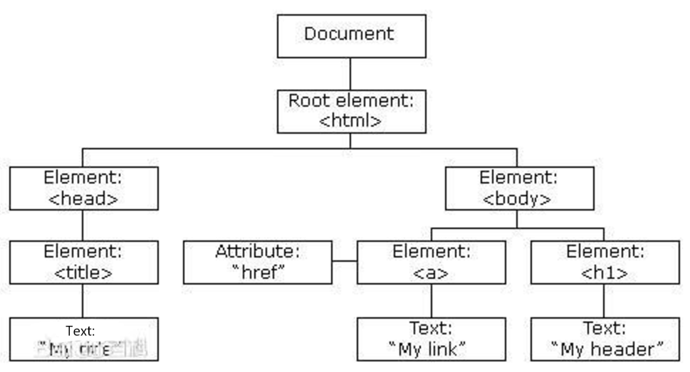
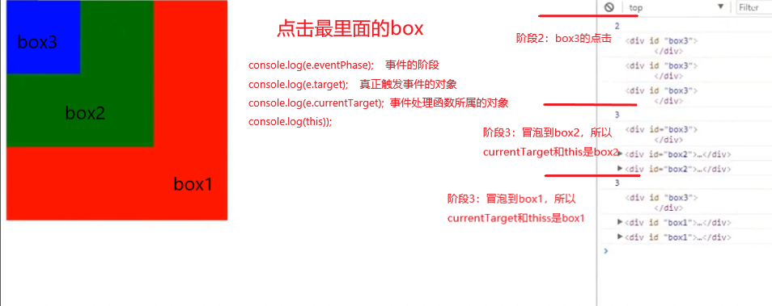
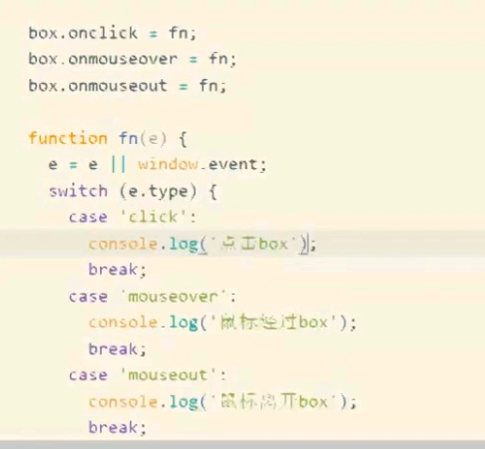
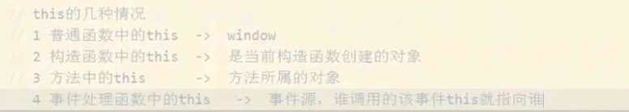
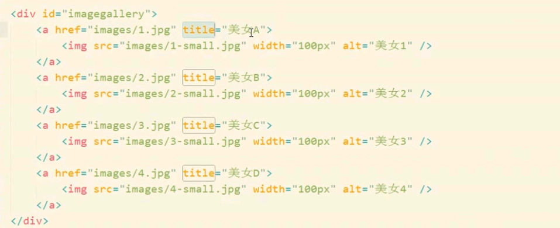
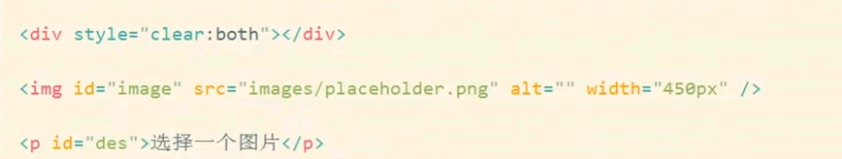
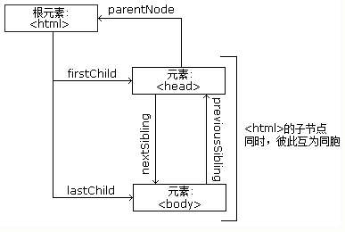
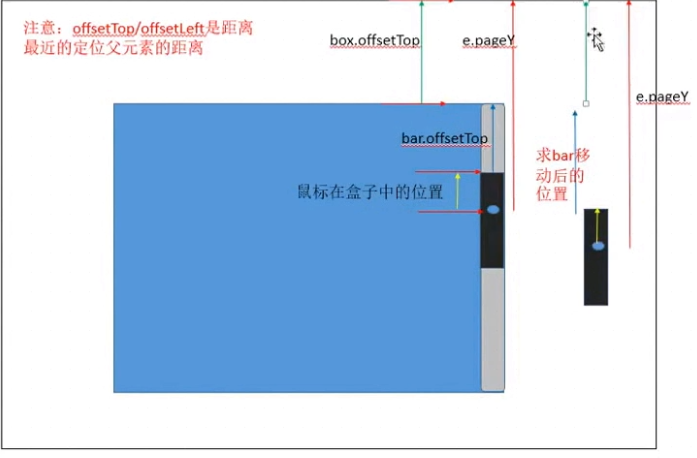

---
 学习目标:
  - 掌握API和Web API的概念
  - 掌握常见浏览器提供的API的调用方式
  - 能通过Web API开发常见的页面交互功能
  - 能够利用搜索引擎解决问题
typora-copy-images-to: media
---

# 一、Web API

## Web API介绍

### API的概念

API（Application Programming Interface,应用程序编程接口）是一些预先定义的函数，目的是提供应用程序与开发人员基于某软件或硬件得以访问一组例程的能力，而又无需访问源码，或理解内部工作机制的细节。

- 任何开发语言都有自己的API
- API的特征输入和输出(I/O)
  - var max =  Math.max(1, 2, 3);
- API的使用方法(console.log('adf'))

### Web  API的概念

浏览器提供的一套操作浏览器功能和页面元素的API(BOM和DOM)

此处的Web API特指浏览器提供的API(一组方法)，Web API在后面的课程中有其它含义


### 掌握常见浏览器提供的API的调用方式
[MDN-Web API](https://developer.mozilla.org/zh-CN/docs/Web/API)

### JavaScript的组成


#### (1)ECMAScript - JavaScript的核心 

定义了JavaScript 的语法规范。描述了该语言的语法和基本对象。

JavaScript的核心，描述了语言的基本语法和数据类型，ECMAScript是一套标准，定义了一种语言的标准与具体实现无关

#### (2)BOM - 浏览器对象模型

一套操作浏览器功能的API。描述了**与浏览器进行交互**的方法和接口。

通过BOM可以操作浏览器窗口，比如：弹出框、控制浏览器跳转、获取分辨率等 

#### (3)DOM - 文档对象模型

一套操作页面元素的API。描述了**处理网页内容**的方法和接口。

DOM可以把HTML看做是文档树，通过DOM提供的API可以对树上的节点进行操作

# 二、DOM

### DOM的概念 

文档对象模型（Document Object Model，简称DOM），是[W3C](https://baike.baidu.com/item/W3C)组织推荐的处理[可扩展标记语言](https://baike.baidu.com/item/%E5%8F%AF%E6%89%A9%E5%B1%95%E7%BD%AE%E6%A0%87%E8%AF%AD%E8%A8%80)的标准[编程接口](https://baike.baidu.com/item/%E7%BC%96%E7%A8%8B%E6%8E%A5%E5%8F%A3)。它是一种与平台和语言无关的[应用程序接口](https://baike.baidu.com/item/%E5%BA%94%E7%94%A8%E7%A8%8B%E5%BA%8F%E6%8E%A5%E5%8F%A3)(API),它可以动态地访问程序和脚本，更新其内容、结构和[www](https://baike.baidu.com/item/www/109924)文档的风格(目前  ，HTML和XML文档是通过说明部分定义的)。文档可以进一步被处理，处理的结果可以加入到当前的页面。[DOM](https://baike.baidu.com/item/DOM/50288)是一种基于树的[API](https://baike.baidu.com/item/API/10154)文档，它要求在处理过程中整个文档都表示在[存储器](https://baike.baidu.com/item/%E5%AD%98%E5%82%A8%E5%99%A8)中。

是HTML、XHTML的应用程序接口（API）

DOM又称为文档树模型



- 文档：一个网页可以称为文档
- 节点：网页中的所有内容都是节点（元素、属性、文本、注释等）
- 元素：网页中的标签
- 属性：标签的属性

### DOM经常进行的操作

- 获取元素
- 对元素进行操作(设置其属性或调用其方法)
- 动态创建元素
- 事件(什么时机做相应的操作)

## 一、获取页面元素

### 为什么要获取页面元素

例如：我们想要操作页面上的某部分(显示/隐藏，动画)，需要先获取到该部分对应的元素，才进行后续操作

### 1.根据id获取元素

getElementById() 方法可返回一个匹配特定ID的元素。

```javascript
var div = document.getElementById('div1');
console.log(div);         //如果页面上没有对应id，返回null

// 获取到的数据类型 HTMLDivElement，对象都是有类型的     console.log(div);    _proto_: HTMLDivElement
```

注意：由于id名具有唯一性，部分浏览器支持直接使用id名访问元素，但不是标准方式，不推荐使用。

(如果将<script>标签写在<body>前，还未往下获取到网页结构时，结果为null。因为文档执行顺序从上到下一行行执行。当执行到getElementById('div1')时，div还在下面未生成。返回值是null。所以一般<script>一般写在</body>前或者后

### 2.根据标签名获取元素

getElementsByTagName()方法 返回带有指定标签名的对象**集合**。    

注意：getElementsByTagName()获取到的集合是**动态集合**。如果网页中获取的元素动态增加了，那么集合会动态改变。

(如果将<script>标签写在<body>前，开始集合是空，但是由于是动态的。往下执行集合就会动态发生变化。） 

```javascript
var divs = document.getElementsByTagName('div');    //console.log(divs);  _proto_: HTMLCollection   集合
for (var i = 0; i < divs.length; i++) {
  var div = divs[i];         //每一个是元素    HTMLDivElement
  console.log(div);
} 

补充：
//getElementsByTagName()除了可以用document.来调用还可以通过前面找到的元素来调用。但是getElementById()只可以通过document.来调用
var container = document.getElementById('container');
var divs = container.getElementsByTagName('div');
```

### 3.根据name获取元素

getElementsByName()返回带有指定name属性的对象**集合**。

```javascript
var inputs = document.getElementsByName('hobby');
for (var i = 0; i < inputs.length; i++) {
  var input = inputs[i];
  console.log(input);
}
```

在不同浏览器工作方式不同，比如IE和Opera会找id和name是值的。会有歧义，所以不常用。

### 4.根据类名获取元素

getElementsByClassName()根据标签的class属性来获取元素，返回带有指定class属性的对象**集合**

```javascript
var mains = document.getElementsByClassName('main');
for (var i = 0; i < mains.length; i++) {
  var main = mains[i];
  console.log(main);
}
```

浏览器兼容性问题：IE9以后才支持

### 5.根据选择器获取元素

querySelector()根据选择器来查找元素。返回文档中匹配指定的选择器的**第一个元素**。

querySelectorAll()返回文档中匹配到指定的选择器的**所有元素**。

```javascript
var text = document.querySelector('#text');
console.log(text);

var boxes = document.querySelectorAll('.box');
for (var i = 0; i < boxes.length; i++) {
  var box = boxes[i];
  console.log(box);
}
```

IE8后支持，在做移动端页面就可以用这两个方法。没有兼容性问题都支持。在pc上有兼容性问题。


getElementById与querySelector的区别：

​        由于querySelector是按css规范来实现的，所以它传入的字符串中**第一个字符不能是数字**。

​	前三种getxxxByxxx获取的是动态集合，而querySelector获取的是**静态集合**。

​	简单的说就是，动态就是选出的元素会随文档改变，静态的不会，取出来之后就和文档的改变无关了

​	getElementById性能更好，而querySelector按照CSS选择器规范，当在多级查找时，更为方便。


- 总结

```
掌握
	getElementById()
	getElementsByTagName()
了解
	getElementsByName()
	getElementsByClassName()
	querySelector()
	querySelectorAll()
```

## 二、事件

事件：触发-响应机制

### 1.事件三要素

- **事件源**:触发(被)事件的元素 		比如btn
- **事件名称**: 比如click 点击事件
- **事件处理程序**:事件触发后要执行的代码(函数形式)

### 2.事件的基本使用

```javascript
var box = document.getElementById('box');
box.onclick = function() {                //事件名是click  注册事件：onclick 
  console.log('代码会在box被点击后执行');  
};
```

### 案例
- 点击按钮弹出提示框
- 点击按钮切换图片

```javascript
<input type="button" value="点击" id="btn">


  //1.获取元素
var btn = document.getEelmentById('btn');          
var pic = document.getElementById('pic');
var flag = 1;   //添加标记，flag = 1对应a.jpg；flag = 2对应b.jpg
//2.给按钮注册事件
btn.onclick = function () {	
  //3.切换图片
  	if (flag === 1) {						
    	pic.src = "images/a.jpg";       //获取到的DOM元素与对应的HTML标签具有相同的属性，通过属性设置
    	flag = 2;
  	} else if (flag === 2) {
     	pic.src = "images/b.jpg"                   
    	flag = 1;  
  	}
}
```

## 三、事件详解及应用

### 1.注册/移除事件的三种方式

```javascript
var box = document.getElementById('box');
 //第一种
box.onclick = function () {          
  console.log('点击后执行');
};
box.onclick = null;

//第二种 
box.addEventListener('click', eventCode, false);     //添加   第三个参数flase：事件冒泡 	true：事件捕获
box.removeEventListener('click', eventCode, false);   		//移除

//第三种
box.attachEvent('onclick', eventCode);         
box.detachEvent('onclick', eventCode);

function eventCode() {
  console.log('点击后执行');
}
```


- 第一种注册/移除事件   btn.onclick = function(){}

同个事件目标的多个事件的注册。比如我给同一按钮用下面的方式注册点击事件，两个不同的事件，事件1和事件2。运行只会有事件2。相当把函数给事件赋值，**第二次会把第一次覆盖掉**。
```javascript
<script>
  	var btn = document.getElementById('btn');
 	btn.onclick = function () {      //第一种注册事件的方式
      	alert("user1");
 	}
    btn.onclick = function () {
      	alert("user2");
 	}
    
    //移除事件
    btn.onlick = null;
</script> 
```

​	解决这问题就用到了新的注册事件的方式。

- **addEventListener() / removeEventListener()**

  第二种注册事件方式：

  ​	**addEventListener();**

EventTarget.addEventListener() 方法将指定的监听器注册到EventTarget(事件目标)上，当该对象触发指定的事件时，指定的回调函数就会被执行。事件目标可以是一个文档上的元素Element、Document和Window或者任何其他支持事件的对象 (比如XMLHttpRequest)。

addEventListener()的工作原理是将实现EventListener的函数或对象添加到调用它的EventTarget(事件目标)上的**指定事件类型的事件侦听器列表中**。

基本语法：

```javascript
//type：表示监听事件类型的字符串（名称，比如click、mouseover)
//listener：事件处理函数 function
target.addEventListener(type, listener[, options]);       //前两必须，后面可选
target.addEventListener(type, listener[, useCapture]);
target.addEventListener(type, listener[, useCapture, wantsUntrusted  ]);  // Gecko/Mozilla only

//多次注册事件
var btn = document.getElementById('btn');
btn.addEventListener('click', function () {
  	alert("hello1");
})
btn.addEventListener('click', function () {
  	alert("hello2");
})

//移除addEventListener()注册的事件
移除事件，就不能在注册事件时使用匿名函数，否则移除时访问不到匿名函数，
/*btn.addEventListener('click', function () {
  	alert("hello2");
  	btn.removeEventListener('click', eventCode);     //evenCode写不了注册时的匿名函数
})
应该如下写*/

function btnClick () {
  	alert("hello2");
  	//移除事件：让点了一次后就不再执行
  	btn.removeEventListener('click', btnClick);   //移除的事件名称，移除的事件处理函数
}
btn.addEventListener('click', btnClick);
```

​	IE8以前不支持

其余详细可查看MDN


- **attachEvent() / detachEvent()**

  addEventListener();虽然解决了同个事件目标的多个事件的注册，但是也存在兼容性问题：IE9后才支持。

  IE9前可以通过attachEvent()代替。IE6-10支持，IE11后不支持（非标准的，IE特有的老方法）

  火狐、谷歌都不支持。

  ```javascript
  基本语法：
  //监听的事件名以on前置    
  attached = target.attachEvent(evenNameWithOn, callback)

  //第一个参数，事件名要加on
  btn.attachEvent('onclick', function () {
    	alert("hello");
  })

  //移除attachEvent()注册的事件
  function btnClick () {
    	alert("hello2");
    	//移除事件：让点了一次后就不再执行
    	btn.detachEvent('click', btnClick);   //移除的事件名称，移除的事件处理函数
  }
  btn.attachEvent('click', btnClick);
  ```


### 2.兼容代码

判断存不存在方法。

```javascript
1.添加事件兼容处理
function addEventListener(element, type, fn) {   //type:elementName(不带on)       fn：function
	if (element.addEventListener) {
		element.addEventListener(type, fn, false);    //第三个参数不写默认false
  	} else if (element.attachEvent){
    	element.attachEvent('on' + type,fn);
  	} else {    
    	element['on' + type] = fn;    //其实就是element.onXXX 另一种中括号而已
  	}
}

2.移除事件兼容处理
function removeEventListener(element, type, fn) {
  	if (element.removeEventListener) {
    	element.removeEventListener(type, fn, false);
  	} else if (element.detachEvent) {
    	element.detachEvent('on' + type, fn);
  	} else {
    	element['on'+type] = null;
  	}
}
```
### 3.事件的三个阶段

​	冒泡：从最里往外冒。

​	**事件冒泡**：**最里开始往外执行**。

​		当addEventListener()的第三个参数为false时，就是事件冒泡。

​		当addEventListener()的第三个参数为true时，就是事件捕获。（**从外到里**）

```javascript
<div id="box1">
  	<div id="box2">
  		<div id="box3"></div>     // 三个盒子重叠，最里面的最小
  	</div>
</div>         
        
var box1 = document.getElementById('box1');
var box2 = document.getElementById('box2');
var box3 = document.getElementById('box3');

var arr = [box1, box2, box3];
for (var i = 0; i< arr.length; i++) {
  	arr[i].addEventListener('click', function() {
      	console.log(this.id);
  	}，false)；
}

点最里面的最小的box3
1.捕获阶段:        先执行事件捕获，从外往里 box1 box2 box3
2.当前目标阶段:    执行box3的点击事件
3.冒泡阶段:        执行完box3，从里往外依次冒泡 box3 box2 box1
```

**事件的三个阶段:**

1. **捕获阶段**：从外往里

2. **当前目标阶段**：执行当前点击的元素

3. **冒泡阶段**：从里往外

   ​	事件对象.eventPhase属性可以查看事件触发时所处的阶段

注意：

​	box.onclick和box.attachEvent都不可以设置是  冒泡或捕获 ，**只有事件冒泡**。因为attachEvent()是IE的老版本中支持的，只有两个参数，没有第三个参数。

​	这两种注册的事件是事件冒泡的形式。

### 4.事件委托

当我要给ul里的每个li注册点击事件，由于有事件冒泡，不用给每个子元素注册。因为点击li时，点击事件可以传递到父元素来。本来li做，交给ul去做来实现。

**事件委托**：本来该它做的，交给它的上一级去做。 	 原理：事件冒泡

见下例:

```javascript
var ul = document.getElementById('ul');
ul.onclick = function(e) {   //e：事件参数（对象） 当事件发生时，能获取一些和事件相关的数据
  	//获取到当前点击的li   e.target：真正触发事件的对象     console.log(e.target)  结果是点击的<li></li>
  	e.target.style.backgroundColor = 'red';   //让当前获取到的li高亮显示
}

补充：点击清除其他的样式，在onclick里设置高亮前添加即可
var li = ul.children;    
for( var i = 0; i < li.length; i++) {
	li[i].style.backgroundColor = '';
}
```

e：事件对象    当事件发生时，能获取一些和事件相关的数据

**e.target**：真正触发事件的对象           console.log(e.target)      结果是点击的<li></li>

### 5.事件对象的属性和方法

通过事件对象，可以获取到事件发生时，和事件相关的一些数据。

DOM标准中，给事件处理函数一个参数：e。这个e就是事件对象。（在老版本的IE中获取事件对象，是window.event）

```javascript
var btn = document.getElementById('btn');
btn.onclick = function(e) {   //e：事件对象  当事件发生时，能获取一些和事件相关的数据
	e = e || window.event;      	//处理事件对象的浏览器兼容性。参数e传过来内容就是e，如果参数e是undefined										或者null(即不支持） 就是window.event;
  
  	console.log(e.eventPhase);    //事件的阶段：数值1 、2、3    即捕获阶段、处于目标阶段、冒泡阶段
  	console.log(e.target);      //真正触发事件的对象 兼容：老版本是srcElement
  	console.log(e.currentTarget);      //事件处理函数所属的对象 其实就是事件处理函数中的this
  	console.log(e.type);      //获取事件类型，可通过e.type判断触发的到底是哪个事件
  	console.log（e.clientX/clientY);  //获取鼠标在浏览器的可视区域的坐标。
    console.log（e.pageX/pageY);  //获取鼠标在当前页面的位置（整个文档，包括滚动条的距离）。页面位置。
}
```

一个例子：




**各属性：**

- e.eventPhase	   事件的阶段：数值1 、2、3    即捕获阶段、处于目标阶段、冒泡阶段
- e.target || e.srcElement        用于获取触发事件的元素。 真正触发事件的对象    **兼容：老版本是srcElement**
- e.currentTarget         事件处理函数所属的对象 其实就是事件处理函数中的this


- e.type         获取事件类型，可通过e.type判断触发的到底是哪个事件

  

  ​

  ​

  ​

- e.clientX/clientY     获取鼠标在浏览器的可视区域的坐标。所有浏览器都支持，窗口位置。

- e.pageX/pageY       获取鼠标在当前页面的位置（整个文档，包括滚动条的距离）。页面位置。**IE8以前不支持**

  ​	兼容处理：pageY = clientY + 页面滚动出去的距离

  ​		页面滚动出去的距离：**document.body.scrollLeft/scrollTop**            谷歌中

  ​						      **document.documentElement.scrollLeft/scrollTop**  有些浏览器使用这个，谷歌是0

  ​	documentElement：文档的根元素（整个html文档） 对应的html标签。  而body对应body标签

  ```javascript
  //滚动出去的距离兼容处理函数
  function getScroll() {
    	scrollLeft = document.body.scrollLeft || document.documentElement.scrollLeft;
  	scrollTop = document.body.scrollTop || document.documentElement.scrollTop;
    	return {         //返回一个对象
        	scrollLeft: scrollLeft,
        	scrollTop: scrollTop
    	}
  }
  //pageX/pageY兼容处理
  function getPage(e) {
    	var pageX = e.pageX || e.clientX + getScroll.scrollLeft;   //加上getScroll函数返回的scrollLeft属性
    	var pageY = e.pageY || e.clientY + getScroll.scrollTop;
    	return {
        	pageX: pageX,
        	pageY: pageY
    	}
  }

  //注意在注册事件 以及在注册事件里调用以上兼容处理函数时，记得不要忘了写事件对象e， 比如下方案例3
  ```

**方法：**

- e.preventDefault();        取消默认行为(标准DOM方法)                  IE老版本 e.returnValue=false;  (非标准，谷歌也支持)

  ​	补充：取消默认行为以前还有  return false;

- e.stopPropagation();      取消事件冒泡 (标准DOM方法)                IE老版本 e.cancelBubble = true;(非标准，谷歌也支持)

   					停止事件传播：点击box3，父级box2、box1不执行

#### 案例

1. 跟着鼠标飞的天使

```javascript
//鼠标移动时，鼠标坐标就是图片坐标
#pic {       
   position: absolute; 			/*图片脱离文档流*/
}

var pic = document.getElementById('pic');   //onmousemove前获取元素，如果写在事件中，每次移动都要找，非常慢
document.onmousemove = function(e) {
  	e = e || window.event;
  	pic.style.left = e.pageX -10 + 'px';       //记得单位 ,-10让图片离鼠标更近
  	pic.style.top = e.pageY -10 + 'px';      
}
//兼容处理见上方
```


2. 鼠标点哪图片飞到哪里

3. 获取鼠标在div内的坐标

   ```javascript
   //只要获得鼠标距离屏幕的距离和div距离屏幕的距离即可
   var box = document.getElementById('box');
   box.onclick = function(e) {        //注册事件别忘了e
     	e = e || window.event;
     	//获取鼠标在盒子中的位置 = 鼠标的坐标 - 盒子的坐标
     	//var x = e.pageX 调用别忘了传事件对象e
     	var x = getPage(e).pageX - this.offsetLeft;        // this.offsetLeft 盒子在页面的x距离
     	var y = getPage(e).pageY - this.offsetTop;		
   }	
   ```

### 6.常用的鼠标和键盘事件

鼠标事件：

- onmouseup		鼠标按键放开时触发
- onmousedown     鼠标按键按下触发
- onmousemove     鼠标移动触发

键盘事件：

- onkeyup		 键盘按键弹起触发

- onkeydown    键盘按键按下触发

  - 区别：keydown时，所按的键还未落入文本框。

    ​	    keyup键盘弹起时，已经落入文本框。

案例：文本框只可以输入数字（加一个删除键）

```javascript
<input id="txt" type="text">
<script>
	var txt = document.getElementById('txt');
	txt.onkeydown = function(e) {
      	//判断用户当前输入是否是数字
      	e = e || window.event;
      	//e.keyCode：键盘码   其实对应ASCII码 键盘上是数字对应48-57  但是此时数字键之外包括删除、刷新键都不行了
     	if ((e.keyCode <48 || e.keyCode >57)&&e.keyCode !==8) { //非数字，不想落入文本框(删除可以，code是8)
          	//取消默认行为return false;也行 但要注意此行有后续代码时，不能用return false; 否则后续代码不执行
          	e.preventDefault(); 
     	}
	}
```


## 四、属性操作

### 1.非表单元素的属性

默认属性非自定义的可以直接通过点语法设置属性值

**href**、**title**、**id**、**src**、**className**

```javascript
<a href="https://www.baidu.com" title="我是百度" id="link">百度</a>

  
//获取DOM对象的属性值  
var link = document.getElementById('link');
console.log(link.id);       //  link
console.log(link.href);     //  https://www.baidu.com
console.log(link.title);    //  我是百度

var pic = document.getElementById('pic');
console.log(pic.id);     // pic
console.log(pic.src);   //返回本地磁盘的绝对路径
console.log(pic.alt);   //我是图片

//设置DOM对象的属性
link.href = 'http://www.google.cn/'
link.title = 'google';
```

DOM对象的属性（元素）一般情况对应标签的属性。比如class在DOM中是className。（因为class在js中是关键字，不可作为变量或者属性的名字。）

#### 案例

​	1.点击按钮显示隐藏div

```javascript
<style type="text/css">
		#box {
			background-color: red;
			width: 200px;
			height: 200px;
		}
		.show {
			display: block;
		}
		.hidden {
			display: none;
		}
</style>


<input type="button" value="隐藏" id="btn">
<div id="box" >	
      
</div>

<script type="text/javascript">
	var btn = document.getElementById('btn');
	var isShow = true;
	btn.onclick = function () {
		var box = document.getElementById('box');
		if (isShow) {
			box.className = 'hidden';					//className对应class
			btn.value = '显示';    //this.value = '显示';   等效
			isShow = false;
		} else {
			box.className = 'show';
			btn.value = '隐藏';    //this.value = '显示';   等效
			isShow = true;
		}
		
	} 
</script>
```

事件处理函数中 this指向谁？



​	2.美女相册


​	

点击上面的小图片，下方大图切换成点击的。1.jpg是原图，1-small.jpg是小图片。







```javascript
//1.获取所有的a标签
<script>
  var imagegallery = document.getElementById('imagegallery');
  var links = imagegallery.getElementsByTagName('a');
  //2.给所有的a标签注册事件
  for (var i = 0; i < links.length; i++) {
      var link = links[i];   //所有a标签对应的元素
      link.onclick = function () {
          var image = document.getElementById('image');
          image.src = this.href;  //点击时，循环已结束，link是第四个图片links[4]，所以不能写link.href
          var des = document.getElementById('des');  
          des.innerText = this.title;
          return false;     //取消a标签的自动跳转，onclick事件里return false即可。
      }
  }
</script>
```

### 2.innerHTML和innerText详解

- innerHTML和innerText

  获得或设置开始标签和结束标签之间的内容。 

```javascript
//1.设置内容：innerHTML会生成为标签，innerText不会生成为标签
<div id="box1"></div>
<div id="box2"></div>
	<script type="text/javascript">
		var box1 = document.getElementById('box1');
		var box2 = document.getElementById('box2');
		box1.innerHTML = '我是文本<p>我会生成为标签</p>';    
		console.log(box1.innerHTML);        //我是文本 (换行，因为生成了p标签）    我会生成为标签
		box2.innerText = '我是文本<p>我不会生成为标签</p>';  
		console.log(box2.innerText);     //我是文本<p>我不会生成为标签</p>
	</script>
//浏览器上显示由于innerText不会生成标签，标签语句成了内容。所以效果和console.log一样
    
//2.获取内容：innerHTML会把标签也获取到，innerText会把标签过滤掉。
<div id="box1">我是文本<p>我会生成为标签</p></div>
<div id="box2">我是文本<p>我不会生成为标签</p></div> 
    <script type="text/javascript">
		var box1 = document.getElementById('box1');
		var box2 = document.getElementById('box2');
		console.log(box1.innerHTML);  //我是文本<p>我会生成为标签</p>
		console.log(box2.innerText);  //我是文本   (换行）    我会生成为标签
	</script>
//浏览器效果一致，内容标签一致，结构一致
```
- HTML转义符

```
"		&quot;
'		&apos;
&		&amp;
<		&lt;   // less than  小于
>		&gt;   // greater than  大于
空格	   &nbsp;
©		&copy;
```

- innerHTML和innerText的区别


  **1.设置内容：innerHTML会生成标签，innerText不会生成标签。**

  **2.获取内容：innerHTML会把标签也获取到，innerText会把标签过滤掉。innerHTML会把html文档内容原封不动获取到（包括空白、换行)，而innerText会把内容前后的换行和空白都去掉（指的是html文档中的而不是标签产生的效果）。**    

- innerText的兼容性处理

  获取元素的内容：**innerText**和**textContent** 这两者主要是**兼容性的区别**。

  谷歌、新版火狐、IE9及以上：两个都支持：

  旧版火狐：只支持textContent，旧版IE只支持innerText。

  ​

  判断当前浏览器是否支持元素的innerText属性，支持使用element.innerText获取内容，不支持使用element.textContent获取内容。

  typeof element        属性不存在时是undefined，存在会返回属性的类型。

  ```javascript	
  function getInnerText(element) {
    	if (typeof element.innerText === 'String') {   //innnerText的类型是String
        	return element.innerText;    
    	} else {
        	return element.textContent;
    	}
  }
  ```

  不过将来不用自己去做兼容的大量处理，了解实现过程即可。

- innerText(textContent)与innerHTML的选择

  获取内容时，想带标签标签就用innerHTML，不带就前者。

  设置内容时，生成标签用innerHTML，不生成标签用前者。当设置不含标签的内容时，应该用innerText，效率高。因	为innerHTML会解析字符串中的标签。

### 3.表单元素属性

- value 用于大部分表单元素的内容获取(option除外)
- type 可以获取input标签的类型(输入框或复选框等)
- disabled 禁用属性     true/false
- checked 复选框选中属性
- selected 下拉菜单选中属性

#### 案例

- 点击按钮禁用文本框            text.disabled = true;


- 给文本框赋值，获取文本框的值

  大量拼接字符串会导致有性能问题，而数组不会开辟新的空间，是在当前的内存后追加每一项元素，要快得多，从而结束

- 检测用户名是否是3-6位，密码是否是6-8位，如果不满足要求高亮显示文本框

  ```javascript
  <!DOCTYPE html>
  <html lang="en">
  <head>
    <meta charset="UTF-8">
    <title>Document</title>
    <style>
      .bg {
        background-color: yellow;
      }
    </style>
  </head>
  <body>
      <input type="text" id="txtUserName"> <br>
      <input type="password" id="txtUserPassword"> <br>
      <input type="button" value=" 登 录 " id="btnLogin">
      <script>
        // 检测用户名是否是3-6位，密码是否是6-8位，如果不满足要求高亮显示文本框
        	var btnLogin = document.getElementById('btnLogin');

        	btnLogin.onclick = function () {
          	// 检测用户名是否是3-6位，密码是否是6-8位
          	var txtUserName = document.getElementById('txtUserName');
          	var txtUserPassword = document.getElementById('txtUserPassword');

          	//检测用户名是否是3-6位
          	if (txtUserName.value.length < 3 || txtUserName.value.length > 6) {
            		txtUserName.className = 'bg';
            		return;
          	} else {
            		txtUserName.className = '';
          	}

          	// 密码是否是6-8位
          	if (txtUserPassword.value.length < 6 || txtUserPassword.value.length > 8) {
            		txtUserPassword.className = 'bg';
            		return;
          	} else {
            		txtUserPassword.className = '';
          	}

          	// 
          	console.log('执行登录');
        	}
      </script>
  </body>
  </html>

  ```

  ​

- 设置下拉框中的选中项

- 搜索文本框

- 全选反选

  细看全选反选案例

### 4.自定义属性操作

已有的属性DOM封装了可以点出来。**自己定义的属性，点语法不可以获取到**。

- getAttribute() 获取标签行内属性

- setAttribute() 设置标签行内属性

  - 除了setAttribute()外，还可以通过classList.add()来添加属性

- removeAttribute() 移除标签行内属性

  - 通过classList.remove()来移除属性。另外判断元素有无属性。可以通过classList.contains('属性名')

- 与element.属性的区别: 上述三个方法用于获取任意的行内属性。

  ```javascript
  var box = document.getElementById('box');
  console.log(box.age);    //undefined   自定义的属性
  box.getAttribute('age');
  box.setAttribute('sex','meal');       //设置的属性名 以及属性值
  box.removeAttribute("name")； 
  ```

  已有属性也可以通过以上方法操作。

### 5.样式操作

1. 使用类样式    .className
2. 使用style       .style.width

```javascript
// 根据id获取元素 封装成函数
function my$(id) {
	return document.getElementById(id);
}

1.使用类样式(自己带有的属性)
my$('btn').onclick = function () {
	my$('txt').className = 'cls';
  	my$('txt').className = 'cls';
}

2.使用style
my$('btn').onclick = function () {
    // 样式属性  background-color
    // DOM中style的属性  backgroundColor
    var box = my$('box');
    box.style.width = '200px';
    box.style.height = '200px';
    box.style.backgroundColor = 'red';
}
```

当设置多个样式属性的时候使用类样式方便，当设置样式属性比较少的时候使用style比较方便。

- 使用style方式设置的样式显示在标签行内
```javascript
var box = document.getElementById('box');
box.style.width = '100px';
box.style.height = '100px';
box.style.backgroundColor = 'red';
```

- 注意

  通过样式属性设置宽高、位置的属性类型是字符串，需要加上px

### 6.类名操作

- 修改标签的className属性相当于直接修改标签的类名
```javascript
var box = document.getElementById('box');
box.className = 'show';
```

### 案例

1. 开关灯

```javascript
function my$(id) {
	return document.getElementById(id);
}
// 是否开灯  false 关灯状态  true 开灯状态
var isOpen = true;
my$('btn').onclick = function () {
	if (isOpen) {
     	document.body.style.backgroundColor = 'black';
        this.value = '开灯';
        isOpen = false;
     } else {
        document.body.style.backgroundColor = 'white';
        this.value = '关灯';
        isOpen = true;
     }
}
```

2. 点击按钮改变div的背景颜色
3. 图片切换二维码案例

```javascript
// 当鼠标移入  onmouseover
// 当鼠标移出  onmouseout
var nodeSmall = my$('node_small');
nodeSmall.onmouseover = function () {
	// my$('er').className = 'erweima show';
	my$('er').className = my$('er').className.replace('hide', 'show');  //class设置了CSS样式display
}
nodeSmall.onmouseout = function () {
	// my$('er').className = 'erweima hide';
	my$('er').className = my$('er').className.replace('show', 'hide');
}
```

4. 当前输入的文本框高亮显示

```javascript
var inputs = document.getElementsByTagName('input');
for (var i = 0; i < inputs.length; i++) {
	var input = inputs[i];
     if (input.type !== 'text') {   // 判断input是否是文本框
          continue;
     } 
     input.onfocus = function () {   // 让当前正在输入的文本框 高亮显示
     	for (var i = 0; i < inputs.length; i++) {   // 让所有的文本框去掉高亮的效果
        	var input = inputs[i];
        	if (input.type !== 'text') {
            	continue;
             }
             input.style.backgroundColor = '';   // 去除所有文本框高亮显示
         }      
        // 当前文本框高亮显示
        this.style.backgroundColor = 'lightgray';
     }
 }
```

5. 点击按钮改变div的大小和位置
6. 列表隔行变色、高亮显示
7. tab选项卡切换

6、7较复杂，详细见 **02-WebAPI02和03** 代码

总结：

    // DOM文档对象模拟
    //
    // 常见的DOM操作
    //    获取元素   getElementById()  getElementsByTagName()
    //    给元素注册事件    onclick   onmouseover  onmouseout  onfocus  onblur
    //    操作元素的属性
    //        非表单元素   href  title  src alt等
    //        表单元素     type  value  checked  disabled  selected
    //        公共属性     id   className style
    //        样式操作     className  style
    //        自定义属性   setAttribute()   getAttribute()   removeAttribute()
## 五、创建元素的三种方式

动态创建元素，如搜索相关、购物车等等

### 1.document.write()

```javascript
document.write('新设置的内容<p>标签也可以生成</p>');
```

当点击按钮时，使用document.write()输出内容会把之前网页的内容都覆盖掉。所以有局限性，**只能在页面加载的时候去输出，不能在事件中去使用，不然会覆盖。**

几乎不用，有一个应用例子是网页的客服在线帮助聊天是第三方提供的花钱购买的，注册后提供的代码。里面涉及的js就有document.write()。

### 2.innerHTML

详细可见   **四、2.innerHTML和innerText详解**

```javascript
var box = document.getElementById('box');
box.innerHTML = '新内容<p>新标签</p>';
```

1.设置内容：innerHTML会生成为标签。

2.获取内容：innerHTML会把标签也获取到。innerHTML会把html文档内容原封不动获取到（包括空白、换行)，

```javascript
//动态生成一个列表
//数据从服务器端获得，现在暂时模拟一下数据
var datas = ["ruby", "weiss", "blake", "yang"];
var btn = document.getElementById("btn");
btn.onclick = function () {
  	var div1 = document.getElementById("div1");
  	div1.innerHTML = '<ul>';       //效率问题，每次设置innerHTML都会（修改DOM树）重新绘制，速度慢
  	for (var i = 0; i <datas.length; i++) {    //遍历
      	var data = datas[i];
      	div1.innerHTML += '<li>' + data + '</li>';         //拼接字符串
  	}
  	div1.innerHTML += '</ul>';
}
//效率问题，每次设置innerHTML都会（修改DOM树）重新绘制，速度慢

优化1.先定义一个变量，先把字符串拼好，再一次性赋给div1.innerHTML
btn.onclick = function () {
  	var div1 = document.getElementById("div1");
  	var html = '<ul>';       //从此往下整段代码先把字符串拼接好给变量      字符串不可变，每次设置都重新开辟内存
  	for (var i = 0; i <datas.length; i++) {    
      	var data = datas[i];
      	html += '<li>' + data + '</li>';         
  	}
  	html += '</ul>';
  	div1.innerHTML = html;       //重新绘制1次
}
//由于字符串不可变，每次设置都需要重新开辟内存，耗费时间，拼接字符串时也是。当大量时就很明显

优化2. 使用数组替代字符串拼接
var datas = ["ruby", "weiss", "blake", "yang"];
var btn = document.getElementById("btn");
btn.onclick = function () {
  	var div1 = document.getElementById("div1");
  	var arr = [];
  	arr.push('<ul>');       
  	for (var i = 0; i <datas.length; i++) {    
      	var data = datas[i];
      	arr.push('<li>' + data + '</li>');         
  	}
  	arr.push('</ul>');
  	div1.innerHTML = arr.join('');       //join方法将数组转换成字符串
}
```

### 3.document.createElement()

document.createElement()是动态创建了一个**对象**，可以设置属性

```javascript
//在内存中创建对象，还未放到DOM结构中
var div = document.createElement('div');    //生成了<div></div>     
//添加进DOM树中
document.body.appendChild(div); 
//document.createElement()是动态创建了一个对象，可以设置属性
div.innerText = 'hello';
div.style.backgroundColor = 'red';
```

深入理解见下方案例

### 4.性能问题

创建简单的，比如就一个p标签就用innerHTML。如果复杂的或者创建完后，需要注册事件，推荐createElement()。

- innerHTML方法由于会对字符串进行解析，需要避免在循环内多次使用。
- 可以借助字符串或数组的方式进行替换，再设置给innerHTML
- 优化后与document.createElement性能相近


### 5.案例(两个复杂)

- 动态创建列表，高亮显示

  ```javascript
  <input type="button" id="btn" value="按钮">
  <div id="div1"></div>

  <script type="text/javascript">
  //动态生成一个列表
  var datas = ["ruby", "weiss", "blake", "yang"];
  var btn = document.getElementById("btn");
  btn.onclick = function () {
    	var ul1 = document.createElement("ul");   //点击按钮，动态创建ul
    	var div1 = document.getElementById("div1");
    	div1.appendChild(ul1);		//将ul放在DOM树上，并且重新绘制 （ul添加到div下）
    	for (var i = 0; i <datas.length; i++) {    
        	var data = datas[i];
        	var li1 = document.createElement('li');      //内存中动态创建li  
        	ul1.appendChild(li1);     //把li添加到DOM树，并且会重新绘制   （li添加到ul下)
        	setInnerText(li1,data);   //设置li中的显示内容         li.innerText = data;
         	// 给li注册事件
        	li1.onmouseover = liMouseOver;   //就像上面的onclick 右边是一个事件函数，不加括号，因为括号是调用
        	li1.onmouseout = liMouseOut;   //不是函数调用，而是函数赋给onmouseout事件
    	}
  }

  //处理innerText和contentText的兼容性问题
  function setInnerText(element,content) {
    	if (typeof element.innerText === 'String') {   //innnerText的类型是String
        	element.innerText = content;    
    	} else {
        	element.textContent = content;
    	}
  }
  //鼠标经过高亮显示
  function liMouseOver() {
    	this.style.backgroundColor = 'red';
  }
  //鼠标离开取消
  function liMouseOut() {
    	this.style.backgroundColor = '';
  }  
  </script>
  ```

  ​	谷歌、新版火狐、IE9及以上：两个都支持：

  ​	旧版火狐：只支持textContent，旧版IE只支持innerText。

- 根据数据动态创建表格

  ```javascript
  <div id="box"></div>

  //自己封装的获取元素方法
  function my$(id) {  
    return document.getElementById(id);
  }
  //数据是服务器端给的，发生变化。所以动态创建，不能写死
  var datas = [                                        //数组，模拟数据
        {name: 'zs', subject: '语文', score: 90},
        {name: 'ls', subject: '数学', score: 80},
        {name: 'ww', subject: '英语', score: 99},
        {name: 'zl', subject: '英语', score: 100},
        {name: 'xs', subject: '英语', score: 60},
        {name: 'dc', subject: '英语', score: 70}
  ];

  // 表头数据
      var headDatas = ['姓名', '科目', '成绩', '操作'];
  //1.创建table元素 
  var table = document.createElement('table'); 
  my$('box').appendChild(table);
  table.border = '1px';                              //直接设置table元素的属性而不是样式style
  table.width = '400px';
   //2.创建表头thead 
  var thead = document.createElement('thead');
  table.appendChild(thead);

  var tr = document.createElement('tr'); //创建tr
  thead.appenChild(tr);
  tr.style.height = '40px';                             //设置tr的样式属性 thead 高40px 背景浅灰色
  tr.style.backgroundColor = 'lightgray';
   
  var th = document.createElement('th');    //创建th
  tr.appenChild(th);
  // 遍历头部数据，创建th
  for (var i = 0; i < headDatas.length; i++) {
  	var th = document.createElement('th');
       tr.appendChild(th);
       // th.innerText
       setInnerText(th, headDatas[i]);   //设置th中的显示内容
  }
  // 3 创建数据行
  var tbody = document.createElement('tbody');
  table.appendChild(tbody);
  tbody.style.textAlign = 'center';
  for (var i = 0; i < datas.length; i++) {          //创建行tr  循环，每次一行 每次一个学生
  	// 一个学生的成绩 {name: 'zl', subject: '英语', score: 100},
  	var data = datas[i];
  	tr = document.createElement('tr');       //tr前面已经声明过 ，需要时重新创建一个即可
  	tbody.appendChild(tr);

       // 遍历对象,拿到对象中每个属性的值   （解决代码重复)
  	for (var key in data) {          
       	var td = document.createElement('td');
       	tr.appendChild(td);
        	setInnerText(td, data[key]);      //每次将那个学生各属性内容添加
        }
        // 生成删除对应的列
  	td = document.createElement('td');
  	tr.appendChild(td);
       // 删除的超链接
       var link = document.createElement('a');
       td.appendChild(link);
       link.href = 'javascript:void(0)';
       setInnerText(link, '删除');      //link内容是删除
    
       link.onclick = linkDelete;
  }
  function linkDelete() {
        // removeChild()
        // 获取父元素
        // 
        // 获取要删除的行
  	var tr = this.parentNode.parentNode;
  	tbody.removeChild(tr);
       return false;
  }
  ```

## 六、节点操作

元素节点、属性节点、文本节点、注释节点...（共12种）

### 1.Node节点的属性

- nodeType  节点的类型
  - 1 元素节点
  - 2 属性节点
  - 3 文本节点 
- nodeName  节点的名称(标签名称)
- nodeValue  节点值
  - 元素节点的nodeValue始终是null


```javascript
<span id="spanId">11222</span>
<script>
  	//1.标签节点
	var span1 = document.getElementById("spanId");
	alert(span1.nodeType);		//1
	alert(span1.nodeName);		//SPAN		大写标签名
	alert(span1.nodeValue);		//null		null：元素节点的nodeValue始终是null
	//2.属性节点
	var id1 = span1.getAttributeNode("id");
	alert(id1.nodeType);		//2 
	alert(id1.nodeName);		//id		属性名
	alert(id1.nodeValue);		//spanId	属性值  
	//3.文本节点
	var text1 = span1.firstChild;
	alert(text1.nodeType);		//3
	alert(text1.nodeName);		//#text		#text
	alert(text1.nodeValue);		//11222		文本内容 
	...
```


### 2.模拟文档树结构


```javascript
function Node(option) {
  //第一个运算数转换为布尔类型是true，直接返回第一个运算数。如果第一个转换为布尔类型是fasle，返回第二个运算数、
  //比的if{}esle{}简化的三目运算符更简化
  this.id = option.id || '';    
  this.nodeName = option.nodeName || '';
  this.nodeValue = option.nodeValue || '';
  this.nodeType = 1;
  this.children = option.children || [];
}

var doc = new Node({       // 创建html节点
  nodeName: 'html'
});
var head = new Node({    // 创建head节点
  nodeName: 'head'
});
var body = new Node({    // 创建body节点
  nodeName: 'body'
})
doc.children.push(head);   // 设置html中的子节点 head
doc.children.push(body);   // 设置html中的子节点 body

var div = new Node({
  nodeName: 'div',
  nodeValue: 'haha',
});

var p = new Node({
  nodeName: 'p',
  nodeValue: '段落'
}) 
body.children.push(div);    // 设置body中的子节点 div
body.children.push(p);      // 设置html中的子节点 p

function getChildren(ele) {
  for(var i = 0; i < ele.children.length; i++) {
    var child = ele.children[i];
    console.log(child.nodeName);
    getChildren(child);
  }
}
getChildren(doc);
```

### 3.节点层级以及方法

元素节点、属性节点、文本节点、注释节点....（文本属性还有例如换行节点）

- 节点层级


 

1. 父节点：**parentNode**

2. 子节点：childNode（所有子节点，兼容性很差）  children     firstChild/lastChild  第一个/最后一个**子节点**

   ​		 firstElementChild/lastElementChild    第一个/最后一个**子元素** (IE9后)

3. 同辈节点：nextElementSibling   下一个兄弟元素节点       previousElementSibling   上一个兄弟元素节点

   ​		   nextSibling	 下一个兄弟节点			          previousSibling	 上一个兄弟节点

```javascript
var box = document.getElementById('box');
console.log(box.parentNode);
console.log(box.childNodes);
console.log(box.children);
console.log(box.nextSibling);
console.log(box.previousSibling);
console.log(box.firstChild);
console.log(box.lastChild);
```

一个简单的例子
```javascript
<ul id="ulId">
	<li id="li1">1111111</li>
     <li id="li2">22222</li>
     <li id="li3">3333</li>
</ul>
1.
var li1 = document.getElementById('li2');
var ul1 = li1.parentNode;    //找父节点
console.log(ul1.id);    //ulId
2.
var ul1 = document.getElementById('ulId');
var li1 = ul1.firstChild;    
console.log(li1.id);       //li1
3.
var li2 = document.getElementById('li2');
console.log(li2.nextElementSibling.id); //li1 如果用nextSibling出问题：换行节点  结果:undefined
console.log(li2.previousElementSibling.id);      //li3  
```

- 关于节点与元素节点


```javascript
//下面div中有5个节点：文本节点（换行）、元素节点（span)、文本节点（换行）、注释节点、文本节点（换行）
<div>           
  	<span>111</span>
	<!--这是一个注释-->
</div>
```
注意

1. childNodes和children的区别，**childNodes获取的是子节点**（包括不想要的换行节点等等），**children获取的是子元素**。通过属性可以通过children[i]或者.item(i)访问到节点/元素或者实现遍历。

2. **nextSibling和previousSibling**获取的是**节点**，**nextElementSibling和previousElementSibling**获取的是**元素**。

   同理**firstChild/lastChild和firstElementChild/lastElementChild。**

   ​

   nextElementSibling和previousElementSibling有兼容性问题，IE9以后才支持。

兼容性补充：

​	1.  IE6-8也支持children，但可能会错误地包含comment（注释）节点。

​	2. nextSibling和 previousSibling在火狐、谷歌、IE9后都是指向的下一个/上一个节点（**包括空文档和换行节点**），仅仅在IE678是指向**上一个/下一个元素节点**。

而nextElementSibling和previousElementSibling在火狐、谷歌、IE9后都是指向的**下一个/上一个元素节点**。


```
节点操作，方法
	appendChild()    
	insertBefore(newNode,oldNode)   //要插入的新节点，作为参照的节点  (放在特定位而不是firstChild和lastChild)
	replaceChild(newNode,oldNode)  //要插入的节点，要替换的节点         （ 这个方法会返回要替换的节点）
	removeChild()
节点层次，属性
	parentNode
	childNodes
	children
	nextSibling/previousSibling            nextElementSibling/previousElementSibling
	firstChild/lastChild                   firstElementChild/lastElementChild 
```


```javascript
var body = document.body;
var div = document.createElement('div');     //创建元素
body.appendChild(div);           //插入节点

var firstEle = body.children[0];
body.insertBefore(div, firstEle);        //要插入的节点，在谁之前插入

body.removeChild(firstEle);           //删除节点

var text = document.createElement('p');
body.replaceChild(text, div);		//替换节点
```

- 其他方法

  cloneNode()：

  ​	1. 参数为true，执行深复制：复制节点和整个子节点树。

  ​	2. 参数为false，执行浅复制：只复制节点本身。

  复制后的节点副本属于文档所有，但没有指定父节点。需要appendChild()、insertBefore()、replaceChild()将它们添加到文档中。

  hasChildNode()：

  ​	节点包含一个或多个子节点的情况下返回true

  ​

  补充：

  1. firstElementChild兼容处理

  ```javascript
  function getFirstElementChild(element) {
  	var node, nodes = this.childNodes, i = 0;
       	while (node = nodes[i++]) {
          	if (node.nodeType === 1) {
              	return node;
               }
           }
           return null;
  }
  //完整代码详细看MDN Element.firstElementChild
  ```

  2. void 运算符对给定的表达式进行求值，然后返回undefined。

     当用户点击一个以 javascript: URI 时，它会执行URI中的代码，然后用返回的值替换页面内容，除非返回的值是undefined。void运算符可用于返回undefined。例如：

  ```javascript
  //href="javascript:void(0); 使得点击a标签时页面不跳转
  //以前还有给onclick事件添加一个return fasle; 以达目的
  <a href="javascript:void(0);">        //其实就是javascript:undefined;
    这个链接点击之后不会做任何事情，如果去掉 void()，
    点击之后整个页面会被替换成一个字符 0。
  </a>
  <p> chrome中即使<a href="javascript:0;">也没变化，firefox中会变成一个字符串0 </p>
  <a href="javascript:void(document.body.style.backgroundColor='green');">
    点击这个链接会让页面背景变成绿色。
  </a>
  ```

  ​

  案例：

  ​	选择水果(选择的移到右边，右边移到左边)

  代码见案例

  ```javascript
  //解决遍历时随着移走的项数改变，不能完全移走完的情况（children中的项被移走之后，索引会重新排列）

  // 注意简化全部移动的，innerHTML移动子元素的话，如果子元素有事件，移动之后元素的事件丢失
  select.innerHTML = all.innerHTML;
  //当我们是用innerHTML 清空子元素的时候  如果子元素有事件，此时会发生内存泄漏
  all.innerHTML = '';  // 清空标签之间的内容
  ```


# 三、BOM

### BOM的概念

BOM(Browser Object Model) 是指浏览器对象模型，浏览器对象模型提供了独立于内容的、可以与浏览器窗口进行互动的对象结构。BOM由多个对象组成，其中代表浏览器窗口的Window对象是BOM的顶层对象，其他对象都是该对象的子对象。

我们在浏览器中的一些操作都可以使用BOM的方式进行编程处理，

比如：刷新浏览器、后退、前进、在浏览器中输入URL等


## 一、BOM的顶级对象window

window是浏览器的顶级对象，当调用window下的属性和方法时，可以省略window。（比如document和alert）

​	补充：

​		甚至之前所写的document也是属于window的。浏览器所有成员都是属于window的。

​		可以认为，window代表整个浏览器窗口。不是可视区域，而是整个。 

​		定义一个全局变量都属于window，都是window对象的属性。 var age = 18;     console.log(window.age);


注意：window下一个特殊的属性 window.name。

```javascript
//window本身就有一个name属性，默认是空字符串，是字符串类型。
var name = 123; 
console.log(name);       // 即使你设置了name是数字，结果还是字符串

//还有top也是window的属性，只能获取，不能赋值
var top = 'top';
console.log(top);      //打印出来是个window，可展开，有兴趣可以去试试

避免使用以上
```


## 二、对话框

浏览器提供的三种对话框

- alert()
- prompt()
- confirm() 

但是将来都不会使用，以前经常。因为一样子难看，无法控制样式。二用户体验不好，要点击确定。现在是弹出一个层，过几秒自动消失。不同浏览器外观不同，而且弹出无法其他操作。

```javascript
//演示 了解即可
btn.onclick = function() {
  	alert('hello');
}
btn.onclick = function() {
  	var userName = prompt('请输入姓名', 'ch');           //前一个提示，后一个文本框默认文字
  	console.log(userName);        //用户输入的值会得到
}
btn.onclick = function() {
  	var isSure = confirm('是否取消操作');      //会返回布尔类型      
  	console.log(isSure);        //点确定会得到true,取消会得到false
}

不好看，用户体验不好。
将来会弹出一个层（div),div里放两按钮来替代confirm;div里放文本框来替代prompt;div里显示提示文字替代alert
```


## 三、页面加载事件和卸载事件

之前提及<script>标签放在body后以确保能获取到body里的内容。而如果放在head中，由于代码从上往下依次执行，获取不到。而如果放在head中，使用页面加载事件window.onload(在页面加载完成后执行)

页面加载完成：页面上所有元素创建完毕，并且引用的外部资源下载完毕（包括图像、脚本文件、CSS 文件等）。

​			   所以执行较晚，而<script>标签放在body是当页面元素创建完毕就会执行。所以后者效率会高。

另外也可用于标签上，<div id="box" onload></div>：当div加载完成了，或者图片。所以不仅window有，所有元素也有onload事件。

- onload 加载事件

```javascript
window.onload = function () {         //其实也可像上面的window的属性或方法一样省略window
  // 当页面加载完成执行
  // 当页面完全加载所有内容（包括图像、脚本文件、CSS 文件等）执行
}
```

- onunload 卸载事件

```javascript
window.onunload = function () {
  // 当用户退出页面时执行
}
```

​	注意，在onunload事件中，所有对话框都是不能用的，因为整个页面要卸载了，window被冻结了。


## 四、定时器

#### 1.setTimeout()和clearTimeout() 

在指定的毫秒数**到达之后执行指定的函数**，**只执行一次**。

setTimeout() 两个参数。第一个：要执行的函数	第二个：间隔的时间，毫秒数

```javascript
// 创建一个定时器，1000毫秒后执行，返回定时器的标示
var timerId = setTimeout(function () {        //有返回数，一个整数，定时器的标识
  console.log('Hello World');
}, 1000);

// 取消定时器的执行
clearTimeout(timerId);
```

**案例：点击弹出删除提示窗口，3s后隐藏**

```javascript
//div设置好样式，默认dispay: none; div不显示
<style>
  	#tip {
		width: 150px;
		height: 30px;
		background-color: lightgray;
		opacity: 0.5;
		margin: 0 auto;
		padding-top: 5px;
		text-align: center;
		color: red;
		display: none;
  	}
</style>  


<body>
  <input type="button" id="btn" value="删除">
  <div id="tip">删除成功</div>	
  <script>        //页面所有元素创建完毕执行，不需要等待外部文件下载完毕
   		var btn = document.getElementById('btn');
		btn.onclick = function() {
          	//删除操作
          	
          	var tip = document.getElementById('tip');   
          	tip.style.display = 'block';
          	setTimeOut(function() {      //3s后隐藏
              	tip.style.display = 'none';
          	}, 3000)
		}
  </script>  
</body>
```

#### 2.setInterval()和clearInterval()

setInterval() 两个参数。要执行的函数，毫秒数

定时调用的函数，可以按照给定的时间(单位毫秒)**周期调用函数**

```javascript
// 创建一个定时器，每隔1秒调用一次
var timerId = setInterval(function () {
  	var date = new Date();
  	console.log(date.toLocaleTimeString());
}, 1000);

// 取消定时器的执行
clearInterval(timerId);
```

案例：

```javascript
1.定时器
2.倒计时 见经典案例
3.简单动画
//盒子要脱离文档流，position: absolute;
btn.onclick = function() {
  	//1.box.style.left = box.style.left + 10 + 'px';   style.left获取的是标签中的style属性设置的样式属性的值
  	/*开始没有设置该样式属性，获取到的是空字符串。点击一次，再点一次后，得到的是left=10px10px不适合法值，当给样式		属性设置非法值时，设置浏览器会自动过滤掉。所以点了第一次移动了，以后再点没反应*/
  	//获取当前盒子位置 offsetLeft offsetTop 偏移值   只读，不可设置，只可获取   
  	/*2.盒子不停向右走
    for (var i = 0; i < 100; i++) {     //循环速度非常非常快，看不到慢慢走的效果
      	box.style.left = box.offsetLeft + 5 +'px';
	}*/
  	//3.
  	var timerId = setInterval(function() {
      	var target = 500;      //最终停止的位置，避免写死，下方用变量替换
      	var step = 5;   //步进  同样不在下方写死
      	if (box.offsetLeft >= target) {  //让盒子停在500px处
          	clearInterval(timeId); 
          	box.style.left = target +'px';    //若下方设置不是5px，改成6px,可能会超出500一些
          	return; //退出函数
      	}
      	box.style.left = box.offsetLeft + step +'px';
	},30);
}

//一下子点好几次，box移动会快很多，因为每点一次就创建一个定时器。点10次，就相当于3ms移动一次，所以越来越快
//通过判断，保证页面上只有一个定时器在执行动画
var timerId = null;    
btn.onclick = function() {
    if (timeId) {  //如果有定时器，null时为false
      	clearInterval(timerId) //先清除定时器，再设置为null
      	timerId = null;
	}
    timerId = setInterval(function() {
      	var target = 500;      //最终停止的位置，避免写死，下方用变量替换
      	var step = 5;   //步进  同样不在下方写死
      	if (box.offsetLeft >= target) {  //让盒子停在500px处
          	clearInterval(timeId); 
          	box.style.left = target +'px';    //若下方设置不是5px，改成6px,可能会超出500一些
          	return; //退出函数
      	}
      	box.style.left = box.offsetLeft + step +'px';
	},30);
}

//封装函数
var timerId = null;    //必须全局变量，保证页面只有一个timerId 不能定义到函数里
function animate(element, target) {
	 if (timeId) {  //如果有定时器，null时为false
      	clearInterval(timerId) //先清除定时器，再设置为null
      	timerId = null;
	}
    timerId = setInterval(function() {
      	//var target = 500;     target通过参数传过来，所以删掉
      	var step = 5;   //步进  同样不在下方写死
      	if (element.offsetLeft >= target) {  //让盒子停在500px处
          	clearInterval(timeId); 
          	element.style.left = target +'px';    //若下方设置不是5px，改成6px,可能会超出500一些
          	return; //退出函数
      	}
      	element.style.left = box.offsetLeft + step +'px';
	},30);
}
btn.onclick = function() {
	animate(box, 800);
}
btn1.onclick = function() {
	animate(box, 400);
}

问题1.
//点击按钮时，只有第二个动，第一个不动。因为只有一个timerId，全局变量只能存储一个定时器。
//第二个animate函数会把上一个animate函数创建的定时器销毁
btn.onclick = function() {  //点击按钮，两个同时动到800
	animate(box, 800);
  	animate(box1,800);
}
btn1.onclick = function() {  //点击按钮，两个同时动到400
	animate(box, 400);
  	animate(box1,400);
}

//解决，不定义全局的timerId,为元素添加一个timerId属性。这样每个box的timerId都是属于自己的
//var timerId = null;    不定义全局的timerId
function animate(element, target) {
	 if (element.timeId) {  //如果有定时器，null时为false
      	clearInterval(element.timerId)   //修改为element的timerId属性
      	timerId = null;
	}
   element.timerId = setInterval(function() {       //动态添加元素的timerId属性
      	var step = 5;   
      	if (element.offsetLeft >= target) {  
          	clearInterval(timeId); 
          	element.style.left = target +'px';    
          	return; 
      	}
      	element.style.left = box.offsetLeft + step +'px';
	},30);
}

问题2：从400-800有动画，但是800到400是立即到，没有动画
function animate(element, target) {
	 if (element.timeId) {  
      	clearInterval(element.timerId)  
      	timerId = null;
	}
   element.timerId = setInterval(function() {       
      	var step = 5;   
     	//当400到800 执行动画
     	//当800到400 不执行动画
     	if(element.offsetLeft > target) { //如果当前位置 > 目标位置  此时step要小于0
          	step = - Math.abs(step);  //每30ms取一次，过了30ms，-step取正又成了正的，所以取绝对值使得step恒负
     	}
     	//原判断也不合理，可以改为当前位置与目标位置相差距离小于srep，就到目标位置
      	if (Math.abs(element.offsetLeft - target) < Math.abs(step)) {  
          	clearInterval(timeId); 
          	element.style.left = target +'px';    
          	return; 
      	}
      	element.style.left = box.offsetLeft + step +'px';
	},30);
}

//往右和往左的速度不一样，因为左移右移的距离不同。因为style.left和offsetLeft不同步，由于body的margin使得相减时得到的值不同
去掉body的margin即可
body {
  	margin: 0;
}
```


## 五、location对象

location对象是window对象下的一个属性，使用的时候可以省略window对象

location可以**获取或者设置浏览器地址栏的URL**  

#### 1.location有哪些成员？

- 使用chrome的控制台查看

- 查MDN

  [MDN](https://developer.mozilla.org/zh-CN/)

- 成员

  - 属性

    - **href**        获取或者设置地址（最常用）	**后面的属性了解**


    - hash	设置或返回从#开始的锚点
    - host         设置或返回主机名和端口号
      - hostname       设置或返回主机名和
      - port                  设置或返回端口号
    - protocal    设置或返回当前url的协议
    - search       设置或返回从？开始的url查询部分

-   方法

    - assign()      委派。作用和href属性一样，可以让页面跳转到指定地方。（和href都记录历史）

    - reload()      重新加载，refresh。其实就是f5。另外可以传一个参数，true/false

      ​			ctrl+f5 强制刷新 从服务器获取页面  就是true

      ​			f5 刷新页面，可能从缓存中加载      false

    - replace()     替换掉地址栏中的地址，但是**不记录历史**

属性，如location.href获取或者设置地址

```javascript
location.href = 'https://www.baidu.com';
location.assign('https://www.baidu.com');
location.repalce('https://www.baidu.com');   //不记录历史，不可以点后退键回到上一页面
location.reload(true); //true 强制从服务器端获取页面  false 若浏览器有缓存的话，直接从缓存获取页面
					//缓存：访问静态页面，浏览器可以把页面存储到本地，下次访问时不从服务器获取，从本地获取
```

#### 2.URL

统一资源定位符 (Uniform Resource Locator, URL)

- URL的组成

```javascript
//形式：协议    主机 端口 路径  数据  锚点
	 scheme://host:port/path?query#fragment
例：
http://www.itheima.com:80/a/b/index.html?name=zs&age=18#bottom    

scheme:通信协议
	常用的http,ftp,maito等，file本地文件
host:主机/域名
	服务器(计算机)域名系统 (DNS) 主机名或 IP 地址。
port:端口号
	整数，可选，省略时使用方案的默认端口，如http的默认端口为80。
path:路径
	由零或多个'/'符号隔开的字符串，一般用来表示主机上的一个目录或文件地址。
query:查询       查询字符串（网页的一些数据）
	可选，用于给动态网页传递参数，可有多个参数，用'&'符号隔开，每个参数的名和值用'='符号隔开。例如：name=zs
fragment:信息片断
	字符串，锚点.
    
query和fragment在做服务器交互时是有意义的，前面很少用，但是可以获取到。
```

#### 作业

解析URL中的query，并返回对象的形式

```javascript
function getQuery(queryStr) {
  var query = {};
  if (queryStr.indexOf('?') > -1) {
    var index = queryStr.indexOf('?');
    queryStr = queryStr.substr(index + 1);
    var array = queryStr.split('&');
    for (var i = 0; i < array.length; i++) {
      var tmpArr = array[i].split('=');
      if (tmpArr.length === 2) {
        query[tmpArr[0]] = tmpArr[1];
      }
    }
  }
  return query;
}
console.log(getQuery(location.search));
console.log(getQuery(location.href));
```


## 六、history对象

请求的url的历史记录

- back()
- forward()
- go()

```javascript
history.back();		//到访问的上一个页面
history.forward();	//到访问的下一个页面
history.go();		//传入参数     1 为下一个   -1为上一个
```


## 七、navigator对象和screen对象

#### 1.navigator对象

navigator对象：记录了跟操作系统和浏览器相关的信息

- userAgent
  - appName

```javascript
navigator.userAgent; 		//可以获取到当前什么操作系统（pc还是移动），当前什么浏览器
navigator.appName;        //浏览器名

//还可以通过window.navigator.onLine来检测网络是否可用
alert(window.navigator.onLine);				//有就true无false
```


#### 2.screen对象

screen对象:获取屏幕的信息

- screen.height
- screen.width


## 八、offset、client、scroll三大家

三组和大小、位置相关的属性。前面已有相关学习。

### 1.偏移量：offset

相对定位父元素offsetParent的偏移量。

之前可以通过offset获取到距离**offsetParent**(最近的**定位父元素**，没有就是body也即是浏览器边缘)的偏移。

- **offsetParent**	    获取距离当前元素最近的**定位**父级元素。如果没有**定位**父元素，此时是body。

  ​	定位父元素指的是父元素有**定位**，比如 position: relative; 	（子绝父相，一般父元素设为相对）

- offsetParent和parentNode的区别

  offsetParent是最近的**定位**父元素。而parentNode是父节点。

```javascript
var box = document.getElementById('box');
console.log(box.offsetParent);
//获取box的坐标
console.log(box.offsetLeft);
console.log(box.offsetTop);
//获取box的大小（包括边框和padding）
console.log(box.offsetWidth);     //获取盒子的宽度
console.log(box.offsetHeight);	  //获取盒子的高度

var child = document.getElementById('child');      // 如果box里还有一个盒子child
console.log(child.offsetLeft);   //获取到的是child距离浏览器的偏移，而不是离box的偏移
console.log(child.offsetTop);	//父元素box没设定位的话，就是body。如果box设置了定位，结果就是距离box的偏移。
```


### 2.客户区(浏览器)大小：client

注意区别事件对象里的属性

```javascript
var box = document.getElementById('box');

//获取盒子边框的宽度
console.log(box.clientLeft);       //左边框border-left的宽度
console.log(box.clientTop);		  //顶边框border-top的宽度

//获取盒子大小 (包括padding 不包括边框)
console.log(box.clientWidth);
console.log(box.clientHeight);
```


### 3.滚动偏移：scroll

三、事件详解与应用中的5.事件对象的属性和方法中pageX/pageY有提及到document.body.scrollTop，包括兼容处理。

```javascript
var box = document.getElementById('box');
 
//获取box内容滚动出去的距离（padding开始）
console.log(box.scrollLeft);
console.log(box.scrollTop);

//内容的大小，包括padding和未显示的内容，不包括滚动条
console.log(box.scrollWidth);		//不包括滚动条的宽度
console.log(box.scrollHeight);       //整个内容的高度，包括滚动条出去的内容的高度
```

而clientWidth/clientHeight是元素的大小+padding ,不包括滚动条


**总结：**

​	offset偏移量：相对最近定位父元素的偏移量。		offsetHeight    元素的大小 + padding + border

​	client客户区的大小：盒子边框的宽度				clientHeight     元素的大小 + padding

​	scroll偏移量：滚动的偏移量。					scrollHeight      内容的大小(包括滚动出去的内容) + padding


### 4.案例(加深理解) 

具体源代码看**经典案例**

1. **拖拽案例**	

   鼠标按下事件onmousedown	鼠标移动事件onmousemove	移除鼠标按下事件onmouseup 

      (1)当鼠标按下的时候，求鼠标在盒子中的位置		鼠标在盒子中的位置 = 鼠标在页面上的位置 - 盒子的位置

      (2)当鼠标在页面上移动的时候。求盒子的坐标		盒子的坐标 = 鼠标当前在页面中的位置 - 鼠标在盒子中的位置

      (3)当鼠标弹起的时候，移除鼠标移动事件    	最后：点击关闭按钮，隐藏盒子

      移动记得设置脱离文档流

2. **弹出登录窗口**

   点击弹出登陆窗口，可拖拽，背景是div遮盖层：灰色凸显登陆框，而且遮盖使得登陆窗口外其他不可点击。

3. **放大镜案例**

   （1）鼠标经过小图，会出现黄色层和右边大图。离开小图，隐藏黄色遮盖层和大图。

   （2）鼠标在小图中移动，黄色遮盖层会跟着鼠标移动。

   （3）黄色遮盖层移动时，右边大图片也跟着移动。（小图片移动多少距离，大图片移动相同比例的距离）

   补充：

   ​	1.small.wepg是谷歌公司研发的一种图片格式，相同画质下体积比jpg、png更小，所以下载速度更快。(只在谷歌支持，但像淘宝这些经过服务器处理，谷歌打开就是wepg，其他打开就是jpg)

   ​	2.未阻止黄色遮盖层出小图时，黄色遮盖层出了小图还会有是因为事件冒泡（黄色的onmosemove传递给了父元素）

   ​	3.mouseover / mouseout        会触发事件冒泡，边缘进入时，会出现bug，不停的冒泡，黄色遮盖层不停闪烁

   ​	不需要事件冒泡时，就用mouseenter / mouseleave

4. **模拟滚动条**

   (3)根据内容的大小，计算滚动条的高度（页面加载后立即显示滚动条高度，所以放在第一）

   ​	   滚动条的高度 / scroll的高度 = box的高度 / 内容的高度

   (1)让滚动条能拖拽

   (2)当滚动条拖拽时，改变内容的位置

   (3)根据内容的大小，计算滚动条的高度

   内容越多，滚动条越小

5. 匀速动画函数

6. 变速动画函数

7. 无缝轮播图

8. 回到顶部  

**总结**

1.

鼠标在页面的位置：e.pageX / e.pageY

盒子在页面的位置：box.offsetLeft / box.offsetTop

鼠标在盒子的位置：x/y = 鼠标在页面的位置 - 盒子在页面的位置 = e.pageX / e.pageY - box.offsetLeft / box.offsetTop

盒子的坐标：boxX/boxY = 鼠标在页面的位置 - 鼠标在盒子的位置 = e.pageX / e.pageY - x/y

设置盒子跟着鼠标移动

​	 box.style.left = boxX + 'px';

​	box.style.top = boxY + 'px';

2.

根据比例关系求**放大镜小图与大图**与**滚动条中滚动条高度与内容滚动的距离**的等比例移动距离

​	mask移动的距离 / mask最大能够移动的距离  = **<u>大图片移动的距离</u>** / 大图片最大能够移动的距离

​	 **<u>滚动条的高度</u>** / scroll的高度 = box的高度 / 内容的高度

​	**<u>内容滚动的距离</u>** / 内容最大能够滚动的距离 = 滚动条滚动的距离 / 滚动条最大能够滚动的距离

3.



滚动条在盒子的位置：bar.offsetTop		（滚动条离最近定位父元素距离，也就是离box距离）

鼠标在滚动条中的位置：y = 鼠标在页面的位置  - 滚动条在盒子的位置 - 盒子在页面的位置= e.pageY - bar.offsetTop - 			  box.offsetTop

滚动条移动后的位置：barY = 鼠标在页面的位置 - 鼠标在滚动条中的位置 - 盒子在页面的位置 = e.pageY - y  - 			  box.offsetTop

## 附录

### 元素的类型

