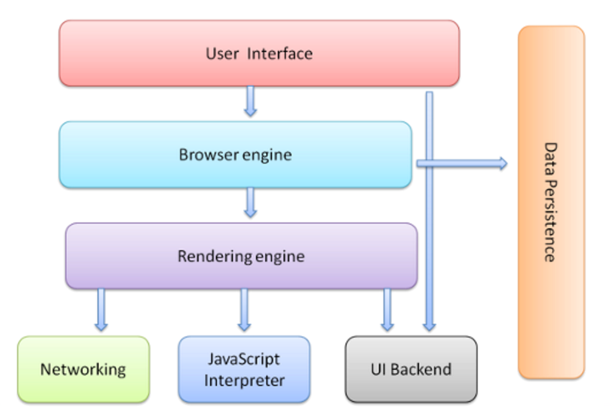

---
学习目标:
  - 理解面向对象开发思想
  - 掌握 JavaScript 面向对象开发相关模式
  - 掌握在 JavaScript 中使用正则表达式
  
typora-copy-images-to media
---

# JavaScript 高级


### 目标

- 理解面向对象开发思想
- 掌握 JavaScript 面向对象开发相关模式
- 掌握在 JavaScript 中使用正则表达式

### 案例演示

- [贪吃蛇](snake/index.html)

---

## 回顾

> 由于 JavaScript 高级还是针对 JavaScript 语言本身的一个进阶学习，所以在开始之前我们先对以前所学过的 JavaScript 相关知识点做一个快速复习总结。

### 重新介绍 JavaScript

#### JavaScript 是什么

- 解析执行：轻量级解释型的		（解释一行执行一行)           慢

  ​							     (java、c#是编译执行：一次性编译成可执行代码，再一行行执行            快) 

- 语言特点：(灵活)   动态特性(可随意给对象添加属性、方法)         头等函数 (First-class Function)

  + 又称函数是 JavaScript 中的一等公民		(java中函数是二等，一等是类)

- 执行环境：在宿主环境（host environment）下运行，浏览器是最常见的 JavaScript 宿主环境
  + 但是在很多非浏览器环境中也使用 JavaScript ，例如 node.js

  [MDN-JavaScript](https://developer.mozilla.org/zh-CN/docs/Web/JavaScript)

#### JavaScript 的组成

- ECMAScript  - 语法规范
  - 变量、数据类型、类型转换、操作符
  - 流程控制语句：判断、循环语句
  - 数组、函数、作用域、预解析
  - 对象、属性、方法、简单类型和复杂类型的区别
  - 内置对象：Math、Date、Array，基本包装类型String、Number、Boolean
- Web APIs
  - BOM
    - onload页面加载事件，window顶级对象
    - 定时器
    - location、history
  - DOM
    - 获取页面元素，注册事件
    - 属性操作，样式操作
    - 节点属性，节点层级
    - 动态创建元素
    - 事件：注册事件的方式、事件的三个阶段、事件对象 

#### JavaScript 可以做什么

> 阿特伍德定律：
>
> Any application that can be written in JavaScript, will eventually be written in JavaScript.  
>
> 任何可以用*JavaScript*来写的应用，最终都将用*JavaScript*来写
>
> 阿特伍德 stackoverflow的创始人之一

- [知乎 - JavaScript 能做什么，该做什么？](https://www.zhihu.com/question/20796866)
- [最流行的编程语言 JavaScript 能做什么？](https://github.com/phodal/articles/issues/1)

### 浏览器是如何工作的



[参考链接](http://www.2cto.com/kf/201202/118111.html)

```
User Interface  用户界面，我们所看到的浏览器
Browser engine  浏览器引擎，用来查询和操作渲染引擎
*Rendering engine 用来显示请求的内容，负责解析HTML、CSS，并把解析的内容显示出来
Networking   网络，负责发送网络请求和接受服务器返回的内容
*JavaScript Interpreter(解析者)   JavaScript解析器，负责执行JavaScript的代码
UI Backend   UI后端，用来绘制类似组合框和弹出窗口
Data Persistence(持久化)  数据持久化，数据存储  cookie、HTML5中的sessionStorage
```


### JavaScript 执行过程

JavaScript 运行分为两个阶段：

- 预解析
  + 全局预解析（所有变量和函数声明都会提前；同名的函数和变量函数的优先级高）
  + 函数内部预解析（所有的变量、函数和形参都会参与预解析）
    * 函数
    * 形参
    * 普通变量
- 执行

先预解析全局作用域，然后执行全局作用域中的代码，
在执行全局代码的过程中遇到函数调用就会先进行函数预解析，然后再执行函数内代码。

---

# 一、JavaScript 面向对象编程


### 面向对象介绍

#### 什么是对象

> Everything is object （万物皆对象）


对象到底是什么，我们可以从两次层次来理解。

**(1) 对象是单个事物的抽象。**

一本书、一辆汽车、一个人都可以是对象，一个数据库、一张网页、一个与远程服务器的连接也可以是对象。当实物被抽象成对象，实物之间的关系就变成了对象之间的关系，从而就可以模拟现实情况，针对对象进行编程。

**(2) 对象是一个容器，封装了属性（property）和方法（method）。**

属性是对象的状态，方法是对象的行为（完成某种任务）。比如，我们可以把动物抽象为animal对象，使用“属性”记录具体是那一种动物，使用“方法”表示动物的某种行为（奔跑、捕猎、休息等等）。

在实际开发中，对象是一个抽象的概念，可以将其简单理解为：**数据集或功能集**。

ECMAScript-262 把对象定义为：**无序属性的集合，其属性可以包含基本值、对象或者函数**。
严格来讲，这就相当于说对象是一组没有特定顺序的值。对象的每个属性或方法都有一个名字，而每个名字都映射到一个值。


  提示：每个对象都是基于一个引用类型创建的，这些类型可以是系统内置的原生类型，也可以是开发人员自定义的类型。


#### 什么是面向对象

> 面向对象不是新的东西，它只是过程式代码的一种高度封装，目的在于提高代码的开发效率和可维 护性。


面向对象编程 —— Object Oriented Programming，简称 OOP ，是一种编程开发思想。
它将真实世界各种复杂的关系，抽象为一个个对象，然后由对象之间的分工与合作，完成对真实世界的模拟。

在面向对象程序开发思想中，每一个对象都是功能中心，具有明确分工，可以完成接受信息、处理数据、发出信息等任务。
因此，面向对象编程具有灵活、代码可复用、高度模块化等特点，容易维护和开发，比起由一系列函数或指令组成的传统的过程式编程（procedural programming），更适合多人合作的大型软件项目。

面向对象与面向过程： 

- 面向过程就是亲力亲为，事无巨细，面面俱到，步步紧跟，有条不紊
- 面向对象就是找一个对象，指挥得结果
- 面向对象将执行者转变成指挥者
- 面向对象不是面向过程的替代，而是面向过程的封装

面向对象的特性：

- **封装性** 
- **继承性**
- [**多态性**]抽象

扩展阅读：

- [维基百科 - 面向对象程序设计](https://zh.wikipedia.org/wiki/%E9%9D%A2%E5%90%91%E5%AF%B9%E8%B1%A1%E7%A8%8B%E5%BA%8F%E8%AE%BE%E8%AE%A1)
- [知乎：如何用一句话说明什么是面向对象思想？](https://www.zhihu.com/question/19854505)
- [知乎：什么是面向对象编程思想？](https://www.zhihu.com/question/31021366)

#### 程序中面向对象的基本体现

在 JavaScript 中，所有数据类型都可以视为对象，当然也可以自定义对象。
自定义的对象数据类型就是面向对象中的类（ Class ）的概念。

我们以一个例子来说明面向过程和面向对象在程序流程上的不同之处。

假设我们要处理学生的成绩表，为了表示一个学生的成绩，面向过程的程序可以用一个对象表示：

```javascript
var std1 = { name: 'Michael', score: 98 }
var std2 = { name: 'Bob', score: 81 }
```

而处理学生成绩可以通过函数实现，比如打印学生的成绩：

```javascript
function printScore (student) {
  	console.log('姓名：' + student.name + '  ' + '成绩：' + student.score)
}
```

如果采用面向对象的程序设计思想，我们首选思考的不是程序的执行流程，
而是 `Student` 这种数据类型应该被视为一个对象，这个对象拥有 `name` 和 `score` 这两个属性（Property）。
如果要打印一个学生的成绩，首先必须创建出这个学生对应的对象，然后，给对象发一个 `printScore` 消息，让对象自己把自己的数据打印出来。

抽象数据行为模板（Class）：

```javascript
function Student(name, score) {
  	this.name = name;
  	this.score = score;
  	this.printScore = function() {
    	console.log('姓名：' + this.name + '  ' + '成绩：' + this.score);
  	}
}
```

根据模板创建具体实例对象（Instance）：

```javascript
var std1 = new Student('Michael', 98)
var std2 = new Student('Bob', 81)
```

实例对象具有自己的具体行为（给对象发消息）：

```javascript
std1.printScore() // => 姓名：Michael  成绩：98
std2.printScore() // => 姓名：Bob  成绩 81
```

面向对象的设计思想是从自然界中来的，因为在自然界中，类（Class）和实例（Instance）的概念是很自然的。
Class 是一种抽象概念，比如我们定义的 Class——Student ，是指学生这个概念，
而实例（Instance）则是一个个具体的 Student ，比如， Michael 和 Bob 是两个具体的 Student 。

所以，面向对象的设计思想是：

- 抽象出 Class(构造函数)
- 根据 Class(构造函数) 创建 Instance(实例)
- 指挥 Instance 得结果

面向对象的抽象程度又比函数要高，因为一个 Class 既包含数据，又包含操作数据的方法。

### 一、创建对象四种方式

#### 1.简单方式(两种):

- new Object()创建对象

我们可以直接通过 `new Object()` 创建：

```javascript
var person = new Object()
person.name = 'Jack'
person.age = 18

person.sayName = function () {
  	console.log(this.name)
}
```

- 对象字面量创建       

每次创建通过 `new Object()` 比较麻烦，所以可以通过它的简写形式对象字面量来创建：

```javascript
var person = {};      //空对象

var person = {
  	name: 'Jack',
  	age: 18,
  	sayName: function () {
    	console.log(this.name)
  	}
}
```

对于上面的写法固然没有问题，但是假如我们要生成两个 `person` 实例对象呢？

```javascript
var person1 = {
  	name: 'Jack',
  	age: 18,
  	sayName: function () {
    	console.log(this.name)
  	}
}

var person2 = {
  	name: 'Mike',
  	age: 16,
  	sayName: function () {
    	console.log(this.name)
  	}
}
```

通过上面的代码我们不难看出，这样写的代码太过冗余，重复性太高。

#### 2.简单方式的改进：工厂函数

- 工厂函数     创建多个对象

我们可以写一个函数，解决代码重复问题：

```javascript
function createPerson(name, age, job) {
  	var person = new Object();   			
  	person.name = name;
  	person.age = age;
  	person.job = job;
  	person.sayHi = function(){
    	console.log(this.name + 'Hello,everyBody');
  	}
  	return person;       					
}
```

然后生成实例对象：

```javascript
var p1 = createPerson('Jack', 18)
var p2 = createPerson('Mike', 18)
```

问题：

这样封装确实爽多了，通过工厂模式我们解决了创建多个相似对象代码冗余的问题，
但却没有解决**对象识别的问题**（即怎样知道一个对象的类型）。无法通过typeof获取对象的具体类型。

由于工厂函数都是通过new Object()方式创建对象，所以类型都是Object。通过typeof 都是Object类型，没有具体的自己的类型。

见下方

```javascript
console.log(typeof p1);      //Object
//像数组用typeof也是Object
console.log(typeof arr);     //Object
//判断是否是某种复杂类型。用instanceOf
console.log(arr instanceof Array);  //true
而p1由于是 var person = new Object();  根本没法判断复杂类型：p1 instanceof ?
```

所以可以通过构造函数替代工厂函数，构造函数创建的对象可以通过instanceof来判断更具体的类型。

第四种见下方，构造函数

### 二、自定义构造函数

构造函数——构造对象的函数

```javascript
内容引导：

- 构造函数语法
- 分析构造函数
- 构造函数和实例对象的关系(获取对象的具体类型)
  - 实例的 constructor 属性  ——构造函数   p1.constructor === Person        (不建议，因为constructor可以被改变)
  - instanceof 操作符		判断是否是某种复杂类型
- 普通函数调用和构造函数调用的区别
- 构造函数的返回值
- 构造函数的问题
```

#### 1.更优雅的工厂函数：构造函数

一种更优雅的工厂函数就是下面这样，构造函数：

```javascript
function Person (name, age) {
  	this.name = name
  	this.age = age
  	this.sayName = function () {
    	console.log(this.name)
  }
}

var p1 = new Person('Jack', 18);       //调用构造函数要用new
p1.sayName() // => Jack

var p2 = new Person('Mike', 23)
p2.sayName() // => Mike
```

获取对象的具体类型

```javascript
console.log(typeof p1);     //Object      注意还是Object，但是看下面可以获取到对象p1的具体类型
console.log(p1.constructor === Person);      //true    但不建议，因为constructor可以被改变
console.log(p1 instanceof Object); 			//true
console.log(p1 instanceof Person); 			//true
```

#### 2.解析构造函数代码的执行

在上面的示例中，`Person()` 函数取代了 `createPerson()` 函数，但是实现效果是一样的。
这是为什么呢？

我们注意到，**`Person()`** 中的代码与 `createPerson()` 有以下几点不同之处：

- 没有显示的创建对象
- 直接将属性和方法赋给了 `this` 对象
- 没有 `return` 语句
- 函数名使用的是大写的 `Person`

而要创建 `Person` 实例，则必须使用 `new` 操作符。
以这种方式调用构造函数会经历以下 4 个步骤：（**new在执行时会做4件事**）

1. new会在内存中创建一个新的空对象
2. new会让this指向这个新的对象
3. 执行构造函数中的代码				( 目的：给这个新对象加属性和方法)
4. 返回新对象

下面是具体的伪代码：

```javascript
function Person (name, age) {
  // 当使用 new 操作符调用 Person() 的时候，实际上这里会先创建一个对象
  // var instance = {}        instance实例
  // 然后让内部的 this 指向 instance 对象
  // this = instance
  // 接下来所有针对 this 的操作实际上操作的就是 instance

  this.name = name
  this.age = age
  this.sayName = function () {
    console.log(this.name)
  }

  // 在函数的结尾处会将 this 返回，也就是 instance
  // return this
}
```

#### 3.构造函数和实例对象的关系

使用构造函数的好处不仅仅在于代码的简洁性，更重要的是我们可以识别对象的具体类型了。
在每一个实例对象中同时有一个 **`constructor` 属性，该属性指向创建该实例的构造函数**：

```javascript
console.log(p1.constructor === Person) // => true
console.log(p2.constructor === Person) // => true
console.log(p1.constructor === p2.constructor) // => true
```

对象的 `constructor` 属性最初是用来标识对象类型的(不推荐，因为constructor可以被改变)

但是，如果要检测对象的类型，还是使用 `instanceof` 操作符更可靠一些：

```javascript
console.log(p1 instanceof Person) // => true
console.log(p2 instanceof Person) // => true
```

总结：

- 构造函数是根据具体的事物抽象出来的抽象模板
- 实例对象是根据抽象的构造函数模板得到的具体实例对象
- 每一个实例对象都具有一个 `constructor` 属性，**指向**创建该实例的**构造函数**
  + 注意： `constructor` 是实例的属性的说法不严谨，具体后面的原型会讲到
- 可以通过实例的 `constructor` 属性判断实例和构造函数之间的关系
  + 注意：这种方式不严谨，推荐使用 `instanceof` 操作符，后面学原型会解释为什么

    (在介绍更简单的原型语法时，需手动将constructor指向构造函数，否则丢失)

#### 4.构造函数的问题：内存浪费

使用构造函数带来的最大的好处就是创建对象更方便了，也解决了工厂函数没法识别对象类型的问题。

但是其本身也存在一个浪费内存的问题：

```javascript
function Person (name, age) {
  this.name = name
  this.age = age
  this.type = 'human'
  this.sayHello = function () {
    console.log('hello ' + this.name)
  }
}

var p1 = new Person('Tom', 18)
var p2 = new Person('Jack', 16)
```

在该示例中，从表面上好像没什么问题，但是实际上这样做，有一个很大的弊端。
那就是对于每一个实例对象，`type` 和 `sayHello` 都是一模一样的内容，sayHello这个function也会在内存中开辟空间。多个对象会存储多个`sayHello` 方法。
每一次生成一个实例，都必须为重复的内容，多占用一些内存，如果实例对象很多，会造成极大的内存浪费。

```javascript
console.log(p1.sayHello === p2.sayHello) // => false      （其实是比较地址）
```

对于这种问题(解决`sayHello` 存储多份的问题)我们可以**把需要共享的函数定义到构造函数外部**：

```javascript
function sayHello = function () {
  console.log('hello ' + this.name)
}

function Person (name, age) {
  this.name = name
  this.age = age
  this.type = 'human'
  this.sayHello = sayHello
}

var p1 = new Person('Top', 18)
var p2 = new Person('Jack', 16)

console.log(p1.sayHello === p2.sayHello) // => true
```

这样确实可以了，但是如果有多个需要共享的函数的话，就会造成全局命名空间冲突的问题。

你肯定想到了可以**把多个函数放到一个对象中用来避免全局命名空间冲突的问题**：

```javascript
var fns = {
  sayHello: function () {
    console.log('hello ' + this.name)
  },
  sayAge: function () {
    console.log(this.age)
  }
}

function Person (name, age) {
  this.name = name
  this.age = age
  this.type = 'human'
  this.sayHello = fns.sayHello
  this.sayAge = fns.sayAge
}

var p1 = new Person('lpz', 18)
var p2 = new Person('Jack', 16)

console.log(p1.sayHello === p2.sayHello) // => true
console.log(p1.sayAge === p2.sayAge) // => true
```

至此，我们利用自己的方式基本上解决了构造函数的内存浪费问题。
但是代码看起来还是那么的格格不入，那有没有更好的方式呢？——**原型**

#### 小结

```javascript
- 构造函数语法
- 分析构造函数
- 构造函数和实例对象的关系
  - 实例的 constructor 属性
  - instanceof 操作符
- 构造函数的问题
```

### 三、原型

每个构造方法都有个属性——原型对象

补充：函数也是对象，对象才有属性和方法。不光是构造函数，任何函数都有prototype。构造函数调用要用new来调用，普通函数用小括号来调用。

```javascript
内容引导：

- 使用 prototype 原型对象解决构造函数的问题
- 分析 构造函数、prototype 原型对象、实例对象 三者之间的关系
- 属性成员搜索原则：原型链
- 实例对象读写原型对象中的成员
- 原型对象的简写形式
- 原生对象的原型
  - Object
  - Array
  - String
  - ...
- 原型对象的问题
- 构造的函数和原型对象使用建议
```

#### 1. `prototype`：内存浪费更好的解决方案：

JavaScript 规定，每一个构造函数都有一个 `prototype` 属性，指向另一个对象。
这个对象的所有属性和方法，都会被构造函数的所拥有。

这也就意味着，我们可以**把所有对象实例需要共享的属性和方法直接定义在 `prototype` 对象上**。

```javascript
function Person (name, age) {
  this.name = name
  this.age = age
}

console.dir(Person.prototype);     //打印对象

//通过prototype对象动态增加属性和方法
Person.prototype.type = 'human';      //添加type属性

Person.prototype.sayName = function () {    //添加sayName方法
  console.log(this.name)
}

//通过Person构造函数创建的对象，可以访问Person.prototype中的成员
var p1 = new Person('ch',22);
var p2 = new Person('cc',20);

p1.sayNme();
p2.sayNme();

console.log(p1.sayName === p2.sayName); // => true	 是同一个，解决了构造函数的内存浪费
```

这时所有实例的 `type` 属性和 `sayName()` 方法，其实都是同一个内存地址，指向 `prototype` 对象，因此就提高了运行效率。

一般情况下，对象的属性在构造函数中设置，对象的方法在构造函数的原型对象中来设置。

- 补充：

  prototype是构造函数中的原型属性，对象中的`__proto__`属性比如`s1.__proto__`就指向构造函数中的原型属性，是对prototype的<u>引用</u>，也是原型。`__proto__`是非标准的属性。为什么有这个属性呢？因为对象可以访问到构造函数中的原型对象的成员或者方法。所以对象中必须有一个属性(`__proto__`)可以去引用prototype原型对象。

  实例对象的`__proto__`是指向构造函数的 `prototype` 对象的指针(引用)

  当调用对象的属性或方法的时候，先去找对象本身的属性、方法。如果对象有该属性或者方法，此时去调用原型中的属性、方法，如果对象中没有该属性、方法，原型中也没有该属性和方法，此时会报错。	

  ```javascript
  console.log(s1.__proto__ === Person.prototype);    //true 
  //原型对象也是对象，只要是对象，console.dir 里面就有__proto__属性
  ```

  在原型对象中又有一个属性**constructor，记录了创建该对象的构造函数**

#### 2.构造函数、实例、原型三者之间的关系

右侧神秘对象是prototype原型对象，通过构造函数Person.ptorotype属性可以访问到原型对象。通过原型对象的constructor属性，Person.ptorotype.constructor可以访问到构造函数。


补充：

复杂图


**原型链：**最右边从s1对象开始斜上去的链

**成员查找规则：**

比如调用对象的sayHi()方法，就在当前对象本身来找有无，没有就去原型对象中查找sayHi()方法，如果原型对象也没有，继续往上找(Object原型对象)，如果还没有再往上就是null了。此时会告诉函数未定义undefined

```javascript
console.log(s1.__proto__.__proto__ === Object.prototype);       //true
```


**读取属性：**先在对象本身查找，如果没有的话，去原型链上去查找

**设置属性：**设置属性值时，不会搜索原型链，而是直接给对象自身新增一个属性。所以如果属性1为在原型对象上(student.prototype.属性1 = 123;)，如果改变s1的属性1，不会影响到s2的属性1。哪怕属性1在原型对象上，是共享的。但是设置属性不会搜索原型链，所以不会改变。


**任何函数都具有一个 `prototype` 属性，该属性是一个对象。**

```javascript
function F () {}
console.log(F.prototype) // => object

F.prototype.sayHi = function () {
  console.log('hi!')
}
```

构造函数的 `prototype` 对象默认都有一个 `constructor` 属性，指向 `prototype` 原型对象所在函数(构造函数)。

```javascript
console.log(F.prototype.constructor === F) // => true 构造函数F的原型对象的constructor属性
```

通过构造函数得到的实例对象内部会包含一个指向构造函数的 `prototype` 对象的指针(引用) `__proto__`。

```javascript
var instance = new F()
console.log(instance.__proto__ === F.prototype) // => true
```

  `__proto__` 是非标准属性。

实例对象可以直接访问原型对象成员。

```javascript
instance.sayHi() // => hi!
```

总结：

- 任何函数都具有一个 `prototype` 属性，该属性是一个对象
- 构造函数的 `prototype` 原型对象默认都有一个 `constructor` 属性，指向 `prototype` 对象所在函数(即构造函数)
- 通过构造函数得到的实例对象内部会包含一个指向构造函数的 `prototype` 对象的指针(引用) `__proto__`
- 所有实例都直接或间接<u>继承</u>了原型对象的成员

#### 3.属性成员的搜索原则：原型链

了解了 **构造函数-实例-原型对象** 三者之间的关系后，接下来我们来解释一下为什么实例对象可以访问原型对象中的成员。

每当代码读取某个对象的某个属性时，都会执行一次搜索，目标是具有给定名字的属性

- 搜索首先从对象实例本身开始
- 如果在实例中找到了具有给定名字的属性，则返回该属性的值
- 如果没有找到，则继续搜索指针指向的原型对象，在原型对象中查找具有给定名字的属性
- 如果在原型对象中找到了这个属性，则返回该属性的值

也就是说，在我们调用 `person1.sayName()` 的时候，会先后执行两次搜索：

- 首先，解析器会问：“实例 person1 有 sayName 属性吗？”答：“没有。
- ”然后，它继续搜索，再问：“ person1 的原型有 sayName 属性吗？”答：“有。
- ”于是，它就读取那个保存在原型对象中的函数。
- 当我们调用 person2.sayName() 时，将会重现相同的搜索过程，得到相同的结果。

而这正是多个对象实例共享原型所保存的属性和方法的基本原理。

总结：

- 先在自己身上找，找到即返回
- 自己身上找不到，则沿着原型链向上查找，找到即返回
- 如果一直到原型链的末端还没有找到，则返回 `undefined`

#### 4.实例对象读写原型对象成员

**读取**：

- 先在自己身上找，找到即返回
- 自己身上找不到，则沿着原型链向上查找，找到即返回
- 如果一直到原型链的末端还没有找到，则返回 `undefined`


**写入：**


值类型成员**写入**（`实例对象.值类型成员 = xx`）：        s1.name = 'ch';

- 当实例期望重写原型对象中的某个普通数据成员时实际上会把该成员添加到自己身上  (就是上面的 设置原型属性 )
- 也就是说该行为实际上会屏蔽掉对原型对象成员的访问

引用类型成员**写入**（`实例对象.引用类型成员 = xx`）：   

- 同上


**复杂类型修改**（`实例对象.成员.xx = xx`）：<u>之所以和上面不同就是为了不把自己原有的方法覆盖掉</u>

（因为是复杂成员，所以可以点出复杂成员里的属性）

- 同样会先在自己身上找该成员，如果自己身上找到则直接修改
- 如果自己身上找不到，则沿着原型链继续查找，如果找到则修改
- 如果一直到原型链的末端还没有找到该成员，则报错（`实例对象.undefined.xx = xx`）

#### 5.更简单的原型语法

我们注意到，前面例子中每添加一个属性和方法就要敲一遍 `Person.prototype` 。(此时不需设constructor的问题)
为减少不必要的输入，更常见的做法是用一个<u>包含所有属性和方法的对象字面量来重写整个原型对象</u>：

```javascript
function Person (name, age) {
  this.name = name
  this.age = age
}

// prototype={ } 大括号相当于新的对象，相当Person.prototype = new Object();          
//注意： 原型对象丢失了 constructor成员    只有下面两个成员，没有constructor成员
Person.prototype = {  
  type: 'human',
  sayHello: function () {
    console.log('我叫' + this.name + '，我今年' + this.age + '岁了')
  }
}
```

在上面示例中，我们将 `Person.prototype` 重置到了一个新的对象。
这样做的好处就是为 `Person.prototype` 添加成员简单了，但是也会带来一个问题，那就是<u>原型对象丢失了 `constructor` 成员。</u>   (  console.log(s1.constructor); 结果是系统自带的Object，而不是构造函数 )


**如果重置了 `prototype` 记得修正 `constructor` 的指向**

所以，我们为了保持 `constructor` 的指向正确，建议的写法是：

```javascript
function Person (name, age) {
  this.name = name
  this.age = age
}

Person.prototype = {
  constructor: Person,            // => 手动将 constructor 指向正确的构造函数
  type: 'human',
  sayHello: function () {
    console.log('我叫' + this.name + '，我今年' + this.age + '岁了')
  }
}
```

注意：**先去设置原型属性，再创建对象，才可以访问原型对象中的成员。**


或者如下(原型继承中的例子)

```javascript
Student.prototype = new Person();       //此时他的__proto__属性是Person
Student.prototype.constructor = Student;     //手动将 constructor 指向正确的构造函数
```


#### 6.原生对象的原型

扩展内置对象的

  所有函数都有 prototype 属性对象。

- Object.prototype
- Function.prototype
- Array.prototype
- String.prototype
- Number.prototype
- Date.prototype
- ...

数组或者String等中的prototype是不允许修改的。因为如果对prototype重新赋值，那么数组对象原来自己的很多方法就被覆盖掉，没有了。所以这些内置对象去设置他的prototype时，必须通过`实例对象.成员.xx = xx`去修改，而不是用大括号括起的覆盖。

练习：为数组对象和字符串对象扩展原型方法。

#### 7.原型对象使用建议

- 私有成员（一般就是非函数成员）放到构造函数中
- 共享成员（一般就是函数）放到原型对象中
- **如果重置了 `prototype` 记得修正 `constructor` 的指向**

### 案例：随机方块

---

# 二、面向对象游戏案例：贪吃蛇

### 案例介绍

#### 游戏演示

演示：[贪吃蛇](snake/index.html)

#### 案例目标

游戏的目的是用来体会js高级语法的使用 不需要具备抽象对象的能力，使用面向对象的方式分析问题，需要一个漫长的过程。

### 功能实现

#### 搭建页面

放一个容器盛放游戏场景 div#map，设置样式

```css
#map {
  width: 800px;
  height: 600px;
  background-color: #ccc;
  position: relative;
}
```

#### 分析对象

- 游戏对象
- 蛇对象
- 食物对象

#### 创建食物对象

- Food

  - 属性

    - x       
    - y
    - width
    - height
    - color       

  - 方法

    - render       随机创建一个食物对象，并输出到map上 (渲染，设置食物方块样式)

- 创建Food的构造函数，并设置属性

```js
var position = 'absolute';
var elements = [];
function Food(x, y, width, height, color) {      //或者传入一个对象，调用对象的属性
  	this.x = x || 0;		//this 构造函数中，指向构造函数所创建的对象
  	this.y = y || 0;          
  	// 食物的宽度和高度(像素)
  	this.width = width || 20;
  	this.height = height || 20;
  	// 食物的颜色
  	this.color = color || 'green';
}
```

- 通过原型设置render方法，实现随机产生食物对象，并渲染到map上

```js
Food.prototype.render = function (map) {
  // 随机食物的位置，map.宽度/food.宽度，总共有多少分food的宽度，随机一下。然后再乘以food的宽度
  this.x = parseInt(Math.random() * map.offsetWidth / this.width) * this.width;
  this.y = parseInt(Math.random() * map.offsetHeight / this.height) * this.height;

  // 动态创建食物对应的div
  var div = document.createElement('div');
  map.appendChild(div);
  div.style.position = position;
  div.style.left = this.x + 'px';  //this.x可以想想这其实是在构造函数中，是构造函数的方法。回去看看构造函数基本
  div.style.top = this.y + 'px';
  div.style.width = this.width + 'px';
  div.style.height = this.height + 'px';
  div.style.backgroundColor = this.color;
  elements.push(div);
}
```

- 通过自调用函数，进行封装，通过window暴露Food对象

  <u>自调用函数——开启一个新的作用域，防止命名冲突(全部的js文件都在全局作用域下，定义的变量、函数名可能冲突)</u>

  ```javascript
  (function (){
    	//所有代码移到自调用函数中
  })()              前面括号括起表示一个函数表达式，后面小括号是函数调用
  ```

  自调用函数中的局部变量在全局访问不到，自调用函数外 var food = new Food();会提示Food未定义。可以使Food构造函数让外部访问,通过window对象解决

```js
(function (){
  	//所有代码移到自调用函数中
  	window.Food = Food;
})()   

这样在自调用函数外的全局变量调用 var food = new Food();其实就是调用window.Food()；只不过window可省略
```

#### 创建蛇对象


- Snake

- 属性

  - width    蛇节的宽度 默认20
  - height   蛇节的高度 默认20
  - body     数组，蛇的头部和身体，第一个位置是蛇头
  - direction    蛇运动的方向  默认right  可以是 left  top bottom

- 方法

  - render  把蛇渲染到map上

- Snake构造函数

```js
var position = 'absolute';
var elements = [];
function Snake(width, height, direction) {
  // 设置每一个蛇节的宽度
  this.width = width || 20;
  this.height = height || 20;
  // 蛇的每一部分, 第一部分是蛇头
  this.body = [
    {x: 3, y: 2, color: 'red'},
    {x: 2, y: 2, color: 'red'},
    {x: 1, y: 2, color: 'red'}
  ];
  this.direction = direction || 'right';
}
```

- render方法

```js
Snake.prototype.render = function(map) {
  for(var i = 0; i < this.body.length; i++) {
    var obj = this.body[i];
    var div = document.createElement('div');
    map.appendChild(div);
    div.style.left = obj.x * this.width + 'px';
    div.style.top = obj.y * this.height + 'px';
    div.style.position = position;
    div.style.backgroundColor = obj.color;
    div.style.width = this.width + 'px';
    div.style.height = this.height + 'px';
  }
}
```

- 在自调用函数中暴露Snake对象

自调用函数——开启一个新的作用域，防止命名冲突(包括其他js文件的函数名冲突)

```javascript
(function (){
  	//所有代码移到自调用函数中
})()              前面括号括起表示一个函数表达式，后面小括号是函数调用
```

自调用函数钟的局部变量在全局访问不到，让构造函数让外部访问通过window对象解决

```js
window.Snake = Snake;
```

#### 创建游戏对象

游戏对象，用来管理游戏中的所有对象和开始游戏。（控制游戏的逻辑）

- Game

  - 属性

    - food

    - snake

    - map

  - 方法

    - start            开始游戏（绘制所有游戏对象）


- 构造函数

```js
function Game(map) {
  this.food = new Food();
  this.snake = new Snake();
  this.map = map;
}
```

- 开始游戏，渲染食物对象和蛇对象

```js
Game.prototype.start = function () {
  this.food.render(this.map);
  this.snake.render(this.map);
}
```

### 游戏的逻辑

#### 写蛇的move方法

- 在蛇对象(snake.js)中，在Snake的原型上新增move方法

1. 让蛇移动起来，把蛇身体的每一部分往前移动一下
2. 蛇头部分根据不同的方向决定 往哪里移动

```js
Snake.prototype.move = function (food, map) {
  // 让蛇身体的每一部分往前移动一下
  var i = this.body.length - 1;
  for(; i > 0; i--) {
    this.body[i].x = this.body[i - 1].x;
    this.body[i].y = this.body[i - 1].y;
  }
  // 根据移动的方向，决定蛇头如何处理
  switch(this.direction) {
    case 'left': 
      this.body[0].x -= 1;
      break;
    case 'right':
      this.body[0].x += 1;
      break;
    case 'top':
      this.body[0].y -= 1;
      break;
    case 'bottom':
      this.body[0].y += 1;
      break;
  }
}
```

- 在game中测试

```js
this.snake.move(this.food, this.map);
this.snake.render(this.map);
```

#### 让蛇自己动起来

- 私有方法

    ```
    什么是私有方法？
      不能被外部访问的方法
    如何创建私有方法？
      使用自调用函数包裹(不写在原型上)
    ```

- 在game.js中 添加runSnake的私有方法，开启定时器调用蛇的move和render方法，让蛇动起来

  定时器中的this是指向window，不能用this。function开头用that = this;然后在定时器函数中用that替换this解决。

  也可以通过在定时器的function()后调用bind(that)。 改变this的指向，然后定时器函数中还是用this解决。

- 判断蛇是否撞墙

```js
function runSnake() {
  var timerId = setInterval(function() {
    this.snake.move(this.food, this.map);
    // 在渲染前，删除之前的蛇
    this.snake.render(this.map);

    // 判断蛇是否撞墙
    var maxX = this.map.offsetWidth / this.snake.width;
    var maxY = this.map.offsetHeight / this.snake.height;
    var headX = this.snake.body[0].x;
    var headY = this.snake.body[0].y;
    if (headX < 0 || headX >= maxX) {
      clearInterval(timerId);
      alert('Game Over');
    }

    if (headY < 0 || headY >= maxY) {
      clearInterval(timerId);
      alert('Game Over');
    }

  }.bind(that), 150);
}
```

- 在snake中添加删除蛇的私有方法，在render中调用

```js
function remove() {
  // 删除渲染的蛇
  var i = elements.length - 1;
  for(; i >= 0; i--) {
    // 删除页面上渲染的蛇
    elements[i].parentNode.removeChild(elements[i]);
    // 删除elements数组中的元素
    elements.splice(i, 1);
  }
}
```

- 在game中通过键盘控制蛇的移动方向

```js
function bindKey() {
  document.addEventListener('keydown', function(e) {
    switch (e.keyCode) {
      case 37:
        // left
        this.snake.direction = 'left';
        break;
      case 38:
        // top
        this.snake.direction = 'top';
        break;
      case 39:
        // right
        this.snake.direction = 'right';
        break;
      case 40:
        // bottom
        this.snake.direction = 'bottom';
        break;
    }
  }.bind(that), false);
}
```

- 在start方法中调用

```js
bindKey();
```

#### 判断蛇是否吃到食物

```js
// 在Snake的move方法中

// 在移动的过程中判断蛇是否吃到食物
// 如果蛇头和食物的位置重合代表吃到食物
// 食物的坐标是像素，蛇的坐标是几个宽度，进行转换
var headX = this.body[0].x * this.width;
var headY = this.body[0].y * this.height;
if (headX === food.x && headY === food.y) {
  // 吃到食物，往蛇节的最后加一节
  var last = this.body[this.body.length - 1];
  this.body.push({
    x: last.x,
    y: last.y,
    color: last.color
  })
  // 把现在的食物对象删除，并重新随机渲染一个食物对象
  food.render(map);
}
```

### 其它处理

#### 把html中的js代码放到index.js中

避免html中出现js代码

#### 自调用函数的参数

```js
(function (window, undefined) {
  var document = window.document;

}(window, undefined))
```

- 传入window对象

将来代码压缩的时候，可以吧 function (window)  压缩成 function (w)

- 传入undefined

在将来会看到别人写的代码中会把undefined作为函数的参数(当前案例没有使用)
因为在有的老版本的浏览器中 undefined可以被重新赋值，防止undefined 被重新赋值

#### 整理代码

现在的代码结构清晰，谁出问题就找到对应的js文件即可。
通过自调用函数，已经防止了变量命名污染的问题

但是，由于js文件数较多，需要在页面上引用，会产生文件依赖的问题(先引入那个js，再引入哪个js)
将来通过工具把js文件合并并压缩。现在手工合并js文件演示

- 问题1

```js
// 如果存在多个自调用函数要用分号分割，否则语法错误
// 下面代码会报错
(function () {
}())

(function () {
}())
// 所以代码规范中会建议在自调用函数之前加上分号
// 下面代码没有问题
;(function () {
}())

;(function () {
}())
```

- 问题2 

```js
// 当自调用函数 前面有函数声明时，会把自调用函数作为参数
// 所以建议自调用函数前，加上;
var a = function () {
  alert('11');
}
    
(function () {
  alert('22');
}())
```

---


# 三、继承

### 什么是继承

- 现实生活中的继承

  ```javascript
    function extend(parent, child) {
      	for (var key in parent) {
          	if (child[key]) {      //如果子有同名属性了，不复制(继承)同名的属性
              	continue;
    		}
          	child[key] = parent[key];
      	} 
    }
    //比如王思聪和王健林，王思聪只有一个name属性，其余全部继承自王健林。 子承父业

    贪吃蛇中应用
    //原代码
    if (headX === food.x && headY === food.y) {
      	// 吃到食物，往蛇节的最后加一节
      	var last = this.body[this.body.length - 1];
      	this.body.push({
        	x: last.x,
        	y: last.y,
        	color: last.color
      	})
      	// 把现在的食物对象删除，并重新随机渲染一个食物对象
      	food.render(map);
    }

    //拷贝
    if (headX === food.x && headY === food.y) {
      	var last = this.body[this.body.length - 1];
       	//对象拷贝
     	var obj = {};
      	extend(last, obj);    //拷贝最后一节生成多的一节身体
      	this.body.push(obj);
        // 把现在的食物对象删除，并重新随机渲染一个食物对象
      	food.render(map);
    }
      
  ```
  对象和对象间不是真正的继承，而是对象的拷贝。把一个对象的成员拷贝给另一个对象。

  ​

  **继承：类型和类型之间的关系**

  继承目的(本质)：**把子类型中共同的成员提取到父类型中**。 (实现代码的重用)

  ​	父类型约束子类型拥有的成员

- 程序中的继承

  javascript中本身没有继承语法，而java、C#等提供了继承语法。我们需要通过原型来模拟继承。

  ```javascript
  共同属性，都有姓名、性别、年龄属性。有重复，通过继承的方式将它们抽象到父类型中来。
  学生类型  老师类型    ->Person类型

  //父类型
  function Person() {
    	this.name = name;
    	this.age = age;
    	this.sex = sex;
  }
  //子类型
  function Student() {
    	//this.name = 'ch';
    	//this.name = 22;
    	//this.sex = '男';
    	this.score = 100;
  }

  function Teacher() {
    	//this.name = 'ss';
    	//this.name = 29;
    	//this.sex = '女'；
      this.salary = 3000;
  }

  var s1 = new Student();
  ```


### 1.原型继承

原型继承：**设置原型为父类型的对象**。

(将子类型的 `prototype` 属性设置为父类型。父类型的所有属性和方法就会被子类型拥有。)

**原型继承问题**：无法设置构造函数的参数。（什么意思往下段话看）

```javascript
//父类型
function Person () {
  	this.name = 'ch';
  	this.age = 22;
  	this.sex = '男';
}

Person.prototype.sayName = function () {
  	console.log('hello ' + this.name)；
}

//子类型
function Student () {
  	this.score = 100;         //子类型特有的属性
}

// 利用原型的特性实现继承                          
Student.prototype = new Person();       //此时他的__proto__属性是Person   
Student.prototype.constructor = Student;    //修正constructor指向
//注意：↑当给原型属性赋值，一定要设置原型的constructor   


var s1 = new Student();         //访问对象成员，s1本身的成员只具备一个score，而找不到的就去原型中找。设置了原型

console.log(s1.constructor); // => Person

s1.sayName(); // => hello ch
```


s1对象本身并没有那些属性，但是他的原型:`s1.__proto__`中有这些成员。所以就让s1对象继承了Person的成员。

原型继承并不可用。不实用。因为在设置原型时调用了new Person(); 而new Person()只调用了一次，无法给构造函数Person()传参数。而创建学生对象时，要多次调用new Student();而调用new Student()无法设置它的name，age，sex。

(只能给Student本身具有的成员通关传参数设置。就是上面说的，设置属性不会去搜索原型链)


**原型继承的缺点：**无法设置构造函数的参数。因为new Person()只调用一次，如果要传参数<u>只能传一次</u>。new Student()时，无法给Person()传参数。(只能给自身传)

比如：

```javascript
function Person (name, age, sex) {
  	this.name = name;
  	this.age = age;
  	this.sex = sex;
}

Person.prototype.sayName = function () {
  	console.log('hello ' + this.name);
}

//子类型
function Student (score) {
  	this.score = score;      
}

// 利用原型的特性实现继承                          
Student.prototype = new Person('ch',22,'男');      //可以传第一次Person参数
Student.prototype.constructor = Student;  

var s1 = new Student(100);     //只可以传score，就算在子类型小括号中添加了name，age等形参也传不到父类Person

console.log(s1.constructor); // => Person
console.log(s1.score); // => 100
console.dir(s1); 
s1.sayName(); // => hello ch

//如果new Person();不传参数，那么new Student()时就无法再给name，age，sex设置值。另外，子类型中自身不具有的成员，无法通过传入参数设置。
```


**总结：**

JavaScript 规定，每一个构造函数都有一个 `prototype` 属性，指向另一个对象。这个对象的所有属性和方法，都会被构造函数的所拥有。而将子类型的 `prototype` 属性设置为父类型。父类型的所有属性和方法就会被子类型拥有。

### 2.构造函数的<u>属性继承</u>：借用构造函数

可以解决原型继承无法设置构造函数的参数的问题。

<u>但是方法的继承，借用构造函数解决不了</u>。如果写在Person里面而不是prototype的确可以继承，但是又内存浪费了。

**借用构造函数问题：只能继承父类型的属性，无法继承父类型的方法**

```javascript
//父类型
function Person (name, age, sex) {
  	this.name = name;
  	this.age = age;
  	this.sex = sex;
}

/*方法的继承
Person.prototype.sayHi = function() {
	console.log('大家好，我是'+this.name);
}
*/

//子类型
function Student (name, age，sex, score) {
  	// 借用构造函数继承属性成员 
  	Person.call(this, name, age, sex);    //Person的对象变成学生对象，而在Student()中，this就是指向学生对象
  								//进入到Person中时，this此时改为指向Student，所以就给Student这几个属性赋值
  	
  	this.score = score;
}

var s1 = new Student('张三', 18, '男'， 100)
console.log(s1.type, s1.name, s1.age) // => human 张三 18
```

把Person当成普通函数。通过Person.call()去调用，并且通过call()去改变Person中this的指向。让Person中this指向学生对象(即Student中的this)。

### 3.组合继承

解决借用构造函数的问题：只能继续父类型的属性，无法继承父类型的方法

原型继承：设置原型为父类型的对象

组合继承：借用构造函数  + 原型继承

```javascript
//父类型
function Person (name, age, sex) {
  	this.name = name;
  	this.age = age;
  	this.sex = sex;
}

//父类型的方法
Person.prototype.sayHi = function() {
	console.log('大家好，我是'+this.name);
}


//子类型
function Teacher (name, age，sex, salary) {
  	// 借用构造函数继承父类型的属性成员 （与原型继承不同之处）
  	Person.call(this, name, age, sex);     	
  
  	this.salary = salary;
}

//通过原型继承继承父类型方法
Teacher.prototype = new Person();
Teacher.prototype.constructor = Teacher;


/*另一种有问题的方法
Teacher.prototype = Person.prototype;
Teacher.prototype.constructor = Teacher;
*/

/*可以实现继承，但是有个问题。因为指向的是同一个方法，如果我给子类型添加一个子类型特有的方法。Student.prototype.exam = function(){}; 这个子类型特有的方法，父类型对象也会具有。
原因：原型是个对象。内存中只有一个原型对象，Person.prototype指向原型对象。而第一行，使得Teacher.prototype和Person.prototype指向同一个原型对象。所以设置方法，给唯一的对象增加了方法。同理另一个子类型Teacher也是如此。
*/
```

### 4.继承的原型图解

Teacher的简单原型图


将上图的Teacher原型对象通过

```javascript
Teacher.prototype = new Person();
Teacher..prototype.constructor = Teacher.;
```

将Teacher.prototype指向的Teacher原型对象更改为指向Person对象。


### 4.补充:构造函数的原型方法继承：拷贝继承（for-in）

```javascript
function Person (name, age, sex) {
  	this.name = name;
  	this.age = age;
  	this.sex = sex;
}

Person.prototype.sayName = function () {
  	console.log('hello ' + this.name)
}

function Student (name, age，sex, score) {
  	// 借用构造函数继承属性成员 
  	Person.call(this, name, age, sex);    
  							
  	this.score = score;
}

// 原型对象拷贝继承原型对象成员
for(var key in Person.prototype) {
  	Student.prototype[key] = Person.prototype[key]
}

var s1 = Student('张三', 18)

s1.sayName() // => hello 张三
```


# 三、函数进阶

### 1.函数的定义方式

- 函数声明
- 函数表达式
- `new Function()`

#### 1.函数声明

```javascript
function foo () {
  	//预解析会整个函数提升
}
```

#### 2.函数表达式

```javascript
var foo = function () {
	//预解析只是变量foo提升
}
```

#### 3.函数声明与函数表达式的区别

1. 函数声明必须有名字。函数表达式可以没有名字，例如匿名函数

2. 函数声明会函数提升，在<u>预解析</u>阶段就已创建，<u>声明前后都可以调用</u>。

3. 函数表达式类似于变量赋值，等号右边是函数赋值。预解析提升的仅仅是变量的声明，不包括赋值。

   函数表达式没有变量提升，在执行阶段创建，必须在表达式执行之后才可以调用，否则会报错。

```javascript
function fn () {
  	//预解析会整个函数提前
}
var fn1
```


4. 下面是一个**根据条件定义函数**的例子：

```javascript
/*根据不同条件来创建不同的函数
看是否函数提升，如果第一个和第二个函数都提升，那么第二个会覆盖掉第一个的内容。如果提升，那么始终输出的是第二个。
但是现在浏览器是不会提升if语句中的函数声明。if语句里没有作用域，只有函数会开启新的作用域。
在老的IE版本中，if语句中的函数声明也会提升
*/


if (true) {
  	function fn () {
    	console.log(1)
  	}
} else {
  	function fn () {
    	console.log(2)
  	}
}

fn();           //调用fn  1
```

以上代码执行结果在不同浏览器中结果不一致。

不过我们可以使用函数表达式解决上面的问题：

```javascript
//根据不同条件来创建不同的函数 而且没有兼容性问题
var fn;

if (true) {
  	fn = function () {
    	console.log(1)
 	}
} else {
  	fn = function () {
    	console.log(2)
  	}
}

fn();
```

#### 4.new Function()

```javascript
var fn = new Function('var name = "ch";console.log(name)');
fn();

//如果函数需要传递参数
var fn = new Function('a', 'b', 'console.log(a + b)');      //参数要在最前面传入，而且也是字符串形式
fn(1, 2);
```

特点：

1. 代码写在字符串' '中。

2. 函数声明和函数表达式在调用时只解析一次就转为CPU可识别的代码，所以要快。而new Function()解析，首先要把字符串解析成js代码，然后再把js代码解析成CPU可识别的代码。需要二次解析，**执行速度更慢些**。

   **不推荐使用new Function()，但是通过这种方式可以认识到函数也是对象。**

### 2.函数也是对象

- 所有函数都是 `Function` 的实例

  证明fn是Function的实例

  ```javascript
  //证明fn是Function的实例
  // var fn = new Function();
  function fn() {
  }
  console.log(fn.__proto__ === Function.prototype);       //true
  ```

### 3.函数的调用方式

1. 普通函数

```javascript
function fn() {
}
fn();
```

2. 对象方法

```javascript
var obj = {
  	fn: function() {
  	}
}
obj.fn();
```

3. 构造函数

   ```javascript
   function Person (name, age, sex) {
     	this.name = name;
     	this.age = age;
     	this.sex = sex;
   }

    var fn = new Person();
   ```

   ​

4. 作为事件的处理函数 / 事件绑定方法

   ```javascript
   //比如
   btn.onclick = function() {
     
   }
   ```

   ​

5. 作为定时器的参数

   ```javascript
   setInterval(function(){
     
   }, 1000);
   ```


不同调用方式下函数的this指向不同

### 4.函数内 `this` 指向的不同场景

函数的调用方式决定了 `this` 指向的不同：

| 调用方式   | 非严格模式   | 备注                |
| ------ | ------- | ----------------- |
| 普通函数调用 | window  | 严格模式下是 undefined  |
| 对象方法调用 | 该方法所属对象 | 紧挨着的对象            |
| 构造函数调用 | 实例对象    | 原型方法中 this 也是实例对象 |
| 事件绑定方法 | 绑定事件对象  |                   |
| 定时器函数  | window  |                   |

这就是对函数内部 this 指向的基本整理，写代码写多了自然而然就熟悉了。

**总结：**函数内部的this，是由函数调用的时候来确定其指向的。

### 5.call、apply、bind改变函数中的this

那了解了函数 this 指向的不同场景之后，我们知道有些情况下我们为了使用某种特定环境的 this 引用，这时候时候我们就需要采用一些特殊手段来处理了，例如我们经常在定时器外部备份 this 引用，然后在定时器函数内部使用外部 this 的引用。
然而实际上对于这种做法我们的 JavaScript 为我们专门提供了一些函数方法用来帮我们更优雅的处理函数内部 this 指向问题。
这就是接下来要学习的 call、apply、bind 三个函数方法。

#### 1. call

**功能：**<u>调用一个函数, 改变函数中的this。</u>

**语法：**

```javascript
fn.call(thisArg[, arg1[, arg2[, ...]]])
```

**参数：**其具有一个指定的 `this` 值和分别地提供的参数(参数的列表)。

第一个参数：**设置函数内部this的指向**

其他参数：对应函数的参数

- `thisArg`
  + 在 fn 函数运行时指定的 this 值
  + 如果指定了 null 或者 undefined 则内部 this 指向 window
- `arg1, arg2, ...`
  + 指定的参数列表


**返回值:**

call()返回值就是函数fn的返回值。若没写return，默认就是函数的undefined

**应用：**

```javascript
//在给内置对象的数组对象的增加额外的getSum()方法去求和，可以给Array的prototype原型属性上去增加getSum()方法。如下
Array.prptotype.getSum = function() {
  	//this的指向是由调用时确定的，就如下方，this是数组对象arr
}

//以下数组方法this是调用的数组对象arr
arr.getSum();
arr.push();
arr.splice();

应用：
1.让伪数组去借用数组的方法去实现一些便捷的操作。
//伪数组：和数组非常相似，但是不具有数组的方法。 比如调用getElementsByTagName()获取到的元素就是一个伪数组
var obj = {
  	0: 100,
  	1: 10,
  	2: 11,
  	3: 12,
  	length: 4;
}
//在末尾追加一项，由于是伪数组，不可以用push直接追加。通过属性的方式追加。
法一： (麻烦)
obj['4'] = 13;       //obj.4是错的   对象的属性不能直接是一个数字/数字开头
obj.length ++;
法二： 
//借用数组的push方法，是在Array的原型中有push方法，所以先在Array原型中找到push方法，再通过call改变this
Array.prptotype.push.call(obj, 13);    //通过call改变push的this指向，改为obj。如果arr.push this是数组对象arr

//借用splice删除前三项
Array.prptotype.splice.call(obj, 0, 3);  


2.任何对象都有Object提供toString方法去将对象转换为字符串。
var obj = {
  	name: 'ch';
};

console.log(obj.toString());       //结果：[Object Object]    前面代表是对象，后面是对象的类型
var arr = [5, 9];
console.log(arr.toString());     // 结果：5, 9


console.log(Object.prptotype.toString.call(arr));      //toString是Object原型提供的，所以先找到toString方法
//结果：[Object Array]   ？？报错了
```


**注意：**该方法的作用和 `apply()` 方法类似，只有一个区别，就是 `call()` 方法接受的是若干个参数的列表，而 `apply()` 方法接受的是一个包含多个参数的数组。

#### 2. apply

**功能：**<u>调用一个函数, 改变函数中的this。</u>

  注意：

​       该方法的作用和 `call()` 方法类似，只有一个区别，就是 `call()` 方法接受的是若干个参数的列表，而 `apply()` 方法接受的是一个包含多个参数的<u>**数组**</u>。

**语法：**

```javascript
fun.apply(thisArg, [argsArray])
```

**参数：**其具有一个指定的 `this` 值，以及作为一个**数组**（或类似数组的对象）提供的参数。

- `thisArg`： this的指向
- `argsArray` ：参数数组

`apply()` 与 `call()` 非常相似，不同之处在于提供参数的方式。`apply()` 使用参数数组而不是一组参数列表。例如：

```javascript
fun.apply(this, ['eat', 'bananas'])
```

**应用：**

```javascript
求数组中的最大值，自己写函数很麻烦。
1.可以通过Math.max()方法求最大值去求数组中的最大值
//Math.max(3,5,6); 不可以传数组arr，去求数组中的最大值
var arr = [3, 6, 9, 1, 10];
//此时apply可以调用函数，但不需要改变max中的this，因为只需要求数组的最大值就可以了。第一个参数可以写成空
console.log(Math.max.apply(null, arr));     //apply可以把数组中的每一项展开传给max。会返回一个最大值 10
console.log(Math.max.apply(Math, arr));    //不需要改变this，就是默认的Math。不传null

2.打印数组每一项在同一行上  和console.log效果一样 空格隔开
console.log(1, 2, 3);      //结果：1 2 3
console.log(arr);        //结果：(可展开) [5] [3, 6, 9, 1, 10]          不一样
//不需要改变log的this，console就是log中默认的this    apply会将数组arr各项展开传递给log
console.log.apply(console， arr);          //结果：3 6 9 1 10
```


apply常用：把**数组展开**传递给前面的方法。让某些事情变得简单，比如求数组最大值。

#### 3. bind

**和call、apply区别：**bind不会去调用方法，而是会拷贝一个新的方法。然后我们再来手动调用这个新的方法

**功能：**改变函数的this，并且**返回一个新的函数**。          (不调用函数，还需我们自己来调用) 


bind() 函数会创建一个新函数（称为绑定函数），新函数与被调函数（绑定函数的目标函数）具有相同的函数体（在 ECMAScript 5 规范中内置的call属性）。
当目标函数被调用时 this 值绑定到 bind() 的第一个参数，该参数不能被重写。绑定函数被调用时，bind() 也接受预设的参数提供给原函数。
一个绑定函数也能使用new操作符创建对象：这种行为就像把原函数当成构造器。提供的 this 值被忽略，同时调用时的参数被提供给模拟函数。

**语法：**

```javascript
fun.bind(thisArg[, arg1[, arg2[, ...]]])
```

**参数：**

- thisArg
  + 当绑定函数被调用时，该参数会作为原函数运行时的 this 指向。当使用new 操作符调用绑定函数时，该参数无效。

- arg1, arg2, ...
  + 当绑定函数被调用时，这些参数将置于实参之前传递给被绑定的方法。

**返回值：**

返回由指定的this值和初始化参数改造的原函数**拷贝**。

```javascript
理解：
1.
var a =123;
function fn() {
	console.log(this.a);         //函数中this指向window
}
fn();       //结果：123       其实就是window.fn       window调用的函数，函数中的this指向window

var o = {a: 'abc'};         //对象o也有一个a

var fn1 = fn().bind(o);     //fn1接受返回的新函数,改变了this的指向 为bind中的第一个参数 o对象
fn1();     //结果：abc        相当于o.fn()      this指向o对象，通过o对象来调用 


2.
function fn(x, y) {
	console.log(this);    
  	console.log(x + y);
}

//fn(5, 6);     // window  11

var o = {x : 7, y : 8};
var f = fn.bind(o,1,2);        //后面为 传入参数
f();         //obejct  3

但是如果
var o = {};
var f = fn.bind(o);       
f();         //obejct  NaN     除非更改fn里的为this.x + this.y     就是 object 15
如果更改fn里的为this.x + this.y 又传入参数，结果还是15 而不是3

应用：
1.
在贪吃蛇中的runSnake()方法。
默认不改变的话，定时器中的this是指向window，可以通过定时器函数后function{}.bind(that)来改变this的指向。注意bind并没有调用这个函数,而是在内存中新创建了一个函数，并且让新创建函数中的this指向bind中的第一个参数that。
var obj = {
  	name: 'ch',
  	fn: function() {
      	setInterval(function() {         //定时器中的this是指向window，若不用bind改变，定时器中的语句无用
          	console.log(this.name);
      	}.bind(this),1000);       //这里的this是方法fn: function(){}的this,而fn是obj调用的，所以this是obj
  	}
}
obj.fn();

2.
btn.onclick = function() {
  	//事件处理函数中的this是触发该事件的对象：btn
}.bind(obj);       //通过bind改变事件处理函数中this的指向：obj
//注意这里还没调用
```


笔记原有 ?

示例1：

```javascript
this.x = 9; 
var module = {
  x: 81,
  getX: function() { return this.x; }
};

module.getX(); // 返回 81

var retrieveX = module.getX;
retrieveX(); // 返回 9, 在这种情况下，"this"指向全局作用域

// 创建一个新函数，将"this"绑定到module对象
// 新手可能会被全局的x变量和module里的属性x所迷惑
var boundGetX = retrieveX.bind(module);
boundGetX(); // 返回 81
```

示例2：

```javascript
function LateBloomer() {
  this.petalCount = Math.ceil(Math.random() * 12) + 1;
}

// Declare bloom after a delay of 1 second
LateBloomer.prototype.bloom = function() {
  window.setTimeout(this.declare.bind(this), 1000);
};

LateBloomer.prototype.declare = function() {
  console.log('I am a beautiful flower with ' +
    this.petalCount + ' petals!');
};

var flower = new LateBloomer();
flower.bloom();  // 一秒钟后, 调用'declare'方法
```


#### 小结

- call 和 apply 特性一样
  + 都是用来调用函数，而且是立即调用
  + 但是可以在调用函数的同时，通过第一个参数指定函数内部 `this` 的指向
  + call 调用的时候，参数必须以参数列表的形式进行传递，也就是以逗号分隔的方式依次传递即可
  + apply 调用的时候，<u>参数必须是一个数组，然后在执行的时候，会将数组内部的元素一个一个拿出来，与形参一一对应进行传递</u>
  + 如果第一个参数指定了 `null` 或者 `undefined` 则内部 this 指向 window

- bind
  + 可以用来指定内部 this 的指向，然后生成一个改变了 this 指向的新的函数
  + 它和 call、apply 最大的区别是：**bind 不会调用**
  + bind 支持传递参数，它的传参方式比较特殊，一共有两个位置可以传递
    * 1. 在 bind 的同时，以参数列表的形式进行传递
    * 2. 在调用的时候，以参数列表的形式进行传递
    * 那到底以谁 bind 的时候传递的参数为准呢还是以调用的时候传递的参数为准
    * 两者合并：bind 的时候传递的参数和调用的时候传递的参数会合并到一起，传递到函数内部

### 6.函数的其它成员

都是在函数内部通过函数名.出来的。

- arguments
  + 伪数组实参集合                     (获取到是调用函数时传过去的实参)

    ​

    注意：函数名.arguments 和之前的 arguments 不一样  	后者是函数的一个私有属性。虽然打印结果看起来一样
- caller
  + 函数的调用者
- length
  + 形参的个数
- name
  + 函数的名称 

```javascript
function fn(x, y, z) {
  //1.伪数组   获取到是调用函数时传过去的实参
  console.log(fn.arguments); 
  //2.函数的调用者  fn在全局范围调用时caller的是null，如果像下方在test函数中，调用者caller就是test
  console.log(fn.caller); 
  //3.函数的名称   字符串类型
  console.log(fn.name);   //fn   
  //4.函数的形参个数
  console.log(fn.length);  // 3
  console.log(arguments.caller === fn); // 函数本身
  以上不需掌握了解即可。函数内部只需掌握一个下方的arguments即够我们使用
  
  函数内部有一个私有变量：arguments     这个arguments 不是fn.arguments 	后者是函数的一个属性
  //伪数组   获取到是函数的实参
  console.log(arguments);         //打印结果看起来和fn.arguments一样
}

function test() {
  	fn(10, 20, 30);     //即使函数fn没有形参，也可以通过arguments获取到调用函数时传过去的实参10 20 30
}

test();
```

arguments ：

比如Math.max()； 传递参数个数不固定，可以传2个也可以传3个等等。

```javascript
function() {  //不需要传形参
  	//当函数参数个数不固定时，在函数内部可以通过arguments获取到实际传过来的参数
  	var max =arguments[0];
  	for (var i = 0; i < arguments.length; i++) {
      	if (max < arguments[i]) {
          	max = arguments[i];
      	}
  	}
  	return max;
}
console.log(max(1, 3, 10, 4, 6))
```

### 7.高阶函数

函数在js中是一等公民，函数特别的灵活。它既可以作为变量，可以作为变量的值，还可以作为参数和返回值。

**当函数作为参数或者函数作为返回值时就是高阶函数。**

1. 函数可以作为**参数**
2. 函数可以作为**返回值**

#### 1.函数作为参数

```javascript
举例：每天吃饭，吃完后做什么不确定        
function eat(callback) {      //传递一个参数，形参callback是传入的函数
  	setTimeout(function () {
    	console.log('吃完饭');    
      	//吃完后做的事情(不确定)
    	callback();      //吃完后 调用 传入的参数函数
  	}, 1000);
}

//吃完后干什么是由我们传过来的函数决定的
eat(function () {   //调用eat方法 传入函数作为实参
  	console.log('去唱歌');
});
```

实例：sort排序

```javascript
var arr= [35, 20, 1, 50];
//数组的sort方法  可以将函数作为参数
arr.sort(function(a, b) {   //sort()方法中有一个参数，这个参数是函数。并且函数有两个参数a和b
  	return a - b;       //返回值有要求：大于0，小于0或者等于0
});
console.log(arr);       //得到从小到大排序的数组


模拟内部实现 
//arr.mySort() 
//让数组本身具有这个方法：给Array的原型上去增加mySort()方法  因为是arr调用的，所以mySort()的this是arr数组对象
Array.prototype.mySort() = function(fn) {   //调用时传一个函数fn，但fn返回值有要求：大于0，小于0或者等于0
  	//冒泡排序 外层循环 				让外部调用者去决定进行大到小还是小到大排序。函数传参不能带() 那是调用
  	for(var i = 0; i < this.length - 1; i++) {
      	var isSort = true;        //记录是否排好序
      	//内层循环
      	for(var j = 0; j < this.length - i - 1; j++) {
          	if (fn(this[j], this[j + 1]) > 0) {     //调用fn()，传两个参数：把相邻两项传给fn，在fn内部比较
              	isSort = false;						就像上面的callback()一样  调用
              	var temp = this[j];
              	this[j]; = this[j + 1];
              	this[j + 1] = temp;
          	}        
      	}
      	if(isSort) {
          	break;
      	}
  	}
}
var arr= [35, 20, 1, 50];
arr.mySort(function(a, b) {      //调用时传入了两个参数，那么使用时接收这两个参数
  	return a - b;         //根据用户决定  也可以是b - a从大到小排序
});
console.log(arr);
```

#### 2.函数作为返回值

涉及到闭包

```javascript
1.
写一个函数,生成1-10间的随机整数
function getRandom() {
  	return parseInt(Math.random() * 10) + 1;    //  0-9间的整数+1 -->    1-10间的整数
}
console.log(getRandom());

写一个函数,生成1-10间的随机整数。第一次调用生成随机数，以后每次调用都返回第一次的随机值
function getRandom() {
  	var random = parseInt(Math.random() * 10) + 1;    //保存第一次调用随机生成的值
  	return function() {     //如果直接return random; 每次的值都会被覆盖(作用域销毁),即以后每次的值都随机
      	return random;	//结合闭包内容来看，就是闭包现象使得作用域并没有被销毁，因为变量random还有fn要去访问，
  	}
}
var fn = getRandom();      //因为getRandom()返回的是一个函数
console.log(fn());     //假如随机数是7
console.log(fn());	   // 7 
console.log(fn());	   // 7 

2.
求两个数的和：100 + m 	1000 + m	 10000 + m
一个参数是变化的，另一个参数是固定的   m是固定的一个数
function getSum(n) {    //传入变化的数，比如100
  	return function(m) { 返回传入的数加固定数的和
      	return n + m;
  	}	
}

//求100+m
var fn100 = getSum(100);    //  fn100 = function(m) { return 100 + m;}
//求1000+m
var fn1000 = getSum(1000);

console.log(fn100(2));      // 102   此时传入的参数2是m的值
console.log(fn1000(2)); 	//1002


笔记原有的    ？
function genFun (type) {
  return function (obj) {
    return Object.prototype.toString.call(obj) === type
  }
}

var isArray = genFun('[object Array]')
var isObject = genFun('[object Object]')

console.log(isArray([])) // => true
console.log(isArray({})) // => true
```

# 四、函数闭包

**闭包： ** **在一个作用域中可以访问另一个作用域的变量或者函数。** 

比如当我们在全局作用域中，访问到了局部作用域时，就发生了闭包**现象**。

```javascript
function fn () {       
  	var count = 0;           
  	return {
    	getCount: function () {
      		console.log(count);
    	},
    	setCount: function () {
      		count++;
    	}	
  	}
}

var fns = fn();

//全局访问到局部的变量count
fns.getCount() // => 0
fns.setCount()
fns.getCount() // => 1
```

正常情况下，函数执行时会开启一个局部作用域，当函数执行完毕后，函数(作用域)就会被销毁。作用域中的局部变量就会被销毁。

但是闭包执行完后，fn返回了一个函数fns，而这个函数内部还要访问变量count。所以调用完fn()后，此时fn的作用域并没有被销毁，因为变量count还有人(fns)要去访问，

**闭包特点： 延展了函数的作用域范围**

#### 1.作用域、作用域链、预解析

可以看JavaScript基础笔记**七、函数及应用**的**三、作用域**

- 全局作用域
- 函数作用域
- **没有块级作用域**

```javascript
{
  var foo = 'bar'
}

console.log(foo)

if (true) {
  var a = 123
}
console.log(a)
```

作用域链示例代码：

```javascript
var a = 10

function fn () {
  var b = 20

  function fn1 () {
    var c = 30
    console.log(a + b + c)
  }

  function fn2 () {
    var d = 40
    console.log(c + d)
  }

  fn1()
  fn2()
}
```

- 内层作用域可以访问外层作用域，反之不行

#### 2.什么是闭包

**闭包：**在一个作用域中可以访问另一个作用域的变量。

比如当我们在全局作用域中，访问到了局部作用域时，就发生了闭包**现象**。


闭包就是能够读取其他函数内部变量的函数，<u>由于在 Javascript 语言中，只有函数内部的子函数才能读取局部变量</u>，因此可以把闭包简单理解成 “**定义在一个函数内部的函数**”。

所以，在本质上，闭包就是将函数内部和函数外部连接起来的一座桥梁。因为正常情况下局部作用域可以访问外层的，但是外层作用域不可以访问局部作用域。

**闭包的用途：**

1. **可以在函数外部读取函数内部成员**
2. **让函数内成员始终存活在内存中**

```javascript
function fn () {       
  	var count = 0;           //局部作用域的变量count
  	return function() {
      	return count;
  	}
}

var fns = fn();

//全局访问到局部的变量count
console.log(fns());
```

#### 3.一些关于闭包的例子

示例1：(以前经典面试题：点击li让输出li对应索引，用闭包实现)

```javascript
//有4个li
var ul = document.getELementById('ul');
var list = ul.children;
for(var i = 0; i < arr.length; i++) {     //循环在页面加载时就会执行，循环执行完，i的值是4
  	var li = list[i];
  	//点击li输出li对应的索引
  	li.onclick = function () {   //执行时机与循环时机不同，页面加载时执行和点击执行。点击时，循环早已执行完
    	console.log(i);         //结果都是4
 	}
}

修改          //注：还是用第一种，因为闭包在这里延展作用域，其实降低了性能。本应该用完就释放，未释放还占用着内存。
方式一：老方法
var ul = document.getELementById('ul');
var list = ul.children;
for(var i = 0; i < arr.length; i++) {     
  	var li = list[i];
  	li.index = i;        //让对象的自定义属性记录索引
  	//点击li输出li对应的索引
  	li.onclick = function () { 
    	console.log(this.index);         
 	}
}

方式二：闭包      函数的嵌套
var ul = document.getELementById('ul');
var list = ul.children;
for(var i = 0; i < arr.length; i++) {     
  	var li = list[i];
  	(function(i) {     //每次循环时开启一个新的作用域，把i的值记录下来(i的值传入作用域中)。
      	li.onclick = function () {    //自调用函数中函数的嵌套
    		console.log(i);    //此时的i是父级funciton的i，也就是自调用函数的i      
 	}	
  	})(i);        //调用函数，可以不写名字。而是自调用函数，把i的值传入新的作用域中。并且function也要接受变量i
}
```

示例2：定时器

```javascript
console.log(111);

for(var i = 0; i < 3; i++) {
  setTimeout(function () {      //setTimeout是我们调用的函数，它将第一个参数function放到任务队列中
    console.log(i);         //页面加载时循环就执行了，执行完后i=3
  }, 0);
}
console.log(222);
//结果: 111 222 3 3 3
```

"执行栈"存储着我们从上到下写的代码。在执行javaScript代码时，会先执行"执行栈"的代码，执行"执行栈"上的代码时，没有精力去执行任务队列上的代码。当执行完fn1()后，再执行setTimeout(fn, 0)时，并没有立即执行它里面传的第一个参数：函数，而是将参数函数放到了任务队列中排队。注册事件的function也是放在任务队列中。哪怕setTimeout设置了时间0，也要等"执行栈"上的所有代码都执行完，再去执行任务队列上的函数。

javascript或者说浏览器内部有个消息循环循环，当“执行栈”上的代码执行完毕后，再通过消息循环来任务队列中依次取出函数代码，执行完后丢掉。取出任务队列的fn，执行完，从任务队列中丢出，算是完成一次循环，继续依次处理任务队列的其他函数。


示例3：创建一函数，设置body字体大小

```javascript
<body>我是字体演示
<button id="btn1">按钮1</button>
<button id="btn2">按钮2</button>
<button id="btn3">按钮3</button>

    <script>
    	var btn1 = document.getElementById('btn1');
   		var btn2 = document.getElementById('btn2');
    	var btn3 = document.getElementById('btn3');
        /*
        btn1.onclick = function() {    
            document.body.style.fontSize = '12px';
        }
        btn1.onclick = function() {    
            document.body.style.fontSize = '14px';
        }
        btn1.onclick = function() {    
            document.body.style.fontSize = '16px';
        }
        */

    	//通过闭包创建一个更灵活的函数
    	function makeFunction(size) {
        	return function() {    //函数中嵌套了一个函数，并且在嵌套函数中访问到了外部函数的一个变量
            	document.body.style.fontSize = size + 'px';
        	}
    	}

    	btn1.onclick = makeFun(12);       //btn1.onclick = function(){ }  
    	btn2.onclick = makeFun(14);      
    	btn3.onclick = makeFun(16);   
    </script>
</body>
```
循环修改


```javascript
<body>我是字体演示
<div id="box">
	<button size="12">按钮1</button>          <!--size是自定义属性  -->
	<button size="14">按钮2</button>
	<button size="162=">按钮3</button>
</div>
    <script>
      	 //通过闭包创建一个更灵活的函数
    	function makeFunction(size) {
        	return function() {    //函数中嵌套了一个函数，并且在嵌套函数中访问到了外部函数的一个变量
            	document.body.style.fontSize = size + 'px';
        	}
    	}

    	var box = document.getElementById('box');
    	var buttons = box.children;
		
		for (var i = 0; i < buttons.length; i++) {
          	var btn = buttons[i];
          	//获取标签的自定义属性
          	var size = btn.getAttribute('size');   //获取自定义属性getAttribute 点语法在有些浏览器获取不到
          	btn.onclick = makeFun(size);
		}
  </script>
</body>
```


示例4：投票

示例5：判断类型

示例6：沙箱模式

#### 4.闭包的思考题

思考题 1：

```javascript
var name = "The Window";
var object = {
    name: "My Object",
    getNameFunc: function () {
    	return function () {     //这里没有在一个作用域访问另一个作用域的成员，this就是window 调用的位置也是全局
      		return this.name;     //"The Window"         this由最终调用确定 
    	};
  	}
};

console.log(object.getNameFunc()());      //getNameFunc()调用函数返回一个函数 后面的小括号调用返回的函数
/*相当于
var fn = object.getNameFunc();
fn();       //所以this是window，this.name是"The Window"
*/
闭包：一个作用域中可以访问另一个作用域中的变量     
此处没发生闭包
```

思考题 2：

```javascript
var name = "The Window";　　
var object = {　　　　
	name: "My Object",
  	getNameFunc: function () {
    	var that = this;       //与上面区别多了一行 此时this是objcet 然后记录给了that
    	return function () {
      		return that.name;     //这里的that是object
    	};
 	}
};
console.log(object.getNameFunc()());
```

#### 小结

# 五、函数递归

#### 1.递归执行模型

一个简单例子先理解**函数执行过程**

```javascript
function fn1 () {
  	var n = 10;
  	console.log(n);    //结果:  10
  	fn2();      //fn1内部去调用fn2
}

function fn2 () {
	var n = 20;
  	console.log(n);     //结果:  20
}

fn1();  //全局调用fn1
```

过程：首先调用fn1，进入fn1函数，开启一个新的作用域，里面定义一个变量n=10，这个变量存储在fn1这个作用域范围内。往下，打印fn1作用域中的n。

执行fn2()，进入fn2函数，开启一个新的作用域，并且在这个作用域内又定义了一个变量n=20，此时fn1和fn2中的n是不一样的，因为存储在不同的作用域中。往下，打印fn2作用域中的n。

fn2函数执行完了，对应的作用域就会被销毁，fn2中的变量n也会被销毁。fn2执行完后，回到fn1中调用的位置继续往下执行。fn1函数执行完了，作用域也被销毁，fn1中的变量n也被销毁。


再看看这个的结果：

```javascript
function fn1 () {
  	console.log(111);
  	fn2();
  	console.log('fn1');
}

function fn2 () {
  	console.log(222);
  	fn3();
  	console.log('fn2');
}

function fn3 () {
  	console.log(333);
 	fn4();
  	console.log('fn3');
}

function fn4 () {
  	console.log(444);
  	console.log('fn4');
}

fn1();
//结果： 111 222 333 444 fn4 fn3 fn2 fn1
```

递归呢？

**递归：函数自己调用自己**

```javascript
function fn () {
  	var n = 10;
  	console.log(n);    
  	fn();      //fn内部调用自己
}
fn();          //999次输出报错 Uncaught RangeError: Maximum call stack size exceeded 内存溢出
```

递归一般都要写一个结束的条件，否则类似循环的死循环。会出错，内存溢出：超过了最大的堆栈大小

#### 2.递归举例

1.用递归实现 1 + 2 + 3 + ... + n

```javascript
function getSum(n) {
  	//递归结束的条件
  	if(n === 1) {
      	return 1;
  	}
  	return n + getSum(n - 1);
}
console.log(getSum(10));
```

n = 3,         3 + getSum(2) - - >    3 + 2 + 1

n = 2,         2 + getSum(1) - - >    2 + 1

n = 1,         1 

从上往下，和前面函数过程其实一样。n = 3，先执行 3 + getSum(2)，然后进入getSum(2)函数；n = 2，2 + getSum(1)。然后继续进入getSum(1)函数，getSum(1) = 1，这个函数执行完了会把结果返回给上一层调用的位置，回到n = 2，继续在这个函数往下走，就是2 + 1。

n = 2执行完了，把结果返回到上一层，回到n = 1。前面的调用的函数已经释放掉。

一层层的内部调用

2.计算阶乘的递归函数 1 * 2 * 3 * ... * n

```javascript
function factorial (n) {
  	//递归结束的条件
  	if (n === 1) {
    	return 1;
  	} else {
    	return n * factorial(n - 1);
  	}
}
```

3.斐波那契数列 1、1、2、3、5、8、13、21、34......

```javascript
function fn(n) {
	if(n ===1 || n === 2) {
      	return 1;
	}
  	return fn(n - 1) + fn(n - 2);
}
```

#### 3.递归应用场景：深拷贝、浅拷贝和遍历DOM树

1. 对象的拷贝

   对象的拷贝分为深拷贝和浅拷贝。

- **浅拷贝**

  浅拷贝：把一个对象成员复制给另一个对象时，**只能将对象第一层的简单类型成员的值复制过去**。如果对象的属性又是一个对象，复制的仅仅是对象的引用而没有新创建一个对象。

对象的拷贝

```javascript
var obj1 = {
  	name: 'ch',
  	age: 22,
  	sex: '男'
};
var obj2 = {};

//遍历对象中的成员
for (var key in obj1) {	
  	//obj.key不行，这是访问obj中的key属性。而obj没有key这个属性，key是一个变量，需要中括号方式
  	obj2[key] = obj1[key]; 
}
```

封装成函数:把o1成员复制给o2

```javascript
function copy(o1, o2) {
  	for (var key in o1) {	
  		o2[key] = o1[key]; 
	}
}
copy(obj1, obj2);
```

把对象obj1的成员拷贝给obj2，修改obj1的简单类型成员，不会影响obj2。但是如果修改obj1的复杂类型成员(比如数组对象，这里的dog对象等等)，obj2的相应成员也会改变。因为两者的引用地址是一样的

```javascript
var obj1 = {
  	name: 'ch',
  	age: 22,
  	sex: '男',
  	dog: {						//又是对象
      	name: 'lucky',
      	age: 3
  	}
};
var obj2 = {};

for (var key in obj1) {	
	obj2[key] = obj1[key]; 
}
//修改obj1中的成员
obj1.name = 'zs';		//obj2中的简单类型成员不变
obj1.dog.name = 'ddd';   //obj2中的相应改变

console.dir(obj2);
```
复杂类型dog又是一个对象，所以在内存会开辟一个新的内存空间去存储dog对象。并且obj1中的dog变量指向了dog对象的内存地址，复制成员时，只是把dog对象的地址复制过来了，并没有复制dog对象，所以指向同一个对象。所以修改obj1的复制类型成员的属性，obj2因为指向同一个对象也会改变。


**再总结下浅拷贝：**把一个对象成员复制给另一个对象时，只能将对象第一层的简单类型成员的值复制过去。如果这个对象的属性又是一个对象，复制的仅仅是对象的引用而没有新创建一个对象。

只是复制了对象的一层。

- **深拷贝**

  深拷贝：多层复制。将复杂类型成员(对象)也拷贝了一份。比如上面会复制一个新的dog对象，而不是像浅拷贝的仅仅复制dog对象的内存地址。

  因此不像浅拷贝，修改原对象的复制类型成员的属性，新对象不会改变。

  ```javascript
  var obj1 = {
    	name: 'ch',
    	age: 22,
    	sex: '男',
    	dog: {						
        	name: 'lucky',
        	age: 3
    	},
    	friends: ['ls', 'ww']       //数组对象
  };
  var obj2 = {};

  //递归实现深拷贝(最简单的方式)
  function deepCopy(o1, o2) {
    	for (var key in o1) {
        	//获取key属性对应的值
        	var item = o1[key];
        	//判断
        	if (item instanceof Obejct) {
            	//如果是对象
            	o2[key] = {};     //此时要复制的o1成员是对象，o2的这个成员就是对象
            	deepCopy(item, o2[key]);         	
        	} else if (item instanceof Array){
            	//如果是数组
            	o2[key] = [];
            	deepCopy(item, o2[key]);          //数组也是对象，将数组索引想象为对象的属性
        	} else {
            	 //如果是简单类型
        		o2[key] = o1 [key];
        	}
    	}
  }

  deepCopy(obj1，obj2);
  //修改obj1的成员，不管是简单类型还是复杂类型。都不会再影响obj2的属性
  ```

  ​

  2. 遍历 DOM 树

  ```javascript
  fucntion loadTree(parent) {
    	//隐含结束条件：如果没有子元素，length是0，就不会进入循环，那这次调用就结束
    	for (var i = 0; i < parent.children.length; i++) {
        	//遍历第一级子元素
        	var child = parent.children[i];
        	console.log(child);
        	//递归调用
        	loadTree(child);
    	}
  }
  loadTree(document.body);
  loadTree(document.getElementById('ul'));
  ```

  遍历DOM树找到了所有子元素并打印，在实际开发中，打印子元素并没有意义。希望找到子元素后做些实际的操作，比如注册事件、设置样式...

  修改使得更灵活：通过传递一个函数让loadTree变得非常灵活

  ```javascript
  fucntion loadTree(parent, callback) {     //外部传入callback回调函数来决定操作
    	for (var i = 0; i < parent.children.length; i++) {
        	var child = parent.children[i];
        	//console.log(child);
        	if (callback) {  //如果传了callback ，还可以判断保证是个函数，保证类型
            	//处理找到的子元素
            	callback(child);
        	}
        
        	//递归调用
        	loadTree(child);	//传的实参child
    	}
  }

  //给所有子元素注册点击事件：获取到元素，然后通过loadTree递归来注册
  var ul = document.getElementById('ul');
  loadTree(ul, function(element){      //调用，第二个是callback函数。形参element接受元素
    	//实际操作
    	element.onclick = function () {
        	console.log(this.innnerText);
    	}
  });
  //也可以给子元素设置样式等等
  ```

  ​

---

# 六、正则表达式

- 了解正则表达式基本语法
- 能够使用JavaScript的正则对象

### 正则表达式简介

#### 什么是正则表达式

正则表达式：用于匹配规律规则的表达式，正则表达式最初是科学家对人类神经系统的工作原理的早期研究，现在在编程语言中有广泛的应用。正则表通常被用来检索、替换那些符合某个模式(规则)的文本。
正则表达式是对字符串操作的一种逻辑公式，就是用事先定义好的一些特定字符、及这些特定字符的组合，组成一个“规则字符串”，这个“规则字符串”用来表达对字符串的一种过滤逻辑。

#### 正则表达式的作用

1. 给定的字符串是否符合正则表达式的过滤逻辑(匹配)
2. 可以通过正则表达式，从字符串中获取我们想要的特定部分(提取)
3. 强大的字符串替换能力(替换)

#### 正则表达式的特点

1. 灵活性、逻辑性和功能性非常的强
2. 可以迅速地用极简单的方式达到字符串的复杂控制
3. 对于刚接触的人来说，比较晦涩难懂

### 正则表达式的测试

- [在线测试正则](https://c.runoob.com/front-end/854)
- 工具中使用正则表达式
  + sublime/vscode/word
  + 演示替换所有的数字

### 正则表达式的组成

- 普通字符abc  123
- 特殊字符(元字符)：正则表达式中有特殊意义的字符\d  \w

示例演示：

- `\d` 匹配数字
- `ab\d` 匹配 ab1、ab2

### 元字符

通过测试工具演示下面元字符的使用

#### 常用元字符串

| 元字符  | 说明              |
| ---- | --------------- |
| \d   | 匹配数字            |
| \D   | 匹配任意非数字的字符      |
| \w   | 匹配字母或数字或下划线     |
| \W   | 匹配任意不是字母，数字，下划线 |
| \s   | 匹配任意的空白符        |
| \S   | 匹配任意不是空白符的字符    |
| .    | 匹配除换行符以外的任意单个字符 |
| ^    | 表示匹配行首的文本(以谁开始) |
| $    | 表示匹配行尾的文本(以谁结束) |

#### 限定符

| 限定符   | 说明       |
| ----- | -------- |
| *     | 重复零次或更多次 |
| +     | 重复一次或更多次 |
| ?     | 重复零次或一次  |
| {n}   | 重复n次     |
| {n,}  | 重复n次或更多次 |
| {n,m} | 重复n到m次   |

#### 其它

```
[] 字符串用中括号括起来，表示匹配其中的任一字符，相当于或的意思
[^]  匹配除中括号以内的内容
\ 转义符
| 或者，选择两者中的一个。注意|将左右两边分为两部分，而不管左右两边有多长多乱
() 从两个直接量中选择一个，分组
   eg：gr(a|e)y匹配gray和grey
[\u4e00-\u9fa5]  匹配汉字
```

### 案例

验证手机号：

```javascript
^\d{11}$
```

验证邮编：

```javascript
^\d{6}$
```

验证日期 2012-5-01 

```javascript
^\d{4}-\d{1,2}-\d{1,2}$
```

验证邮箱 xxx@itcast.cn：

```javascript
^\w+@\w+\.\w+$
```

验证IP地址 192.168.1.10

```javascript
^\d{1,3}\(.\d{1,3}){3}$
```

## 七、JavaScript 中使用正则表达式

### 创建正则对象

方式1：

```javascript
var reg = new RegExp('\d', 'i');
var reg = new RegExp('\d', 'gi');
```

方式2：

```javascript
var reg = /\d/i;
var reg = /\d/gi;
```

#### 参数

| 标志   | 说明         |
| ---- | ---------- |
| i    | 忽略大小写      |
| g    | 全局匹配       |
| gi   | 全局匹配+忽略大小写 |

### 正则匹配

```javascript
// 匹配日期
var dateStr = '2015-10-10';
var reg = /^\d{4}-\d{1,2}-\d{1,2}$/
console.log(reg.test(dateStr));
```

### 正则提取

```javascript
// 1. 提取工资
var str = "张三：1000，李四：5000，王五：8000。";
var array = str.match(/\d+/g);
console.log(array);

// 2. 提取email地址
var str = "123123@xx.com,fangfang@valuedopinions.cn 286669312@qq.com 2、emailenglish@emailenglish.englishtown.com 286669312@qq.com...";
var array = str.match(/\w+@\w+\.\w+(\.\w+)?/g);
console.log(array);

// 3. 分组提取  
// 3. 提取日期中的年部分  2015-5-10
var dateStr = '2016-1-5';
// 正则表达式中的()作为分组来使用，获取分组匹配到的结果用Regex.$1 $2 $3....来获取
var reg = /(\d{4})-\d{1,2}-\d{1,2}/;
if (reg.test(dateStr)) {
  console.log(RegExp.$1);
}

// 4. 提取邮件中的每一部分
var reg = /(\w+)@(\w+)\.(\w+)(\.\w+)?/;
var str = "123123@xx.com";
if (reg.test(str)) {
  console.log(RegExp.$1);
  console.log(RegExp.$2);
  console.log(RegExp.$3);
}
```

### 正则替换

```javascript
// 1. 替换所有空白
var str = "   123AD  asadf   asadfasf  adf ";
str = str.replace(/\s/g,"xx");
console.log(str);

// 2. 替换所有,|，
var str = "abc,efg,123，abc,123，a";
str = str.replace(/,|，/g, ".");
console.log(str);
```

### 案例：表单验证

```html
QQ号：<input type="text" id="txtQQ"><span></span><br>
邮箱：<input type="text" id="txtEMail"><span></span><br>
手机：<input type="text" id="txtPhone"><span></span><br>
生日：<input type="text" id="txtBirthday"><span></span><br>
姓名：<input type="text" id="txtName"><span></span><br>
```

```javascript
//获取文本框
var txtQQ = document.getElementById("txtQQ");
var txtEMail = document.getElementById("txtEMail");
var txtPhone = document.getElementById("txtPhone");
var txtBirthday = document.getElementById("txtBirthday");
var txtName = document.getElementById("txtName");

//
txtQQ.onblur = function () {
  //获取当前文本框对应的span
  var span = this.nextElementSibling;
  var reg = /^\d{5,12}$/;
  //判断验证是否成功
  if(!reg.test(this.value) ){
    //验证不成功
    span.innerText = "请输入正确的QQ号";
    span.style.color = "red";
  }else{
    //验证成功
    span.innerText = "";
    span.style.color = "";
  }
};

//txtEMail
txtEMail.onblur = function () {
  //获取当前文本框对应的span
  var span = this.nextElementSibling;
  var reg = /^\w+@\w+\.\w+(\.\w+)?$/;
  //判断验证是否成功
  if(!reg.test(this.value) ){
    //验证不成功
    span.innerText = "请输入正确的EMail地址";
    span.style.color = "red";
  }else{
    //验证成功
    span.innerText = "";
    span.style.color = "";
  }
};
```

表单验证部分，封装成函数：

```javascript
var regBirthday = /^\d{4}-\d{1,2}-\d{1,2}$/;
addCheck(txtBirthday, regBirthday, "请输入正确的出生日期");
//给文本框添加验证
function addCheck(element, reg, tip) {
  element.onblur = function () {
    //获取当前文本框对应的span
    var span = this.nextElementSibling;
    //判断验证是否成功
    if(!reg.test(this.value) ){
      //验证不成功
      span.innerText = tip;
      span.style.color = "red";
    }else{
      //验证成功
      span.innerText = "";
      span.style.color = "";
    }
  };
}
```

通过给元素增加自定义验证属性对表单进行验证：

```html
<form id="frm">
  QQ号：<input type="text" name="txtQQ" data-rule="qq"><span></span><br>
  邮箱：<input type="text" name="txtEMail" data-rule="email"><span></span><br>
  手机：<input type="text" name="txtPhone" data-rule="phone"><span></span><br>
  生日：<input type="text" name="txtBirthday" data-rule="date"><span></span><br>
  姓名：<input type="text" name="txtName" data-rule="cn"><span></span><br>
</form>
```

```javascript
// 所有的验证规则
var rules = [
  {
    name: 'qq',
    reg: /^\d{5,12}$/,
    tip: "请输入正确的QQ"
  },
  {
    name: 'email',
    reg: /^\w+@\w+\.\w+(\.\w+)?$/,
    tip: "请输入正确的邮箱地址"
  },
  {
    name: 'phone',
    reg: /^\d{11}$/,
    tip: "请输入正确的手机号码"
  },
  {
    name: 'date',
    reg: /^\d{4}-\d{1,2}-\d{1,2}$/,
    tip: "请输入正确的出生日期"
  },
  {
    name: 'cn',
    reg: /^[\u4e00-\u9fa5]{2,4}$/,
    tip: "请输入正确的姓名"
  }];

addCheck('frm');


//给文本框添加验证
function addCheck(formId) {
  var i = 0,
      len = 0,
      frm =document.getElementById(formId);
  len = frm.children.length;
  for (; i < len; i++) {
    var element = frm.children[i];
    // 表单元素中有name属性的元素添加验证
    if (element.name) {
      element.onblur = function () {
        // 使用dataset获取data-自定义属性的值
        var ruleName = this.dataset.rule;
        var rule =getRuleByRuleName(rules, ruleName);

        var span = this.nextElementSibling;
        //判断验证是否成功
        if(!rule.reg.test(this.value) ){
          //验证不成功
          span.innerText = rule.tip;
          span.style.color = "red";
        }else{
          //验证成功
          span.innerText = "";
          span.style.color = "";
        }
      }
    }
  }
}

// 根据规则的名称获取规则对象
function getRuleByRuleName(rules, ruleName) {
  var i = 0,
      len = rules.length;
  var rule = null;
  for (; i < len; i++) {
    if (rules[i].name == ruleName) {
      rule = rules[i];
      break;
    }
  }
  return rule;
}
```

---

## 附录

### A 代码规范

#### 代码风格

- [JavaScript Standard Style ](https://github.com/feross/standard)
- [Airbnb JavaScript Style Guide() {](https://github.com/airbnb/javascript)

#### 校验工具

- [JSLint](https://github.com/douglascrockford/JSLint)
- [JSHint](https://github.com/jshint/jshint)
- [ESLint](https://github.com/eslint/eslint)

### B Chrome 开发者工具

### C 文档相关工具

- 电子文档制作工具: [docute](https://github.com/egoist/docute)
- 流程图工具：[DiagramDesigner](http://logicnet.dk/DiagramDesigner/)
